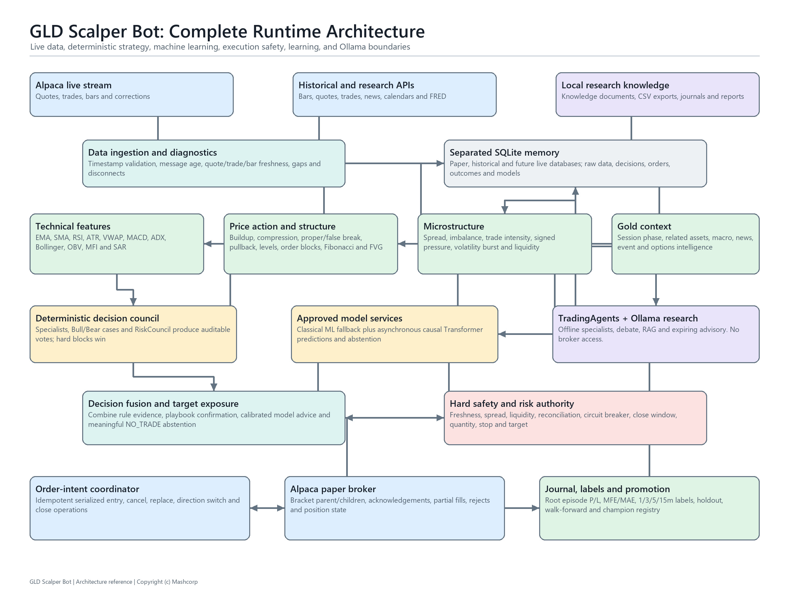
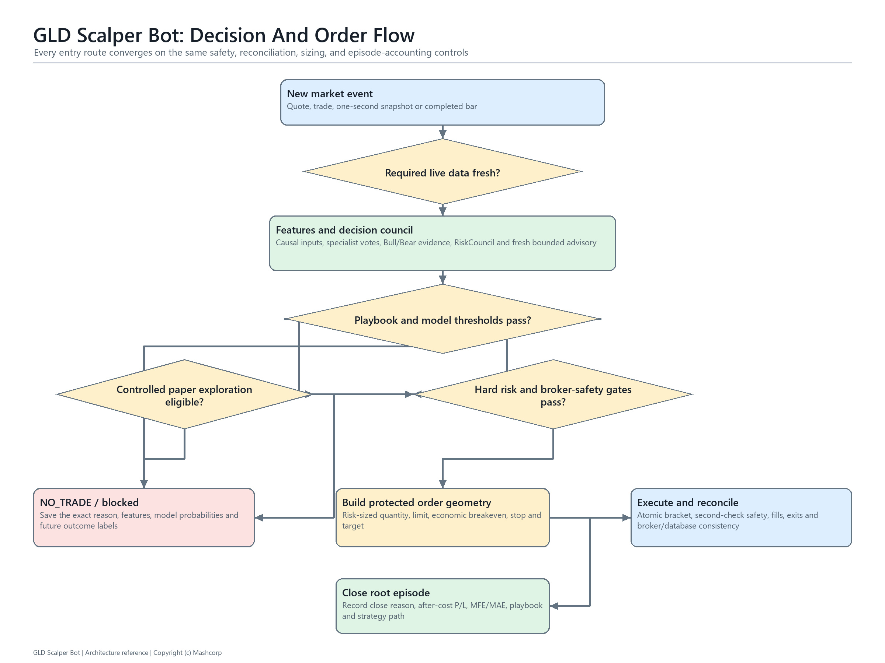
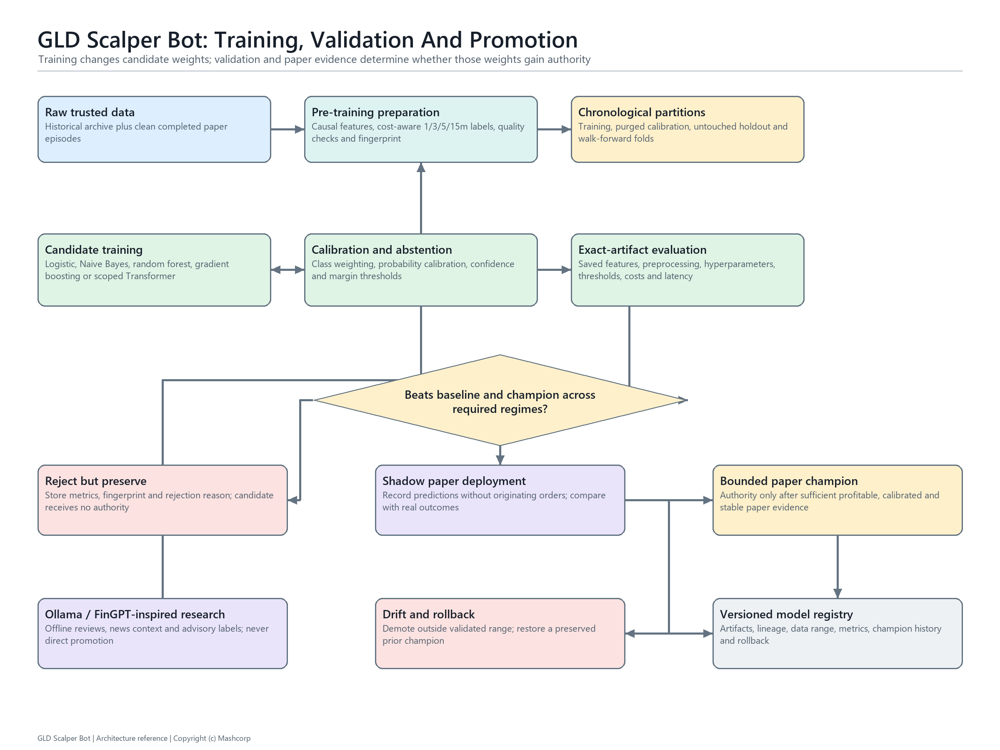

# GLD Scalper Bot

Copyright (c) 2026 @Mashcorp. All rights reserved. Mashcorp and @Mashcorp are claimed trademarks/marks of their owner. This codebase is proprietary software. Do not copy, redistribute, resell, sublicense, or use the name or marks without written permission from @Mashcorp.

## What This Bot Is

GLD Scalper Bot is a paper-trading algorithm for the `GLD` ETF using Alpaca's paper trading API. It watches live market data, stores that data in SQLite, evaluates its full strategy once per minute, and also evaluates quote/trade microstructure on a sub-second event path. It submits protected paper bracket orders and turns completed outcomes into training evidence.

Normal paper mode is intentionally conservative. The optional controlled paper-learning profile samples a limited number of small, near-valid probes. Both modes still refuse stale or disconnected data, failed broker reconciliation, mixed-direction GLD exposure, and unexpected open orders.

This bot is paper trading only. It is not financial advice, and paper trading results do not guarantee live trading results. Alpaca paper trading is a simulation, not a perfect copy of live market execution.

The local command center uses the bot's SQLite/Alpaca bars rather than an embedded chart service. It includes responsive candlesticks and volume, cost-aware analytics, visible backtest results, automatic Transformer scope presets, discovered single- and multi-candidate training, an offline AI research console, and a locally vendored Three.js HUD. The interface source map and security boundary are in `src/gld_scalper/dashboard/README.md`.

## What The Bot Does Every Minute

1. Syncs recent Alpaca GLD paper orders back into SQLite.
2. Records fills and completed bracket trade outcomes when Alpaca reports them.
3. Reviews every newly closed trade, records what helped or hurt it, and creates a supervised training label.
4. Exports hourly CSV files when the export interval is due.
5. Updates slow macro/sentiment context when the hourly macro interval is due.
6. Reviews matured no-trade signals for missed opportunities.
7. Starts safe scheduled retraining only in the configured after-hours window and only when no execution episode is open.
8. Reads the latest SQLite bars, quote, and trade.
9. Builds indicators, price action, microstructure, gold-volatility, macro, and market-context features.
10. Runs the loaded ML model and stores its probabilities, confidence, model version, role, and abstention reason for every completed minute.
11. Runs the specialist reasoning agents, deterministic Bull/Bear decision council, and hard-block review before scoring `LONG`, `SHORT`, and `NO_TRADE`.
12. Converts the decision into a target exposure suggestion.
13. Checks broker account state, open positions, open orders, stale data, session, spread, and shortability.
14. Submits one Alpaca paper bracket limit order only if every safety layer passes.

## Full Operating Model

This section explains the bot as one complete system. Read this before changing settings or running paper trading for the first time.

At a high level, the bot has three separate jobs:

- **Live trader**: collect market data, score setups, manage risk, and place paper trades.
- **Research engine**: record everything, label outcomes, export CSVs, and train candidate models.
- **LLM analyst**: use the configured offline Kimi or Ollama provider to review data and suggest improvements without controlling live trades.

These jobs are intentionally separated. The live trading path must stay predictable, fast, and rule-governed. The LLM path is slower and more flexible, so it is used for review, training advice, and research rather than order execution.

## Programmer's Source-Code Tour

This section explains how to read the project as a Python programmer. It starts
at the process boundary, moves inward through the live runtime, and then follows
the stored evidence back out through training and reporting. Read this section
with [`src/gld_scalper/main.py`](src/gld_scalper/main.py) open beside it.

### 1. How Python Finds And Starts The Bot

[`pyproject.toml`](pyproject.toml) defines a `src`-layout Python package. The
installable package is `gld_scalper`, found below `src/gld_scalper`. The console
entry point is:

```toml
[project.scripts]
gld-scalper = "gld_scalper.main:main"
```

Therefore these two commands eventually call the same function:

```powershell
gld-scalper status
.\.venv\Scripts\python.exe -m gld_scalper.main status
```

At the bottom of `main.py`, `main()` builds the `argparse` parser, parses one
subcommand, and calls the function stored in `args.func`. For example,
`run-paper` dispatches to `run_paper_command()`, while `train` dispatches to
`train_command()`. The command functions are composition roots: they construct
the objects required for one use case and define their lifetime.

### 2. The Lowest-Level Application Contracts

Before reading strategy code, understand these three files:

| File | Why it comes first |
|---|---|
| [`config.py`](src/gld_scalper/config.py) | Defines the `Settings` dataclass, reads `.env`, derives paper/live paths, and rejects unsafe combinations. |
| [`models.py`](src/gld_scalper/models.py) | Defines the in-memory messages passed between strategy, ML, risk, execution, and backtesting. |
| [`database.py`](src/gld_scalper/database.py) | Owns SQLite connection setup, schema migration, serialization, and every durable repository operation. |

`Settings` is dependency injection for configuration. Modules receive a
`Settings` object instead of repeatedly reading environment variables. This
makes tests able to construct explicit configurations and makes safety checks
centralized.

The principal in-memory progression is:

```text
feature dictionary
    -> MarketSignal
    -> MLPrediction
    -> RiskState
    -> OrderPlan
    -> broker order/fill
    -> execution episode and TradeOutcome rows
```

The feature dictionary is intentionally extensible, but names are a contract.
Training and live inference must calculate the same feature name with the same
formula and units. Renaming a key without updating dataset builders, predictors,
tests, and model manifests creates feature drift even if Python still runs.

### 3. What `run_paper_command()` Owns

`run_paper_command()` is the top-level owner of a paper session. Its startup
order is meaningful:

1. Load and validate `Settings`.
2. Open `Database` and apply schema migrations.
3. Configure terminal/file/SQLite logging.
4. Run historical startup recovery so recent bars exist.
5. Construct deterministic strategy, risk, and ML predictor objects.
6. Connect to Alpaca's paper trading client.
7. Start execution reconciliation before accepting entries.
8. Construct one `OrderIntentCoordinator` shared by every order-producing path.
9. Capture the startup account snapshot.
10. Start asynchronous Transformer inference, dynamic position management,
    fast scalping, options intelligence, and the Alpaca data stream as enabled.
11. Warm the stream before the minute loop is allowed to trust it.
12. Enter the minute loop.

The order coordinator is shared because minute entries, fast entries, exits,
cancellations, replacements, direction changes, and shutdown flattening must
not race one another. `ExecutionEngine` creates broker entry intents;
`ExecutionSafetySupervisor` decides whether order traffic is presently safe;
`OrderIntentCoordinator` serializes the actual broker calls.

### 4. The Two Live Market Paths

The runtime has two paths with different clocks.

**Fast event path**

```text
Alpaca websocket
 -> LiveDataStreamRuntime
 -> route_live_event()
 -> FastScalpRuntime event queue
 -> microstructure/fast pattern decision
 -> bounded ML and Transformer advice
 -> RiskEngine
 -> ExecutionEngine
 -> OrderIntentCoordinator
```

Quotes and trades can reach this route multiple times per second. The callback
only records and enqueues work; broker calls do not execute inside the websocket
callback. This protects the stream from slow execution work.

**Minute research/decision path**

```text
SQLite bars, quotes, trades, context
 -> feature builders
 -> playbook and technical analysis
 -> Predictor and Transformer cache
 -> reasoning agents and decision council
 -> StrategyEngine
 -> entry-quality and exploration policy
 -> target exposure
 -> RiskEngine
 -> ExecutionEngine
 -> OrderIntentCoordinator
```

The minute path sleeps until the next minute boundary after one completed
iteration. Maintenance work may take several seconds, so it refreshes `now`
before reading market data and making a decision.

### 5. How A Minute Feature Snapshot Is Built

No single indicator decides the trade. `main.py` incrementally builds one
feature dictionary by calling specialized modules:

1. `feature_engine.py` creates bar indicators and archive-compatible features.
2. `stream_collector.py` supplies connection, message age, and event counts.
3. `price_action.py` classifies buildup, compression, breaks, false breaks,
   pullbacks, and support/resistance behavior.
4. `microstructure.py` adds spread, imbalance, trade intensity, signed volume,
   liquidity, volatility bursts, and freshness.
5. `gold_volatility.py` adds session segment, volatility regime, and cycle data.
6. `order_blocks.py` adds confirmed multi-timeframe institutional-zone proxies.
7. `options_intelligence.py` adds bounded GLD options context.
8. `macro_context.py`, `event_calendar.py`, and `gold_event_impact.py` add slow
   context and event risk.
9. `technical_confluence.py` adds RSI, moving-average, Fibonacci, fair-value-gap,
   and grouped indicator-family evidence.
10. `ema_cross_strategy.py` evaluates completed-bar cross events independently.
11. `strategy_playbooks.py` selects and scores a named setup.

Each module returns data; none submits an order. This is the most important
boundary to preserve when adding a new indicator.

### 6. How Evidence Becomes A Decision

The feature snapshot passes through several independent opinions:

```text
deterministic features
 -> scoped classical Predictor probabilities
 -> cached Transformer probabilities/returns/uncertainty
 -> IndicatorAgent, PatternAgent, TrendAgent, RiskAgent
 -> Bull/Bear deterministic council
 -> StrategyEngine LONG/SHORT/NO_TRADE scores
```

`Predictor` loads an eligible model through `ModelRegistry`. It can abstain when
features are missing, data is stale, confidence is weak, or class separation is
too small. `AsyncTransformerShadowRuntime` calculates sequence predictions on
another thread and exposes only a recent cached result. `transformer_authority`
applies the configured shadow, bounded-adviser, or paper-champion rules.

`StrategyEngine` produces a `MarketSignal`, not an order. The signal carries the
decision, three scores, confidence, regime, and human-readable reasons. Entry
quality, controlled paper exploration, risk, broker state, and execution safety
can still turn that signal into `NO_TRADE`.

### 7. How A Decision Becomes A Broker Order

`target_exposure.py` expresses the desired direction and bounded exposure.
`RiskEngine.build_order_plan()` then checks account/session/data constraints and
calculates quantity, limit price, stop, target, and estimated notional. It either
returns an `OrderPlan` or raises `OrderPlanRejected`.

`ExecutionEngine.submit_entry()` transforms that plan into one or more
independently protected Alpaca bracket tranches. The client order ID is the
idempotency key and episode root. `OrderIntentCoordinator` rejects duplicate
intent keys and serializes submission. This means a retry or duplicated stream
event should recover the same logical episode rather than open another trade.

`execution_safety.py` continuously compares four views of truth:

```text
Alpaca position
Alpaca open orders
SQLite execution episodes
in-memory managed position episodes
```

New brackets receive a grace period before being judged unprotected. Persistent
mismatches, stale order states, stream failures, or repeated broker rejections
freeze new entries through the circuit breaker.

### 8. How Open Trades Are Managed And Closed

`DynamicPositionRuntime` receives the same live quote/trade events as the fast
strategy, but its job is existing exposure. `PositionManager` reconstructs
managed trades from broker orders, tracks maximum favorable/adverse excursion,
and evaluates economic breakeven, structural invalidation, trailing profit,
profit giveback, time limits, and session-close reduction.

Exit and protective-order changes still travel through the shared coordinator.
The manager does not mark a trade closed merely because it requested an exit;
the broker reconciliation path must observe fills and settle quantities.

### 9. How Broker Truth Becomes Learning Memory

`PaperOrderReconciler.sync()` reads Alpaca orders and fills, flattens parent/child
bracket structures, and upserts broker state into SQLite. It associates every
fill with the root episode, preserves strategy/playbook metadata, calculates
execution cost context, and creates a root `trade_outcomes` row only when the
episode is actually complete.

`TradeLearningAnalyzer` reviews closed episodes. `MultiHorizonOutcomeLabeler`
later calculates causal 1, 3, 5, and 15-minute outcomes for decisions.
`MissedOpportunityAnalyzer` performs the corresponding review for skipped
decisions. This gives the trainer examples of good trades, bad trades, and
correct or incorrect abstention.

### 10. How Offline Training Connects Back To Trading

The classical route is:

```text
SQLite/archive evidence
 -> dataset_builder or archive_dataset
 -> causal labels and feature matrix
 -> trainer
 -> calibration and threshold selection
 -> holdout and walk-forward evaluation
 -> immutable candidate artifact
 -> ModelRegistry
 -> paper shadow/champion
 -> Predictor on next process start or reload
```

The Transformer route replaces the flat matrix with aligned causal sequences:

```text
snapshots/bars/quotes/trades
 -> transformer_dataset sequence artifact
 -> transformer_trainer
 -> TorchScript artifact and manifest
 -> historical and paper evaluation
 -> ModelRegistry
 -> AsyncTransformerShadowRuntime
```

Training never mutates a model that is currently making decisions. Every fit
creates a versioned artifact. Promotion changes registry status only after the
required evidence passes. Drift can demote a champion; rollback preserves older
approved versions.

Kimi, Ollama, FinGPT helpers, RAG, and TradingAgents operate beside this
pipeline, not inside the fitting algorithm. They write reviews, macro context,
advisories, and optional high-confidence labels to SQLite. They do not receive
an Alpaca trading client and cannot promote a model.

### 11. Shutdown Is Part Of The Trading Algorithm

The `finally` block in `run_paper_command()` is required behavior, not cleanup
decoration. It freezes entries, stops fast and position workers, stops the
Transformer, requests safe flattening, stops options and stream workers,
performs a final reconciliation, records the shutdown account snapshot, runs a
consistency audit, and only then stops the order coordinator.

When changing startup ownership, add the matching reverse-order shutdown step.
An object that owns a thread, socket, broker intent, or file lock must have one
clear owner and one bounded stop path.

### 12. Dependency Direction

Use this rule when deciding where new code belongs:

```text
main / CLI / tools
    -> application services and runtimes
        -> domain calculations and models
            -> utils

all persistence-aware layers -> Database
all configuration-aware layers -> Settings
only execution layers -> Alpaca trading client
```

Avoid importing `main.py` from domain modules. Avoid importing broker clients
into indicator, feature, model, or LLM modules. Keep `utils` as leaf helpers so
they do not become a hidden second composition root.

### 13. A Practical Reading And Debugging Order

For a first complete code study, use this order:

1. `pyproject.toml`, then `main.main()` and `build_parser()`.
2. `config.Settings`, `models.py`, and `database.Database`.
3. `run_paper_command()` startup and shutdown, without reading helper bodies.
4. `stream_collector.py` and `data_collector.py`.
5. Feature modules, then `strategy_playbooks.py` and `strategy_engine.py`.
6. `ml/predictor.py`, `decision_council.py`, and `reasoning_agents.py`.
7. `risk_engine.py`, `execution_engine.py`, and `execution_safety.py`.
8. `position_manager.py` and `order_reconciler.py`.
9. Outcome learning and the complete `ml` folder.
10. Reports, tools, scripts, and tests.

When debugging a missing trade, follow one decision ID from `signals` to
`model_predictions`, `no_trade_logs` or `decision_executions`, then to
`execution_episodes`, `orders`, `fills`, and `trade_outcomes`. When debugging a
wrong feature, compare the stored feature snapshot with the corresponding
dataset-builder formula and feature-compatibility test. When debugging a broker
mismatch, trust Alpaca as external truth, reconcile before changing SQLite, and
never repair the symptom by deleting episode history.

### 14. Adding A Feature Without Breaking The Architecture

1. Implement a pure causal calculation in the narrowest domain module.
2. Add its setting to `Settings` only if configuration is necessary.
3. Add the feature to both live and historical/archive construction.
4. Persist raw evidence or an audit record when later reconstruction matters.
5. Add focused tests for formula, causality, missing data, and stale data.
6. Add the feature to a playbook or model input; do not call execution directly.
7. Run feature-compatibility, strategy, risk, execution, and full regression
   tests.
8. Update the root and relevant folder README in the same commit.

## Current Interface, Architecture, And Complete Training Route

This is the consolidated operator guide for the current bot. The detailed
sections later in this README explain every subsystem and equation; this section
explains the order in which those subsystems are used. The application now has
a local browser command center in addition to its PowerShell interface. Its five
operator interfaces are:

1. **Local dashboard**: start and stop paper trading, inspect native GLD charts,
   monitor account and execution telemetry, review decisions and root episodes,
   launch training jobs, tail logs, and update masked local connections.
2. **PowerShell CLI**: initialize databases, collect data, label outcomes, train,
   inspect status, export evidence, and start or stop paper trading.
3. **SQLite**: durable paper memory for decisions, predictions, episodes, fills,
   outcomes, advisories, promotion history, and safety events.
4. **CSV exports and reports**: human-readable analysis grouped by data domain.
5. **Logs and status commands**: operational health, loaded model roles,
   Transformer prediction counts, reconciliation state, and training progress.

### Local Dashboard

Install the project dependencies once, then launch the command center:

```powershell
cd "D:\ALPACA TEST\gld_scalper_bot"
.\.venv\Scripts\python.exe -m pip install -e .
.\.venv\Scripts\python.exe -m gld_scalper.main dashboard
```

The browser opens `http://127.0.0.1:8765`. Keep the dashboard terminal window
open while using it. Use `--no-browser` when running on a server with an SSH
tunnel, and never expose the port publicly. The server rejects non-local binds,
does not enable CORS, and requires a random same-origin token for state-changing
requests.

For normal daily use, install the Desktop launcher once:

```powershell
cd "D:\ALPACA TEST\gld_scalper_bot"
powershell.exe -ExecutionPolicy Bypass -File .\scripts\install_dashboard_shortcut.ps1
```

Double-click **Mashcorp GLD Command Center** on the Desktop. The launcher starts
the Python dashboard server in the background, waits for its health endpoint,
and opens Microsoft Edge in standalone application mode. It reuses an existing
dashboard instead of starting a duplicate. ChatGPT and Codex are not required.

To stop only the dashboard server later:

```powershell
powershell.exe -ExecutionPolicy Bypass -File .\scripts\stop_dashboard.ps1
```

Stopping the dashboard server is not a substitute for stopping an active paper
bot. Stop paper trading from the dashboard first so broker reconciliation and
the normal shutdown sequence can complete.

The dashboard is an operator shell, not a replacement execution engine. Start
controls launch the existing allowlisted CLI command in a child process. Paper
orders still pass through the synchronized order coordinator, execution safety,
reconciliation, and broker clients. The native chart and Three.js decision
field are visual analysis only and cannot submit an Alpaca order.

| View | Operational responsibility |
|---|---|
| Overview | GLD quote, account equity, daily P/L, latest decision, open episodes, quick commands, and live bot log. |
| Market | Native SQLite/Alpaca GLD candles plus quote, macro, Transformer, and safety context. |
| Performance | Equity curve, after-cost P/L, win rate, holding time, and closed root outcomes. |
| Trades | Auditable root trading episodes rather than duplicated partial-exit tranches. |
| Intelligence | Agent votes, conventional ML, Transformer state, macro context, and decision history. |
| Training | Classical candidate, continual loop, Transformer dataset/candidate, and backtest controls. |
| AI Lab | Select and generation-test Ollama or Kimi; run FinGPT-assisted macro, RAG, council, labeling, advice, and guarded candidate workflows. Oversized local prompts are compacted, slow Ollama calls receive one reduced retry, and recoverable Kimi failures can fall back to local Ollama for advisory research. |
| 3D Core | Full-bleed Obsidian-style Three.js graph of the actual stream, feature, agent, model, risk, execution, broker, journal, outcome, database, and LLM services. Live telemetry animates node and edge state; drag, zoom, and node selection expose the topology. |
| Backtest Lab | Run chronological simulations and inspect return, drawdown, win rate, profit factor, direction, and trade economics in charts. |
| White Paper | Read the versioned technical, mathematical, risk, training, security, and governance specification in the application. |
| System | Managed process states, execution safety, and per-job terminal output. |
| Settings | Masked Alpaca and LLM settings stored only in the ignored local `.env`. |

Blank credential fields preserve the existing values. The endpoint and child
environment remain locked to Alpaca paper trading. Job output is written under
`logs/dashboard/`; the bot continues writing `logs/bot.log`. See
[`docs/BOT_WHITE_PAPER.md`](docs/BOT_WHITE_PAPER.md) for the concise technical
white paper and the later sections of this README for the full operator and
developer reference.
See [`src/gld_scalper/dashboard/README.md`](src/gld_scalper/dashboard/README.md)
for the backend security and process-lifecycle contract.

### Current Architecture JPEGs



The runtime diagram shows the two asynchronous market routes, deterministic
feature and agent layers, conventional ML, the Transformer cache, the decision
council, risk controls, synchronized order coordinator, Alpaca paper account,
SQLite memory, and the offline Kimi/Ollama/TradingAgents research boundary.



The order-flow diagram shows that no model or indicator submits an order
directly. Minute and fast decisions must converge through data-health checks,
the Bull/Bear council, entry-quality gates, target exposure, account risk,
broker reconciliation, the circuit breaker, and the idempotent order queue.



The training diagram separates raw evidence, causal features, matured labels,
candidate fitting, calibration, holdout testing, walk-forward testing, paper
shadow evidence, promotion, drift monitoring, demotion, and rollback. A saved
candidate is not automatically a champion, and a paper champion is not
automatically approved for live money.

Regenerate these JPEG files with
[`tools/render_architecture_diagrams.py`](tools/render_architecture_diagrams.py)
whenever a future code change adds, removes, or reconnects an architecture
component. A documentation-only wording change does not require regenerating
the images.

### How A Live Paper Decision Works Now

1. `run-paper` validates paper-only configuration and initializes SQLite.
2. Startup freezes entries and reconciles Alpaca positions, nested orders, and
   local execution episodes.
3. The Alpaca websocket streams quotes, trades, bars, corrections, and data
   diagnostics into the live cache and SQLite.
4. The fast route evaluates eligible quote/trade events; the minute route
   evaluates completed causal bar context.
5. Feature builders calculate indicators, price action, Fibonacci structure,
   order blocks, options context, spread, imbalance, intensity, liquidity,
   volatility, session phase, event state, and data age.
6. The loaded conventional model returns class probabilities and an abstention
   result using its exact saved feature profile.
7. A trained Transformer runs asynchronously. The order path reads only a fresh
   cached result; it never waits for PyTorch inference.
8. `IndicatorAgent`, `PatternAgent`, `TrendAgent`, data-health and
   microstructure specialists produce structured evidence.
9. `BullCaseAgent`, `BearCaseAgent`, and `RiskCouncil` combine that evidence.
   A hard safety block always outranks a bullish or bearish vote.
10. A fresh offline TradingAgents/Ollama advisory may make only the configured
    small confidence or sizing adjustment. It cannot call Alpaca.
11. Strategy and playbook rules produce `LONG`, `SHORT`, or `NO_TRADE` and a
    target exposure request.
12. Risk sizing reduces exposure for costs, uncertainty, poor liquidity,
    volatility, stale data, drawdown, correlated exposure, and weak alignment.
13. Reconciliation, shortability, session-close, circuit-breaker, duplicate,
    order-rate, and account-risk gates receive final authority.
14. One synchronized `OrderIntentCoordinator` creates an idempotent bracket
    intent and records its atomic root execution episode.
15. Fills, protection, dynamic exits, costs, final P/L, close reason, journal
    evidence, and later outcome labels feed the next offline training cycle.

### Every Trainable Or Analytical Model

| Model or layer | Input | What training changes | Paper runtime authority |
|---|---|---|---|
| Logistic Regression | One causal numeric feature row | Class weights, coefficients, calibration, and thresholds | Candidate may provide bounded paper-shadow advice; champion may advise normally |
| Gaussian Naive Bayes | One causal numeric feature row | Per-class feature distributions and calibrated probabilities | Same registry and promotion boundary as other tabular candidates |
| Random Forest | One causal numeric feature row | A bounded ensemble of decision trees | Main nonlinear tabular candidate and fallback |
| Gradient Boosting | One causal numeric feature row | Sequential error-correcting decision trees | Competes with the exact same holdout and walk-forward rules |
| Exit Random Forest | Position and post-entry state | `HOLD`, `REDUCE`, and `CLOSE` behavior from trustworthy closed episodes | Advisory only until exit-specific evidence passes its gates |
| Fast Transformer | Last 30-120 seconds | Quote/trade sequence attention, direction, return, cost, and uncertainty heads | Shadow, bounded adviser, or promoted paper champion |
| Minute Transformer | Last 30-90 minutes | Bar/feature sequence attention and multi-horizon heads | Shadow, bounded adviser, or promoted paper champion |
| News Transformer | Event-centered price/liquidity sequence | Post-event direction, cost, and uncertainty | Independent scope; prose never enters the order path |
| Exit Transformer | Position sequence since entry | `HOLD`, `REDUCE`, `CLOSE`, expected return, cost, and uncertainty | Shadow until enough clean exit labels exist |
| Ollama/FinGPT/TradingAgents | Journals, news, summaries, knowledge, and stored evidence | No sklearn or PyTorch weights; writes reviewed advice and structured labels | Offline only; latest bounded SQLite advisory may be read live |
| FinRL-style preview | Historical environment transitions | Experimental policy and reward evidence | Offline research only; no broker authority |

### Complete Training Order

Do not run heavy training, Ollama analysis, and `run-paper` together on the
8 GB laptop. Stop paper trading with `Ctrl+C`, wait for verified broker-flat
shutdown, and wait at least 15 minutes for the last 15-minute label to mature.

#### Stage A: Label Paper Evidence

```powershell
cd "D:\ALPACA TEST\gld_scalper_bot"

.\.venv\Scripts\python.exe -m gld_scalper.main label-paper-outcomes `
  --retry-partial
```

This labels executed and skipped decisions at 1, 3, 5, and 15 minutes after
spread and slippage. It does not fit a model. Run it again later when the first
pass reports partial recent horizons.

#### Stage B: Train All Tabular Entry Candidates

The existing five-year archive is:

```text
data\paper\ml_training\gld_2021_2026_training_v3.joblib
```

Run the resumable search:

```powershell
.\.venv\Scripts\python.exe -m gld_scalper.main train-loop `
  --artifact "D:\ALPACA TEST\gld_scalper_bot\data\paper\ml_training\gld_2021_2026_training_v3.joblib" `
  --horizons 1 3 5 15 `
  --playbooks all proper_breakout false_break_reversal pullback_continuation compression_breakout spread_capture news_event trend_continuation `
  --minimum-samples 750 `
  --paper-weight 2 `
  --continuous-historical `
  --interval-minutes 1 `
  --patience-rounds 3 `
  --minimum-improvement 0.001 `
  --clear-stop
```

Each search round compares Logistic Regression, Gaussian Naive Bayes, Random
Forest, and Gradient Boosting feature profiles. Exact fingerprints prevent an
unchanged experiment from being mistaken for new learning. The loop preserves
all candidates and stops after repeated rounds fail to improve actual
walk-forward net return.

Check or request a cooperative stop from another PowerShell window:

```powershell
.\.venv\Scripts\python.exe -m gld_scalper.main training-loop-status
.\.venv\Scripts\python.exe -m gld_scalper.main stop-training-loop
```

#### Stage C: Train The Independent Exit Model

```powershell
.\.venv\Scripts\python.exe -m gld_scalper.main train-exit-model `
  --strategy-path all
```

An insufficient-samples result is a correct refusal. Continue collecting clean,
closed root execution episodes rather than lowering the evidence requirement.

#### Stage D: Build Every Transformer Sequence Artifact

Use explicit `.seq` directory names. A path ending in `.se`, or a path that was
never built, causes the trainer to stop with `FileNotFoundError`.

```powershell
$Root = "D:\ALPACA TEST\gld_scalper_bot"
$HistoricalDb = "$Root\data\paper\historical\gld_2021_2026_ai_full\gld_scalper_historical.db"
$TransformerRoot = "$Root\data\paper\ml_training\transformer"

$MinuteArtifact = "$TransformerRoot\minute_2021_2026_v1.seq"
$FastArtifact = "$TransformerRoot\fast_2021_2026_v1.seq"
$NewsArtifact = "$TransformerRoot\news_2021_2026_v1.seq"
$ExitArtifact = "$TransformerRoot\exit_paper_v1.seq"

.\.venv\Scripts\python.exe -m gld_scalper.main build-transformer-dataset `
  --database $HistoricalDb --scope minute --source raw `
  --start 2021-01-01 --end 2026-01-01 --stride 5 `
  --max-samples 50000 --max-features 64 --output $MinuteArtifact

.\.venv\Scripts\python.exe -m gld_scalper.main build-transformer-dataset `
  --database $HistoricalDb --scope fast_microstructure --source raw `
  --start 2021-01-01 --end 2026-01-01 `
  --max-samples 50000 --max-features 64 --output $FastArtifact

.\.venv\Scripts\python.exe -m gld_scalper.main build-transformer-dataset `
  --database $HistoricalDb --scope news_event --source raw `
  --start 2021-01-01 --end 2026-01-01 `
  --max-samples 50000 --max-features 64 --output $NewsArtifact

.\.venv\Scripts\python.exe -m gld_scalper.main build-transformer-dataset `
  --database "$Root\data\paper\gld_scalper.db" --scope exit --source raw `
  --start 2026-01-01 --end 2027-01-01 `
  --max-samples 50000 --max-features 64 --output $ExitArtifact
```

The fast build scans the very large quote/trade archive and may require a
separate night. News and exit builds may correctly refuse to finish until their
specialized labels are numerous and trustworthy enough.

#### Stage E: Train Each Transformer Separately

First verify that the artifact exists:

```powershell
Test-Path $MinuteArtifact
Test-Path $FastArtifact
Test-Path $NewsArtifact
Test-Path $ExitArtifact
```

Train one artifact at a time with laptop-safe settings. Replace `$Artifact` for
each scope that returned `True`:

```powershell
$Artifact = $MinuteArtifact

.\.venv\Scripts\python.exe -m gld_scalper.main train-transformer `
  --artifact $Artifact `
  --d-model 32 --layers 2 --batch-size 16 `
  --epochs 10 --patience 3 `
  --walk-forward-folds 3 --walk-forward-epochs 3
```

Repeat on separate nights with `$FastArtifact`, `$NewsArtifact`, and
`$ExitArtifact`. Do not train two Transformer scopes concurrently.

For resumable search after the first candidate, use the exact scope/path pair:

```powershell
.\.venv\Scripts\python.exe -m gld_scalper.main transformer-train-loop `
  --artifact "minute=$MinuteArtifact" `
  --watch --interval-minutes 60 `
  --epochs 8 --walk-forward-epochs 2 --batch-size 16 `
  --no-improvement-patience 3 --minimum-improvement 0.001 `
  --clear-stop
```

Change `minute` to `fast_microstructure`, `news_event`, or `exit` together with
the matching artifact. Inspect and stop with:

```powershell
.\.venv\Scripts\python.exe -m gld_scalper.main transformer-status
.\.venv\Scripts\python.exe -m gld_scalper.main stop-transformer-training
```

#### Stage F: Collect Live Paper Shadow Evidence

Training is offline; inference is live. Restart `run-paper` after training so it
loads the saved model registry:

```powershell
$env:ENABLE_TRANSFORMER_SHADOW="true"
$env:TRANSFORMER_TRADING_MODE="shadow"

.\.venv\Scripts\python.exe -m gld_scalper.main run-paper --no-retraining
```

`--no-retraining` disables scheduled fitting during that process. It does not
disable conventional-model or Transformer inference. A working Transformer
shows loaded model versions and increasing prediction counts:

```powershell
.\.venv\Scripts\python.exe -m gld_scalper.main transformer-status
.\.venv\Scripts\python.exe -m gld_scalper.main status
```

#### Stage G: Evaluate, Promote, Monitor, And Roll Back

After the paper session and label-maturity delay:

```powershell
.\.venv\Scripts\python.exe -m gld_scalper.main label-paper-outcomes --retry-partial
.\.venv\Scripts\python.exe -m gld_scalper.main evaluate-transformer-paper
.\.venv\Scripts\python.exe -m gld_scalper.main transformer-status
.\.venv\Scripts\python.exe -m gld_scalper.main ml-drift-report
```

Transformer authority graduates in this order:

| Mode | What it may do during paper trading |
|---|---|
| `shadow` | Predict asynchronously and save evidence; never alter a decision |
| `bounded_adviser` | Veto a conflicting setup or add a small score adjustment to an aligned existing setup; cannot originate a trade |
| `paper_champion` | A promoted scope may recommend a paper action when technical confluence and every later safety gate agree |

Use `promote-transformer --model-version EXACT_VERSION` only after reading the
reported gate results. `paper_champion` is rejected outside Alpaca paper mode.
The current repository does not authorize live-money Transformer control.

### Is Continuous Transformer Participation Required?

Real-time asynchronous inference is recommended during paper validation, but a
fresh Transformer prediction must not be a hard dependency for broker safety.
The runtime refreshes registered models, performs inference in a background CPU
thread, saves predictions, and exposes only fresh cached values. Missing,
incompatible, slow, stale, or uncertain output falls back to deterministic
rules and the conventional model.

This fail-open advisory boundary is intentional. Requiring a neural prediction
for every quote could freeze protective execution during CPU pressure or model
failure. The correct operational requirement is therefore **continuous health
visibility**, not unconditional Transformer authority: inspect loaded versions,
prediction counts, cache age, inference latency, and errors while retaining the
safe fallback.

### 1. Configuration And Safety Startup

When the bot starts, it first loads settings from `.env`.

Important examples:

```dotenv
ALPACA_PAPER=true
ALPACA_PAPER_TRADE=true
ALPACA_ENDPOINT=https://paper-api.alpaca.markets/v2
BOT_SYMBOL=GLD
BOT_DATA_MODE=paper
DATABASE_URL=sqlite:///data/paper/gld_scalper.db
LLM_PROVIDER=kimi
LLM_MODEL=kimi-k2.6
ENABLE_LLM_LIVE_TRADING=false
```

The settings layer performs basic safety checks before trading logic can run:

- the bot must be in paper mode
- the Alpaca endpoint must be the paper endpoint
- the trade symbol must be `GLD`
- non-SQLite databases are rejected
- project-local database and export paths must stay inside the matching paper/live folder
- short trading must still pass Alpaca asset checks
- the LLM must not be allowed to control live trading

If these assumptions are wrong, the bot should fail early instead of silently trading in an unsafe mode.

### 2. Alpaca Connections

The bot uses Alpaca for two separate things:

- **Trading API**: account state, open positions, open orders, submitted paper orders, fills, and order status.
- **Market data API**: historical bars and live bars/quotes/trades.

The bot trades only through Alpaca paper trading. It uses the Trading API to submit bracket orders and the data stream to keep market context fresh.

The main traded symbol is:

```text
GLD
```

The supporting symbols are:

```text
GDX
GDXJ
IAU
QQQ
SHY
SLV
SPY
IEF
TLT
UUP
VIXY
```

Those supporting symbols help the bot understand the broader gold environment:

- `UUP`: US dollar proxy. Gold often reacts to dollar strength/weakness.
- `TLT`, `IEF`, and `SHY`: Treasury/rates proxies across the curve.
- `SPY`, `QQQ`, and `VIXY`: equity/risk appetite and volatility proxies.
- `SLV`, `IAU`, `GDX`, and `GDXJ`: related precious-metal, gold ETF, and miner context.

The bot does not trade all of these symbols. They are context inputs for `GLD`.

### 3. SQLite Is The Bot's Memory

The SQLite database is the central memory of the bot:

```text
data/paper/gld_scalper.db
```

Paper and future live trading data are intentionally separated:

```text
data/paper/gld_scalper.db
data/live/gld_scalper.db
exports/paper/hourly/
exports/paper/latest/
exports/live/hourly/
exports/live/latest/
```

The current bot is still paper-trading only, so `BOT_DATA_MODE=paper` is the active mode. The live folders are a prepared structure for a later live-trading engineering pass. Keeping these folders separate prevents paper fills, paper labels, no-trade learning, and model-training evidence from being mixed with future real-money records.

Nearly every important event is written there:

- market bars
- live quotes
- live trades
- strategy signals
- no-trade explanations
- paper orders
- fills
- completed trade outcomes
- trading journal entries
- missed-opportunity labels
- macro context
- LLM reviews
- LLM training advice
- candidate/champion model records
- system logs

This matters because the bot is not just trying to trade today. It is trying to build a reviewable dataset that can improve the rules and train future candidate models.

Think of SQLite as the bot's notebook. If something happens and it is not in SQLite, the bot cannot reliably learn from it later.

The live process has several threads that can write at nearly the same time: stream persistence, fast-decision persistence, structured logging, the minute loop, exports, and retraining. The database layer therefore uses SQLite WAL mode, a configurable busy timeout, and one process-wide reentrant write lock. `DATABASE_BUSY_TIMEOUT_MS=30000` gives an external SQLite writer up to 30 seconds to finish. A logging write failure is contained by the logging handler, and `Database.log_event()` will not terminate the trading loop if diagnostic logging itself cannot write. Keep only one `run-paper` process active; the lock coordinates this bot's threads, not two unrelated bot processes.

### 4. Live Data Flow

The live stream collector listens for:

- `GLD` trades
- `GLD` quotes
- minute bars for `GLD` and context symbols

The bot tracks diagnostics such as:

- whether the websocket is connected
- quote count
- trade count
- last live message time
- last live bar time
- market data age
- whether data is stale

This is why logs can say things like:

```text
websocket disconnected
market data stale
live stream stale
```

Those messages are protective. A scalping bot should not trade when the data feed is old, disconnected, or internally inconsistent.

### 5. Fast Event-Driven Scalping Layer

The bot now has two decision speeds:

```text
Fast layer:      quote/trade event driven, target interval about 250 ms
Slow layer:      one-minute bar/context loop
```

The fast layer is designed for:

- tiny spread captures
- very fast false breaks
- news-spike volatility bursts
- bid/ask microstructure scalps
- clean live breakouts
- spread expansion detection
- liquidity collapse detection
- sudden volatility burst detection

The Alpaca websocket still saves live quotes and trades to SQLite, but it also hands compact quote/trade events to a separate fast worker thread. That worker keeps an in-memory rolling window of quotes and trades, so it does not need to query SQLite before deciding.

This is the important speed difference:

```text
Old behavior:
live data -> SQLite -> wait until next minute -> decision

Fast behavior:
live quote/trade -> in-memory fast engine -> decision in milliseconds
```

The fast engine builds only lightweight microstructure features:

- bid
- ask
- midpoint
- spread percentage
- quote imbalance
- trade intensity
- aggressive buy/sell pressure
- signed volume
- realized range over the last few seconds
- liquidity score
- spread expansion ratio
- volatility burst flag

It classifies fast triggers such as:

```text
clean_breakout
false_break
spread_capture
news_spike
fast_block
microstructure
```

Fast decisions are saved to:

```text
fast_scalp_decisions
exports/paper/hourly/.../microstructure/fast_scalp_decisions/
```

The fast layer can submit paper orders when enabled, but it still uses the normal risk engine, broker checks, ML predictor, cooldown, open-position guard, and bracket-order execution. It is faster, but it is not allowed to bypass safety.

Useful fast-layer settings:

```dotenv
ENABLE_FAST_SCALP=true
ENABLE_FAST_SCALP_ORDER_SUBMISSION=true
FAST_SCALP_INTERVAL_MS=250
FAST_SCALP_ORDER_COOLDOWN_SECONDS=30
FAST_SCALP_TIGHT_SPREAD_PCT=0.00035
FAST_SCALP_BREAKOUT_MIN_MOVE_PCT=0.00025
FAST_SCALP_IMBALANCE_THRESHOLD=0.30
FAST_SCALP_MIN_TRADE_INTENSITY=0.40
FAST_SCALP_MIN_CONFIDENCE=0.62
FAST_SCALP_VOLATILITY_BURST_PCT=0.0010
FAST_SCALP_MAX_QUOTE_AGE_SECONDS=2
FAST_SCALP_MAX_TRADE_AGE_SECONDS=3
FAST_SCALP_MIN_SPREAD_STABILITY=0.55
MINUTE_ENTRY_MAX_QUOTE_AGE_SECONDS=15
MINUTE_ENTRY_MAX_TRADE_AGE_SECONDS=30
MINUTE_ENTRY_MIN_TRADE_INTENSITY=0.05
MINUTE_ENTRY_MIN_SPREAD_STABILITY=0.35
```

For rookie developers: this does not make the laptop an HFT server. Alpaca paper order submission and internet latency are still outside the bot's control. What this upgrade changes is the bot's internal reaction time: it can recognize a fast setup immediately from live quote/trade events instead of waiting for the next minute bar.

Every entry is tagged with a New York time-of-day profile: `open`, `morning`, `mid_session`, `afternoon`, or `close`. Mid-session entries require a proper break unless they are a confirmed false-break reversal. Close-profile entries require a high-scoring breakout or trend continuation, and Phase 1's global freeze still blocks every new entry during the final 15 minutes. Reports compare the profiles through their New York entry hour.

### 6. Feature Construction

Once per loop, the bot reads the latest market state and builds a feature snapshot.

The feature snapshot can include:

- raw price and volume
- VWAP position
- moving average behavior
- RSI/MACD-style momentum
- ATR and volatility
- spread percentage
- quote imbalance
- trade intensity
- liquidity score
- support and resistance levels
- range compression
- price-action pattern classification
- gold-specific volatility regime
- macro context
- previous model prediction when a champion model exists

The bot stores the feature snapshot with signals and journal entries so later analysis can explain what the bot saw at the time.

### 7. Price-Action Pattern Engine

The price-action layer tries to describe the setup in trader language instead of only indicator numbers.

It looks for patterns such as:

- **buildup**: price compresses near an important level before a possible move.
- **proper break**: price breaks a level with cleaner confirmation.
- **false break**: price breaks a level but quickly fails.
- **tease break**: price touches or briefly crosses a level without enough confirmation.
- **pullback**: price returns toward a level after a move.
- **support/resistance**: nearby levels that may reject or attract price.
- **range compression**: price narrows into a tight range before volatility expands.

The pattern engine does not place trades by itself. It feeds pattern quality into the final decision and risk sizing.

Playbooks are evaluated separately; they do not share one generic confirmation threshold:

- `proper_breakout` requires a proper break, pattern quality, volume, and buildup or compression evidence.
- `buildup_break` requires buildup, compression, a proper break, and volume confirmation.
- `compression_breakout` requires compression, a proper break, volume expansion, and pattern quality.
- `false_break_reversal` requires a false-break classification, wick rejection, return inside the prior range, and no unconfirmed volatility burst.
- `pullback_continuation` requires the pullback pattern, one-minute and five-minute trend agreement, and an EMA/VWAP reclaim.
- `trend_continuation` requires a full trend stack, five-minute alignment, trend strength, and usable volume.
- `news_event` is post-release only and requires an identified release state, volatility burst, proper break, and directional microstructure pressure.
- `spread_capture` exists only on the fast path and requires a fresh, stable, tight spread plus directional tape.

The selected playbook stores its confirmation names, confirmation count, required count, score, direction, and block reason. This lets the report answer not only which playbook traded, but which exact confirmation was missing from a rejected setup.

#### Multi-Timeframe Order-Block Intelligence

The deterministic engine in `src/gld_scalper/order_blocks.py` treats an order block as a **price zone inferred from completed candles**, not proof that one institution placed a hidden order. Alpaca's normal GLD quote/trade feeds do not identify institutions and are not a full depth-of-book feed.

The engine examines completed 1, 5, 15, 30, 45, and 60-minute candles. A zone is accepted only after an opposing origin candle is followed by an ATR-scaled displacement, a break of recent structure, sufficient volume expansion, and at least two completed post-origin candles.

For every accepted zone it records:

- bullish or bearish direction
- zone low and high
- origin and confirmation times
- displacement percentage and ATR multiple
- volume ratio and break-of-structure confirmation
- fair-value-gap observation
- retest count, mitigation, invalidation, age, and strength

Using completed candles reduces repainting. One-minute zones can be confirmed within several completed minutes. A 60-minute zone necessarily takes longer because its confirming hourly candles must close. After confirmation, the fast engine compares each eligible live midpoint with the saved zone, so a retest can be recognized on the sub-minute path.

Order blocks remain bounded context:

- a strong aligned retest can add up to 6 rule points
- broad multi-timeframe alignment can add 3 rule points
- a clean aligned retest can increase proposed size modestly
- an opposing zone or nearby bullish/bearish conflict reduces size
- a zone cannot bypass spread, liquidity, stale-data, ML, position, broker, or session checks
- a zone cannot create a trade without a valid price-action or microstructure setup

Zones are stored in `order_block_zones` and exported under the `patterns` category.

#### GLD Options Intelligence

The bot collects **GLD listed-option chain snapshots** through Alpaca. It does not scrape the Investing.com XAU/USD options page. XAU/USD FX options and GLD equity options are different instruments, and an HTML page is not a stable broker API.

The background collector requests GLD strikes near the current price and expirations inside the configured window. It runs independently, so a slow options request cannot delay the quote/trade scalping engine.

Per contract, it stores the call/put type, strike, expiration, GLD reference price, bid/ask and sizes, midpoint, spread, latest trade, implied volatility, Greeks, quote age, feed, and source. The aggregate layer estimates:

- call-to-put recent activity ratio
- call and put aggressive-flow proxies
- at-the-money implied volatility and put/call IV skew
- expiration-scaled expected move
- option-chain freshness and liquidity
- options-implied event risk
- bullish, bearish, or neutral GLD context
- confidence and a bounded score adjustment

This is an **activity proxy**, not proof from full historical volume or open interest. A trade near the ask is treated as aggressive buying and one near the bid as aggressive selling, but that inference is imperfect. Alpaca's free `indicative` feed is delayed and its quotes are modified. Select `opra` only when the Alpaca account has the required entitlement.

Options intelligence is deliberately weaker than price action:

- it contributes at most `OPTIONS_MAX_SCORE_ADJUSTMENT`, default 3 points
- it can make only a small size adjustment when fresh, liquid, confident, and aligned
- elevated options event risk can reduce size and increase the no-trade score
- stale or missing options data becomes neutral
- it never directly submits an option or GLD order
- the bot still trades GLD shares only

Contracts are stored in `option_snapshots`; aggregate records are stored in `options_intelligence`. Both export under the `options` category.

### 8. Microstructure Layer

The microstructure layer checks whether the market is clean enough for a short-term trade.

It can evaluate:

- spread regime
- quote imbalance
- trade intensity
- liquidity score
- volatility bursts
- stale quote/trade conditions

For scalping, this matters a lot. A setup can look good on indicators but still be poor if the spread is wide, quotes are thin, or live trade flow is weak.

### 9. Gold-Specific Volatility Layer

Gold does not move the same way all day. The bot includes a gold-specific volatility module that can consider:

- time-of-day behavior
- volatility regime
- intraday seasonality
- cycle/phase style features

The goal is not to predict the future perfectly. The goal is to avoid treating every minute of the session as equal.

For example, a move during a quiet liquidity pocket should be treated differently from a move during a cleaner, more active period.

### 10. Internal Reasoning Agents

The bot uses deterministic internal "agents." These are not LLM agents. They are structured code modules that review different parts of the setup.

Main internal agents:

- `IndicatorAgent`: checks indicator agreement, momentum, VWAP, and trend evidence.
- `PatternAgent`: checks buildup, break quality, compression, pullback, and pattern score.
- `TrendAgent`: checks whether short-term and context trends agree.
- `OrderBlockAgent`: reviews confirmed zones, multi-timeframe direction, retests, and conflicts.
- `OptionsAgent`: reviews fresh, liquid, confidence-weighted GLD options context.
- `RiskAgent`: checks liquidity, spread, volatility, stale data, and risk blocks.

Their outputs are combined into the final signal. This gives the bot a more explainable decision process than a single black-box score.

### 11. Strategy Decision

The strategy engine scores three possible outcomes:

```text
LONG
SHORT
NO_TRADE
```

It also calculates:

- bullish score
- bearish score
- no-trade score
- confidence
- regime
- explanation text

The bot can skip trades for many healthy reasons:

- bullish and bearish evidence are too close
- price is chopping around VWAP
- one-minute and five-minute context disagree
- liquidity is poor
- spread is too wide
- ATR is too low
- market data is stale
- live stream is disconnected
- no champion model exists and rule score is not extreme
- regime is unfavorable

`NO_TRADE` is not failure. For this bot, no-trade decisions are part of risk control and part of the learning dataset.

### 12. Target Exposure

Before execution, the bot converts the signal into a target exposure idea.

Instead of thinking only:

```text
buy or sell
```

the strategy expresses something closer to:

```text
desired GLD exposure = 0%, small long, or small short
```

Then the risk engine can adjust that exposure based on:

- signal confidence
- pattern quality
- liquidity score
- spread
- volatility
- macro alignment
- current account and position state

This makes live trading, backtesting, and future strategy improvements easier to keep consistent.

### 13. Risk Engine

The risk engine is a hard safety layer. It can reduce size or block a trade even when the strategy likes the setup.

It checks:

- paper account status
- buying power
- open `GLD` position
- open `GLD` orders
- session allowed
- stale market data
- stale live stream
- websocket disconnected
- spread too wide
- poor liquidity
- high volatility
- daily loss limits
- shortability for short trades
- macro event risk when available

The risk engine decides whether the bot may create an order plan.

If risk blocks the trade, the bot logs a no-trade reason and does not submit an order.

### 14. Paper Order Execution

If strategy, risk, model, and broker checks all pass, the execution engine submits a paper bracket order to Alpaca.

A bracket order includes:

- entry order
- take-profit exit
- stop-loss exit

The bot uses bracket orders because they make the intended exit plan explicit at order creation time.

The execution engine records:

- side
- quantity
- entry price
- stop price
- take-profit price
- client order id
- Alpaca order id
- broker response

When `ENABLE_PARTIAL_PROFIT_TRANCHES=true` and the calculated quantity is at least two shares, the execution engine divides the entry into two independently protected bracket episodes:

- `-TAKE`: the first portion uses the normal take-profit price.
- `-RUN`: the remaining portion uses a farther target controlled by `PARTIAL_PROFIT_RUNNER_TARGET_MULTIPLIER`.

Each portion has its own broker-resident catastrophic stop. The bot does not submit an unprotected entry and does not cancel a stop before an exit is accepted. This structure lets one portion realize profit while the runner remains protected.

#### Centralized Execution Safety

All production broker writes now pass through one `OrderIntentCoordinator`. The minute loop and fast loop do not call Alpaca independently, and the dynamic position manager does not replace exit legs independently. Entry submissions, stop replacements, protected exits, cancellations, direction changes, residual cleanup, and shutdown liquidation enter the same synchronized queue and execute one at a time.

Every queued operation has an idempotency key. Repeating the same entry callback reuses the first result instead of submitting a second order. A timed-out entry is not blindly submitted again. Before a new entry reaches Alpaca, the coordinator also checks Alpaca by `client_order_id`; only a confirmed not-found response permits creation. This is important because a local timeout does not prove that Alpaca rejected the original request.

`run-paper` starts with entries frozen and performs a safety reconciliation before either decision runtime starts. It compares:

- the GLD position and direction reported by Alpaca
- all open GLD broker orders, including nested bracket legs
- active episodes reconstructed from `orders`
- atomic episodes in `execution_episodes`
- the in-memory episodes managed by the position runtime after that runtime starts
- whether every broker position has an active broker-resident protective stop

The supervisor repeats this check every `EXECUTION_RECONCILE_INTERVAL_SECONDS`, which defaults to three seconds. A broker position with no database episode, no protective stop, or unknown orders is treated as residual exposure. With the default `EXECUTION_FLATTEN_RESIDUAL_POSITIONS=true`, the bot cancels GLD orders, waits for cancellation acknowledgements, closes GLD, and verifies that both the broker position and open-order list are empty before entries are released. It never tries to reconstruct an imaginary stop from incomplete local information.

The inverse mismatch is handled just as carefully. If SQLite contains an active episode while Alpaca reports no GLD position and no open GLD order, startup waits `EXECUTION_RESIDUAL_CONFIRMATION_DELAY_SECONDS` and reads the broker a second time. Only when both independent reads confirm that Alpaca is flat does the bot close the stale local episode with `close_reason=broker_flat_startup_reconciliation`, record an `ORPHAN_EPISODES_CLOSED` safety event, and reconcile again before releasing the entry freeze. This grace period prevents a newly submitted bracket and its parent/child acknowledgements from being mistaken for an orphan.

An opposite-direction signal uses a controlled direction switch. The bot freezes entries, cancels existing GLD orders, closes the current net position, polls Alpaca until flat, reconciles SQLite, waits the configured cooldown, and only then permits the opposite entry. GLD remains one net Alpaca position; this procedure does not pretend that independent long and short holdings can coexist.

The regular-session shutdown has two boundaries:

1. At 15 minutes before close, `session_close_window` freezes every new minute and fast entry.
2. At 10 minutes before close, the supervisor cancels entries and protective orders, closes any remaining GLD position, waits for broker confirmation, reconciles final fills, and requires zero GLD position plus zero open GLD orders.

Pressing `Ctrl+C` follows the same verified flatten procedure when `EXECUTION_FLATTEN_ON_SHUTDOWN=true`. Do not terminate the Python process from Task Manager unless the normal shutdown is genuinely stuck, because a forced process kill cannot wait for broker confirmation.

The circuit breaker counts consecutive broker-write failures, stale/disconnected stream checks during an open market, reconciliation mismatches, and unrecoverable order-state errors. Reaching a configured threshold latches the breaker and freezes new entries for the rest of that process. A restart is required after the underlying cause has been inspected; successful unrelated checks do not silently clear a latched circuit.

The safety audit is durable:

- `execution_episodes` owns episode direction, quantity, fill totals, remaining quantity, average entry/exit, realized P/L, lifecycle status, and version.
- `execution_episode_orders` links entry, protective, replaced, and exit orders to the episode.
- `order_intents` records every queued, running, completed, failed, or timed-out broker write.
- `execution_safety_events` records reconciliation snapshots, flatten confirmations, and circuit trips.

These tables are included in hourly CSV exports under the `execution_safety` folder.

#### Event-Driven Position Management

`run-paper` starts a separate dynamic position-management worker whenever live streaming and `ENABLE_DYNAMIC_POSITION_MANAGEMENT` are enabled. It receives every live GLD quote and trade directly from the websocket route. Management evaluations are throttled to `POSITION_MANAGER_INTERVAL_MS`, which defaults to 250 milliseconds; they do not wait for the next one-minute candle.

The exit hierarchy is deliberately different from the old tight fixed-stop behavior:

1. Every entry is created with a broker-resident catastrophic stop. Alpaca can execute this protection even if the local process or internet connection later fails.
2. An ordinary temporary loss receives recovery room. Reaching `MAX_HOLDING_MINUTES` does not close a losing trade by itself.
3. A losing episode cannot request a discretionary invalidation exit during the first `POSITION_SOFT_EXIT_MIN_HOLD_SECONDS` (default 30 seconds). This grace does not delay its broker-resident stop, session flattening, or an emergency shutdown.
4. Normal paper operation sets `POSITION_ALLOW_DISCRETIONARY_LOSS_EXIT=false`. Conflicting deterministic, ML, technical, or macro opinions therefore cannot liquidate a losing position. The optional multi-group invalidation mechanism remains available for controlled research, but is disabled by default.
5. A single qualifying structural reversal (`POSITION_STRUCTURAL_PROFIT_EXIT_VOTES=1`) may request an exit only after the position clears its complete after-cost profit floor. Order blocks, RSI divergence, and fair-value-gap evidence are recorded separately but belong to the same structural family.
6. A profitable episode can move its stop to breakeven after `POSITION_BREAKEVEN_TRIGGER_PCT`.
7. A stronger favorable move activates a one-direction trailing stop. The stop may tighten but can never move backward and increase risk.
8. A trade beyond the normal holding period is closed only when its profit exceeds the complete after-cost floor.
9. Any remaining episode is flattened shortly before the regular session close so a paper scalp does not silently become an overnight position.

For normal exits, the required directional move is the maximum of the stored entry estimate, the current conservative estimate, and the realized-cost floor:

```text
required move = realized entry cost
              + estimated exit half-spread
              + estimated one-way slippage
              + estimated exit fee
              + minimum net-profit buffer
```

`POSITION_MIN_NET_PROFIT_PCT` defaults to `0.00010`, or 0.01% of entry price, after estimated costs. Actual entry fill costs are loaded from SQLite rather than discarded. The final outcome still records gross P/L, entry and exit spread cost, measured adverse slippage, estimated fees, total estimated live cost, and net P/L after costs.

GLD is a US-listed ETF, not a leveraged CFD, so the bot does not invent a swap charge. Alpaca paper trading also does not reproduce every live friction. The configurable estimates cover spread, slippage, and fees; compulsory live regulatory charges remain represented by the conservative per-share estimate. The strategy is intraday and does not intentionally carry margin interest or stock-borrow exposure overnight.

The bot cannot honestly guarantee that every exit will be profitable. A catastrophic stop, execution-safety flatten, or session-close protection may realize a loss. This is intentional: refusing every losing exit can turn a small scalp loss into an uncontrolled position. Stop orders can also fill away from their stop price during a gap or fast market. The after-cost gate applies to discretionary profit-taking, structural reversal, trailing, giveback, liquidity, and profitable time exits; it cannot override mandatory safety.

The manager changes an existing bracket leg through Alpaca order replacement. Before replacing a take-profit leg with a marketable protected-exit limit, it validates Alpaca's bracket ordering rule: a long bracket's take-profit must remain above its stop, while a short bracket's take-profit must remain below its stop. If the current market is already through that boundary, the replacement is deferred to the still-active broker stop instead of sending a predictably invalid request. The deferral is recorded as `PROTECTED_EXIT_DEFERRED`, and repeated attempts are rate-limited. Every request, deferral, failure, old stop, new stop, current mark, P/L, maximum favorable excursion, and maximum adverse excursion is saved in `position_management_events`. Restart state is saved in `position_management_state` and reconciled against the broker before further management.

#### Sub-Minute Price Record

The websocket still stores raw quotes and trades. In addition, the position worker produces one compact `price_snapshots` row per second with bid, ask, midpoint, last trade, spread, spread percentage, quote age, and trade age. This gives analysis and future ML training a practical sub-minute price series without duplicating every tick into another large table.

### 15. Reconciliation

After orders are submitted, the bot cannot simply assume they filled or closed. It reconciles with Alpaca.

The order reconciler:

- fetches recent paper orders
- updates local order status
- records fills
- detects closed bracket trades
- calculates completed trade outcomes from actual paper fills
- reconstructs maximum favorable excursion, maximum adverse excursion, and the best observed exit time
- writes close and post-trade review journal entries

This keeps SQLite aligned with the broker instead of trusting only local assumptions.

There are two reconciliation speeds. The safety supervisor performs a lightweight broker/database/runtime comparison every few seconds and controls the entry gate. The detailed order reconciler runs through recent nested orders, persists order and fill changes, builds completed outcomes, and links those updates back to atomic execution episodes. Session shutdown explicitly runs detailed reconciliation after Alpaca confirms the account is flat.

Alpaca bracket exit legs use closing intents such as `sell_to_close` and `buy_to_close`. They are not new positions. The reconciler assigns `position_side` only to true opening parents, saves nested legs with `parent_order_id`, and explicitly excludes closing orders from active-episode queries. Database initialization also repairs older rows that were incorrectly classified. This prevents a short exit buy from creating a false LONG episode, a long exit sell from creating a false SHORT episode, or the submission gate from reporting a false mixed-direction position.

#### Accurate Performance Accounting

Performance is measured from broker-confirmed state, not from submitted orders. The bot records an account snapshot at startup, at most once every minute, at the end-of-session flatten, and at shutdown. Each snapshot includes equity, cash, buying power, portfolio value, realized P/L from completed outcomes, broker unrealized P/L, the session equity baseline and peak, current drawdown, drawdown percentage, open positions, and open orders.

Every fill is joined to the most recent quote at or before the broker fill time. The `fills` row preserves:

- bid, ask, midpoint, spread, and spread percentage
- expected executable price: ask for a buy or bid for a sell
- submitted limit or stop price
- actual broker fill price
- adverse slippage beyond the executable touch
- estimated half-spread cost, fee estimate, and total estimated live-trading cost
- root episode ID and `fast` or `minute` strategy path

Spread and slippage are deliberately separated. Slippage is not measured from the midpoint because doing so and then adding spread cost would count the same half-spread twice.

Completed outcomes retain gross P/L and net P/L after spread, adverse slippage, fees, and the configured live-cost estimate. The post-trade review adds maximum favorable excursion, maximum adverse excursion, opportunity cost, and profit given back before exit.

A protected entry can have two exit tranches, but it is one trading idea. Reports therefore show both:

- root trading episodes, used for episode count, win rate, profit factor, and strategy comparisons
- partial exit tranches, used to audit individual fills and exit behavior

The daily report breaks root episodes down by direction, strategy path, playbook, regime, New York entry hour, exit reason, ML prediction, and confidence band. This makes `fast` and `minute` performance independently visible.

At end-of-session and shutdown, `performance_consistency_audits` checks for unmatched fills, orphan child orders, open execution episodes, remaining Alpaca GLD exposure, remaining open orders, and database/broker quantity disagreement. A failed audit means the session is not clean even if a P/L number was produced.

### 16. Trading Journal

The trading journal is the human-readable explanation layer.

It records important trade-related events such as:

- `TRADE_DECISION`
- `ORDER_SUBMITTED`
- `ORDER_SUBMIT_FAILED`
- `ORDER_FILLED`
- `TRADE_CLOSED`
- `TRADE_REVIEW`

The journal is designed so a human can later ask:

```text
Why did the bot do this?
What pattern did it see?
What was the liquidity?
What did risk allow?
What did the model say?
What happened after entry?
```

The LLM can also use this journal later during offline review.

#### Trade-By-Trade Learning

Every reconciled closed paper trade becomes a durable learning record. The review engine joins the result to the original signal and order decision, then preserves:

- the complete entry feature snapshot and agent votes
- actual entry, exit, quantity, notional, holding time, and estimated net return
- maximum favorable excursion and maximum adverse excursion
- setup quality, pattern, liquidity, spread, volatility, macro, and order-block context
- factors that helped the trade and factors that hurt it
- a deterministic mistake category for a bad trade
- a counterfactual describing what condition should have caused a skip or a better exit
- whether the trade was a normal setup or a deliberately small paper exploration

The result is written to `trade_reviews`, a `TRADE_REVIEW` journal row, and an `outcome_labels` training row linked to the original signal. A profitable long becomes `long_good`, a profitable short becomes `short_good`, and a losing or flat trade becomes `no_trade`. This is delayed supervised learning: the bot waits for the broker-confirmed outcome before creating the lesson, so it never teaches itself from an assumed fill or an unfinished trade.

The review is deterministic and runs inside reconciliation. Ollama may explain these records later, but an LLM cannot rewrite the realized result, place an order, or promote a model.

#### Bounded Paper Exploration

The bot may take a very small trade that the normal strategy skipped when the setup is close to qualifying. This creates real paper execution evidence for uncertain but promising conditions. It is not unrestricted risk taking. Exploration is paper-only and requires fresh connected data, regular market hours, a strong directional score and score gap, tight spread, adequate liquidity, no high-impact event risk, no volatility emergency, and no conflicting playbook or strong order block.

Default limits are deliberately small:

```dotenv
ENABLE_PAPER_EXPLORATION=true
PAPER_EXPLORATION_MAX_TRADES_PER_DAY=2
PAPER_EXPLORATION_COOLDOWN_MINUTES=60
PAPER_EXPLORATION_MAX_NOTIONAL=1000
PAPER_EXPLORATION_MIN_SCORE=70
PAPER_EXPLORATION_MIN_SCORE_GAP=20
PAPER_EXPLORATION_MAX_NO_TRADE_SCORE=65
PAPER_EXPLORATION_MIN_LIQUIDITY_SCORE=0.70
PAPER_EXPLORATION_MAX_SPREAD_PCT=0.0008
```

An exploration trade still passes through the normal risk engine, position checks, open-order checks, shortability check, bracket-order execution, reconciliation, and model-promotion rules. It cannot run in live mode. Its review is explicitly tagged so training and human analysis can compare exploration evidence with normal strategy trades.

#### Controlled Paper Learning Mode

`PAPER_LEARNING_MODE=true` enables paper-only data collection, bounded ML advice, and a distinct exploration lane. It does not force the bot to trade and it does not turn every `NO_TRADE` into an order. The normal strategy keeps its live-representative standards; only candidates explicitly tagged `paper_exploration=true` are evaluated by the lower exploration thresholds.

Normal entries require a confirmed playbook. A skipped but near-valid setup can become a small exploration order only when deterministic, informative sampling selects it. The base sample rate is 25%. The probability may increase, to a maximum of 75%, for a decision-boundary score, close model probabilities, model/rule disagreement, indicator disagreement, one missing playbook confirmation, boundary liquidity, or an underrepresented direction, playbook, or regime. Sampling is reproducible from the decision timestamp, symbol, strategy path, playbook, regime, and scores.

Every candidate records `exploration_selection_probability`, `exploration_selection_bucket`, `exploration_priority_reasons`, and an inverse `exploration_propensity_weight`. This allows later training and analysis to account for the fact that exploration executes a selected subset instead of treating the subset as an unbiased sample.

The following conditions remain hard blocks in learning mode:

- stale or disconnected quotes and trades
- wide or unstable spreads
- poor liquidity or uncontrolled high volatility
- low-volatility and sideways fast setups unless the paper exploration lane has a recognized, directionally valid playbook
- active high-risk event windows unless the dedicated post-release news playbook confirms
- missing or conflicting playbook direction
- order-block conflict
- failed broker reconciliation, shortability, exposure, or execution-safety checks
- post-loss cooldown or repeated losses in the same strategy/playbook/regime

The fast path no longer creates a direction from neutral tape and no longer alternates LONG and SHORT by clock time. It needs fresh quote and trade timestamps, minimum trade intensity, stable spread, adequate liquidity, confidence, and one of its specific playbooks: false-break reversal, proper breakout, spread capture, or post-release news event.

Minute and fast strategies have separate outcome attribution and cooldown histories. A fast loss pauses the fast path without automatically pausing a valid minute setup. Three losses in the same strategy path, playbook, and regime within the configured lookback activate a longer regime-level cooldown.

Alpaca reports one net position per symbol, so several GLD entries appear at the broker as one net quantity with an average entry price. The bot preserves each parent bracket's client order ID as a separate internal trade episode. Every tranche therefore retains its own entry, stop-loss and take-profit legs, fills, outcome, review, supervised label, and journal trail. Multiple bracket legs may fill during the same market move. A new tranche is allowed only when it agrees with the existing GLD direction. An opposite-direction order is blocked because it would reduce or reverse Alpaca's net position instead of creating an independent hedge, which would corrupt per-tranche attribution.

The default learning profile permits five active episodes and no more than $5,000 aggregate GLD notional. A selected exploration probe is capped at $2,000. Unvalidated normal setups remain conservatively sized by the existing risk engine. A new episode waits whenever the concurrent-episode or aggregate-notional limit would be exceeded. Learning mode does not mean a guaranteed trade every second: sampling, signal quality, broker acceptance, position direction, bracket exits, session loss, drawdown, order rate, and execution safety determine the realized frequency.

```dotenv
PAPER_LEARNING_MODE=true
PAPER_LEARNING_FAST_MIN_SCORE=55
PAPER_LEARNING_MIN_SCORE=60
PAPER_LEARNING_MIN_SCORE_GAP=5
PAPER_LEARNING_MAX_NO_TRADE_SCORE=100
PAPER_LEARNING_MIN_PLAYBOOK_SCORE=60
PAPER_LEARNING_MIN_PATTERN_QUALITY=0.45
PAPER_LEARNING_MIN_LIQUIDITY_SCORE=0.40
PAPER_LEARNING_MAX_SPREAD_PCT=0.0015
PAPER_LEARNING_EXPLORATION_MAX_NOTIONAL=2000
PAPER_LEARNING_MAX_CONCURRENT_TRADES=5
PAPER_LEARNING_MAX_AGGREGATE_NOTIONAL=5000
PAPER_LEARNING_FAST_ORDER_COOLDOWN_SECONDS=5
PAPER_LEARNING_STOP_LOSS_PCT=0.0008
PAPER_LEARNING_TAKE_PROFIT_PCT=0.0010
PAPER_LEARNING_IGNORE_MODEL_REJECTION=true
PAPER_LEARNING_EXPLORATION_SAMPLE_RATE=0.25
PAPER_LEARNING_MAX_EXPLORATION_TRADES_PER_DAY=0
PAPER_LEARNING_EXPLORATION_COOLDOWN_SECONDS=5
POST_LOSS_COOLDOWN_SECONDS=120
REGIME_LOSS_LOOKBACK_MINUTES=60
REGIME_LOSS_THRESHOLD=3
REGIME_LOSS_COOLDOWN_MINUTES=30
PERFORMANCE_SNAPSHOT_INTERVAL_SECONDS=60
ESTIMATED_FEE_PER_SHARE=0.001
ESTIMATED_MINIMUM_ORDER_FEE=0
PAPER_LEARNING_MAX_SPREAD_TO_STOP_RATIO=0.65
PAPER_REQUIRE_ML_MODEL=true
PAPER_ENABLE_SHADOW_MODEL=true
PAPER_ML_MIN_ADVISORY_CONFIDENCE=0.45
PAPER_ML_MAX_SCORE_ADJUSTMENT=5
```

##### Exact Two-Lane Decision Order

The bot evaluates each opportunity in this order:

1. Build fresh quote, trade, bar, microstructure, technical, pattern, order-block, options, event, and model features.
2. Run the normal strategy. Nothing about paper exploration lowers normal thresholds.
3. If the normal result is `NO_TRADE`, evaluate whether it is a structured exploration candidate.
4. Apply the exploration thresholds and playbook-specific confirmation rule.
5. Calculate and persist the candidate's selection probability.
6. Deterministically sample the candidate.
7. Run the ordinary entry-quality gate, cooldown policy, risk engine, broker reconciliation, synchronized order coordinator, shortability check, exposure limits, and circuit breakers.
8. Submit an order only when every remaining safety layer passes.

| Requirement | Normal strategy | Paper exploration |
|---|---:|---:|
| Fast score/confidence | `62` / `0.62` | `55` |
| Minute directional score | normal `75`; effectively `88` without a champion | `60` |
| Minute bullish/bearish score gap | normal opposing-score contract | `5` |
| Playbook score | `70` | `60` |
| Pattern quality | `0.58` | `0.45` |
| Liquidity | `0.55` | `0.40` |
| Sampling | none; every fully valid setup proceeds | base `25%`, adaptively capped at `75%` |
| Per-probe notional | normal risk sizing | maximum `$2,000` |
| Daily exploration count | not applicable | `0` means unlimited |

`PAPER_LEARNING_MAX_NO_TRADE_SCORE=100` permits an informative candidate even when the model or normal strategy strongly preferred `NO_TRADE`. It does not submit that candidate automatically. The recognized playbook, reduced quality thresholds, sampling decision, and all hard safety gates must still pass. `PAPER_LEARNING_IGNORE_MODEL_REJECTION=true` applies only after `controlled_exploration_selected=true`; it cannot override a rejection for a normal trade.

##### Playbook-Specific Exploration

Exploration does not use one generic pattern rule:

- `proper_breakout`, `buildup_break`, and `compression_breakout` still require an actual proper break.
- `false_break_reversal` requires a false break that returned into the range; it does not require a proper-break confirmation.
- `pullback_continuation` requires a classified pullback and directional playbook agreement.
- `spread_capture` is fast-path only and retains the normal tight-spread contract.
- `news_event` requires a post-release event, a volatility burst, directional playbook agreement, and all but at most one playbook confirmation.
- Any playbook may miss no more than one declared confirmation in exploration mode.

Low-volatility or sideways regimes can contribute exploration evidence only when these structural rules pass. Poor liquidity and uncontrolled high volatility remain blocked.

##### Unlimited Does Not Mean Uncontrolled

`PAPER_LEARNING_MAX_EXPLORATION_TRADES_PER_DAY=0` disables only the daily exploration count. It does not disable:

- maximum five simultaneous GLD episodes;
- maximum `$5,000` aggregate paper-learning notional;
- five-second exploration and fast-order cooldown;
- maximum 12 orders per minute;
- session-loss and drawdown circuit breakers;
- consecutive-loss and regime cooldowns;
- regular-session and market-close entry freezes;
- one net GLD direction at a time;
- stale quote, stale trade, websocket, spread, reconciliation, duplicate-order, stuck-order, shortability, or execution-error blocks.

The performance report marks its top-line total as combined and separately produces `normal_strategy_summary`, `exploration_summary`, and `by_evidence_lane`. Every exploration order, outcome, review, label, and journal record remains tagged so exploratory failures cannot be presented as normal-strategy performance.

##### Start Paper Trading

Stop offline tree training, Transformer training, and heavy Ollama work first. In PowerShell:

```powershell
cd "D:\ALPACA TEST\gld_scalper_bot"

.\.venv\Scripts\python.exe -m gld_scalper.main training-loop-status
.\.venv\Scripts\python.exe -m gld_scalper.main transformer-status
.\.venv\Scripts\python.exe -m gld_scalper.main status

.\.venv\Scripts\python.exe -m gld_scalper.main run-paper
```

## Private GitHub Repository Workflow

The canonical source repository is private and owned by
[`Professor-Masha`](https://github.com/Professor-Masha). Git tracks the project
source, tests, documentation, curated `Knowledge` material, and learned model
artifacts. Learned model binaries and research documents use Git LFS.

The repository intentionally excludes `.env`, credentials, SQLite databases,
raw and derived training data, market-data archives, CSV exports, logs,
backups, Ollama weights, installers, virtual environments, generated backtest
trades, and temporary test files. See `SECURITY.md` and `CONTRIBUTING.md` for
the complete boundary.

Enable the repository safety hook once after cloning:

```powershell
cd "D:\ALPACA TEST\gld_scalper_bot"
.\scripts\install_git_hooks.ps1
```

Every behavioral, configuration, schema, CLI, model, deployment, or safety
change must update this root `README.md` in the same commit. Update the relevant
folder README as well when a public interface or file responsibility changes.
If architecture connections change, regenerate and review the three JPEG
flowcharts before committing. Documentation is part of the definition of done,
not a later cleanup task.

After every completed and verified bot change:

```powershell
git status --short
git diff --check
git add <changed-files>
git diff --cached
git commit -m "Describe the completed change"
$Branch = git branch --show-current
git push -u origin $Branch
```

Feature work should be pushed to its current feature branch, reviewed, and then
merged into the private repository's default branch. Do not silently commit to
another branch merely because an example says `main`. Each future change should
end with a meaningful commit and a GitHub push. The completion report should
include the branch, commit SHA, changed documentation, and tests that passed.
Never use `git add .` without first checking `git status`, because the local
project contains valuable private training and trading data that must remain
outside GitHub. Stage explicit paths so SQLite databases, raw archives, CSVs,
credentials, and unrelated generated model files are not included accidentally.

Leave that window open. Stop safely with `Ctrl+C`; the shutdown workflow freezes entries, cancels entries, reconciles orders, flattens configured paper exposure, and verifies broker state.

##### Train The Tree Models After The Session

First create matured 1, 3, 5, and 15-minute labels from the saved paper decisions:

```powershell
cd "D:\ALPACA TEST\gld_scalper_bot"

.\.venv\Scripts\python.exe -m gld_scalper.main label-paper-outcomes `
  --sources signal fast_scalp `
  --limit 100000

.\.venv\Scripts\python.exe -m gld_scalper.main train --lookback-days 90
```

For the resumable multi-playbook historical and paper-data search, use the `train-loop` commands in **Resumable Offline Continual Training**. Training creates candidates; it does not make a candidate a champion unless the promotion rules pass.

##### Train The Transformer After The Session

Build or refresh a scope-specific sequence artifact, then train it:

```powershell
.\.venv\Scripts\python.exe -m gld_scalper.main build-transformer-dataset `
  --database "D:\ALPACA TEST\gld_scalper_bot\data\paper\gld_scalper.db" `
  --scope minute `
  --source raw `
  --start 2026-01-01 `
  --end 2027-01-01 `
  --max-samples 50000 `
  --max-features 64

.\.venv\Scripts\python.exe -m gld_scalper.main train-transformer `
  --artifact "D:\ALPACA TEST\gld_scalper_bot\data\paper\ml_training\transformer\YOUR_ARTIFACT_FOLDER" `
  --d-model 32 `
  --layers 2 `
  --batch-size 16 `
  --epochs 10 `
  --patience 4 `
  --walk-forward-folds 3 `
  --walk-forward-epochs 2
```

On the 8 GB laptop, use one Transformer scope at a time. The exact continual Transformer commands and graceful-stop procedure are in **Continual Transformer Training**.

##### Use Ollama As An Offline Coach

Ollama does not fit PyTorch or tree-model weights. It reviews stored evidence, suggests advisory labels and training changes, and writes its outputs back to SQLite. Confirm the existing server first:

```powershell
Invoke-RestMethod http://127.0.0.1:11434/api/tags
```

If it is not running, start it in one PowerShell window:

```powershell
cd "D:\ALPACA TEST\gld_scalper_bot"
$env:OLLAMA_MODELS="D:\ALPACA TEST\gld_scalper_bot\_ollama_models"
.\OLLAMA\ollama.exe serve
```

In another PowerShell window:

```powershell
cd "D:\ALPACA TEST\gld_scalper_bot"
$env:LLM_PROVIDER="ollama"
$env:LLM_BASE_URL="http://127.0.0.1:11434"
$env:LLM_MODEL="llama3.2:1b"
$env:LLM_TIMEOUT_SECONDS="240"
$env:ENABLE_LLM_ANALYSIS="true"
$env:ENABLE_LLM_TRAINING_ADVICE="true"
$env:ENABLE_LLM_TRAINING_LABELS="true"
$env:ENABLE_LLM_LIVE_TRADING="false"

.\.venv\Scripts\python.exe -m gld_scalper.main llm-offline-cycle --cadence daily

.\.venv\Scripts\python.exe -m gld_scalper.main llm-analyze `
  --query "Review normal and exploration trades separately. Analyze losses, missed opportunities, setup quality, exit quality, and feature improvements."
```

Keep Ollama outside the live order path. Do not run a heavy Ollama review, tree trainer, or Transformer trainer while `run-paper` is active on the 8 GB laptop.

Dynamic position-management and one-second snapshot settings:

```dotenv
ENABLE_DYNAMIC_POSITION_MANAGEMENT=true
POSITION_MANAGER_INTERVAL_MS=250
POSITION_MANAGER_BROKER_REFRESH_SECONDS=2
PRICE_SNAPSHOT_INTERVAL_SECONDS=1
POSITION_EMERGENCY_STOP_PCT=0.0030
POSITION_BREAKEVEN_TRIGGER_PCT=0.00045
POSITION_BREAKEVEN_OFFSET_PCT=0.00005
POSITION_TRAILING_TRIGGER_PCT=0.00070
POSITION_TRAILING_DISTANCE_PCT=0.00035
POSITION_MIN_STOP_IMPROVEMENT=0.02
POSITION_STOP_REPLACE_COOLDOWN_SECONDS=2
POSITION_PROFITABLE_TIME_EXIT_BUFFER_PCT=0.00010
POSITION_INVALIDATION_MIN_LOSS_PCT=0.00025
POSITION_INVALIDATION_MIN_CONFIDENCE=0.80
POSITION_INVALIDATION_REQUIRED_VOTES=2
POSITION_CLOSE_MANAGEMENT_MINUTES_BEFORE_CLOSE=30
POSITION_CLOSE_RISK_REDUCTION_MINUTES_BEFORE_CLOSE=15
POSITION_FORCE_FLATTEN_MINUTES_BEFORE_CLOSE=8
ENABLE_PARTIAL_PROFIT_TRANCHES=true
PARTIAL_PROFIT_FRACTION=0.50
PARTIAL_PROFIT_RUNNER_TARGET_MULTIPLIER=2.0
```

`POSITION_EMERGENCY_STOP_PCT=0.0030` means 0.30%, not 3%. It is a catastrophic boundary, not a promise that the broker will fill at the exact stop. Position size is still constrained by the configured dollar-risk limit using this wider emergency distance. `PAPER_LEARNING_STOP_LOSS_PCT` remains part of the entry spread-quality check, so the wider emergency stop does not make a poor or expensive entry look acceptable.

Multi-horizon paper-decision labels are controlled separately:

```dotenv
ENABLE_MULTI_HORIZON_OUTCOME_LABELS=true
OUTCOME_LABEL_BATCH_SIZE=5000
OUTCOME_LABEL_MIN_EDGE_PCT=0.0002
OUTCOME_LABEL_SLIPPAGE_PCT=0.0001
OUTCOME_LABEL_SNAPSHOT_TOLERANCE_SECONDS=5
OUTCOME_LABEL_MAX_BAR_GAP_MINUTES=2
```

Every matured minute signal and fast scalp decision receives independent 1, 3, 5, and 15-minute forward-return labels. The labeler first uses `price_snapshots`, which contain the live midpoint or last-trade price captured once per second. When those snapshots do not exist, such as for older paper sessions, it falls back to completed one-minute bar closes. A bar timestamp is treated as the start of its minute, so its close is not available until one minute later. This prevents the training data from seeing a future close at decision time.

Each horizon becomes `long_good`, `short_good`, or `no_trade` only after the raw move is reduced by the observed spread and configured two-sided slippage. Small moves that do not clear both costs and `OUTCOME_LABEL_MIN_EDGE_PCT` remain `no_trade`. The database stores the entry price, price source, all four raw forward returns, all four labels, maximum favorable and adverse excursion, cost estimate, and the originating decision type (`signal` or `fast_scalp`). The scheduled research pass labels up to `OUTCOME_LABEL_BATCH_SIZE` mature decisions every five minutes. It does not train a model inside the live order path.

To backfill labels while paper trading and training are stopped:

```powershell
cd "D:\ALPACA TEST\gld_scalper_bot"
.\.venv\Scripts\python.exe -m gld_scalper.main label-paper-outcomes `
  --start 2026-07-13 `
  --end 2026-07-14 `
  --limit 100000
```

The command is resumable. Decisions already processed from snapshots or bars are skipped, including partial records near the market close where every future horizon cannot exist. This prevents old partial rows from consuming every future scheduler batch. A decision with no trustworthy entry or future price is stored as an audited `unavailable` marker, not falsely labeled as a winning trade or a valid no-trade. After repairing or importing missing price data, add `--retry-partial` to retry partial and unavailable records that do not yet contain all four horizons. The command only writes labels to the active paper SQLite database; it does not start Alpaca, submit orders, or train a model.

Learning happens in two stages. The outcome review and supervised label are saved immediately after Alpaca confirms that a trade closed. Model weights are never rewritten inside the order path. Scheduled fitting is allowed only inside the configured Eastern Time maintenance window, defaults to 8:00 PM through 8:00 AM, and is refused while an execution episode is open. The trainer consumes accumulated labels, builds immutable candidates, and performs chronological holdout and walk-forward evaluation. A candidate becomes champion only if the strict promotion rules approve it. Both trading paths refresh their model selection every 60 seconds.

`PAPER_REQUIRE_ML_MODEL=true` makes participation enforceable instead of assumed. At startup, `run-paper` must load either a true champion or an eligible paper-shadow candidate. If neither can be loaded, startup raises an error before it can submit an order. An eligible shadow must have a real artifact, enough labeled trades, acceptable inference latency, and completed purged walk-forward folds. The shadow can participate in paper learning, but its registry status remains `candidate`; this does not pretend that an unprofitable model passed promotion. A required-model probe also waits until the saved model feature profile is available; this prevents the fast stream from trading during the brief startup period before minute-level context has warmed up.

Before any future live-money deployment, set `PAPER_LEARNING_MODE=false`, restore conservative retraining hours, and re-enable appropriate frequency, loss, and streak guardrails. The safety validator refuses to activate this profile outside Alpaca paper mode.

### 17. No-Trade Learning

Skipped trades are useful data.

When the bot logs `NO_TRADE`, it stores the reason and the feature snapshot. Later, the missed-opportunity analyzer checks whether price moved cleanly after the skip.

Possible labels:

- `VALID_NO_TRADE`: the skip was reasonable.
- `MISSED_LONG`: price later moved cleanly upward.
- `MISSED_SHORT`: price later moved cleanly downward.

This helps the model learn from both action and restraint.

### 18. Scheduled Retraining

The bot can retrain candidate models on a schedule, but it is intentionally conservative.

Retraining can be skipped if:

- there are not enough labeled samples
- labels contain only one class
- there are no profitable long/short examples
- the candidate does not beat the current champion

The training system does not automatically trust a new model just because it exists. A candidate must pass validation before promotion.

### 19. How The LLM Fits

The LLM adapter supports either hosted Kimi or local Ollama. The current local
`.env` selects Kimi as an offline provider:

```dotenv
LLM_PROVIDER=kimi
LLM_MODEL=kimi-k2.6
LLM_BASE_URL=https://api.moonshot.ai/v1
ENABLE_LLM_LIVE_TRADING=false
LLM_OFFLINE_ONLY=true
```

The LLM can read summaries and recent rows from:

- SQLite tables
- CSV exports
- trading journal
- no-trade logs
- missed opportunities
- macro context
- local headline files when available

The LLM can produce:

- data-analysis reviews
- setup-quality notes
- missed-opportunity explanations
- training advice
- feature suggestions
- advisory labels
- macro/sentiment summaries

The LLM cannot:

- submit orders
- change risk limits
- bypass stale-data checks
- promote a model by itself
- guarantee profitable trades
- replace paper-trading evidence

On this 8 GB laptop, every LLM provider is intentionally configured as an
offline research assistant. Kimi moves inference off the laptop but consumes a
remote quota. Ollama keeps data local but uses laptop RAM and CPU/GPU. Neither
provider is part of the order path.

### 20. The Safest Daily Workflow

For paper trading:

```powershell
cd "D:\ALPACA TEST\gld_scalper_bot"
.\.venv\Scripts\python.exe -m gld_scalper.main run-paper
```

## Compact Causal Transformer Upgrade

Copyright and trademark notice: this Transformer subsystem and the wider GLD Scalper Bot remain proprietary software of **@Mashcorp**. Installing PyTorch does not change ownership or licensing.

### Architecture

The bot now supports a small numerical time-series Transformer inspired by the causal attention principle in *Attention Is All You Need*. It is not an LLM. It processes ordered market observations and learns which earlier observations are relevant to the current prediction.

| Component | Laptop-bounded design |
|---|---|
| Encoder | Causal `TransformerEncoder` |
| Layers | 2 by default; 3 is optional |
| Model dimension | 48 by default; 32 or 64 is allowed |
| Attention heads | Exactly 4 |
| Feed-forward dimension | 128 by default |
| Dropout | 0.10 by default |
| Data loading | Memory-mapped NumPy arrays and on-demand windows |
| Batch size | 32 by default |
| Runtime artifact | TorchScript; ONNX is optional |
| Live role | Asynchronous `shadow`, `bounded_adviser`, or promoted `paper_champion` |
| Fallback | Existing random forest and deterministic rules |

The causal mask prevents an observation from attending to a later observation. Chronological train, calibration, holdout, and walk-forward partitions prevent future rows from entering earlier training periods. Explicit missing-data, padding, and market-session masks stop the network from treating missing values, padding, or a previous session as current information.

### Independent Models

One model is not shared across all tasks. Each model has its own artifact, feature profile, registry scope, validation history, and champion history.

| Scope | Input | Default sequence | Purpose |
|---|---|---:|---|
| `fast_microstructure` | Quotes and trades aggregated to one second | 120 seconds | Spread capture, fast breaks, imbalance, liquidity collapse, and volatility bursts |
| `minute` | One-minute decisions or bars | 90 minutes | Price action, trends, pullbacks, compression, patterns, and order blocks |
| `news_event` | Event context with price and liquidity | 90 minutes | Post-event price/liquidity reaction; prose is never processed in the order path |
| `exit` | Position state and movement since entry | Up to 15 minutes | Shadow estimates for hold, reduce, and close behavior |

Entry models output `P(LONG)`, `P(SHORT)`, and `P(NO_TRADE)`. The exit model outputs `P(HOLD)`, `P(REDUCE)`, and `P(CLOSE)`. Every model also estimates 1, 3, 5, and 15-minute returns, expected spread/slippage cost, and uncertainty.

### Safety Boundary

The Transformer has no trading-client, order-coordinator, execution-engine, or risk-engine method. Features are copied into a bounded queue. A background CPU thread performs inference and writes the result to `transformer_predictions`. The live path sees only a previously completed cached value. Missing, stale, slow, incompatible, or failed predictions leave the random forest and deterministic controls fully authoritative.

The Transformer starts in shadow mode. Authority can be increased only in paper mode. It can never override stale-data, liquidity, spread, event, risk, shortability, session-close, exposure, circuit-breaker, or execution-safety blocks. It cannot call the broker, cancel protection, or change broker state directly.

### Install PyTorch

Stop paper trading and offline training first:

```powershell
cd "D:\ALPACA TEST\gld_scalper_bot"
.\.venv\Scripts\python.exe -m pip install -e ".[transformer]"
.\.venv\Scripts\python.exe -c "import torch; print(torch.__version__)"
```

TorchScript is always exported. Optional ONNX support is installed separately:

```powershell
.\.venv\Scripts\python.exe -m pip install -e ".[transformer,onnx]"
```

### Build Sequence Artifacts

Run these jobs after market hours. The historical SQLite database is opened read-only. Artifacts default to `data\paper\ml_training\transformer`.

```powershell
$HistoricalDb = "D:\ALPACA TEST\gld_scalper_bot\data\paper\historical\gld_2021_2026_ai_full\gld_scalper_historical.db"
```

Fast microstructure:

```powershell
.\.venv\Scripts\python.exe -m gld_scalper.main build-transformer-dataset `
  --database $HistoricalDb `
  --scope fast_microstructure `
  --source raw `
  --start 2021-01-01 `
  --end 2026-01-01 `
  --max-samples 50000 `
  --max-features 64
```

Minute setup:

```powershell
.\.venv\Scripts\python.exe -m gld_scalper.main build-transformer-dataset `
  --database $HistoricalDb `
  --scope minute `
  --source raw `
  --start 2021-01-01 `
  --end 2026-01-01 `
  --stride 5 `
  --max-samples 50000 `
  --max-features 64
```

News event:

```powershell
.\.venv\Scripts\python.exe -m gld_scalper.main build-transformer-dataset `
  --database $HistoricalDb `
  --scope news_event `
  --source raw `
  --start 2021-01-01 `
  --end 2026-01-01 `
  --max-samples 50000 `
  --max-features 64
```

Exit models require trustworthy paper position-management events:

```powershell
.\.venv\Scripts\python.exe -m gld_scalper.main build-transformer-dataset `
  --database "D:\ALPACA TEST\gld_scalper_bot\data\paper\gld_scalper.db" `
  --scope exit `
  --source raw `
  --start 2026-01-01 `
  --end 2027-01-01 `
  --max-samples 50000 `
  --max-features 64
```

Use `--overwrite` only to replace a named artifact directory. It does not delete SQLite paper-trading data.

### Train A Candidate

Use the artifact path printed by the build command:

```powershell
.\.venv\Scripts\python.exe -m gld_scalper.main train-transformer `
  --artifact "D:\ALPACA TEST\gld_scalper_bot\data\paper\ml_training\transformer\YOUR_ARTIFACT_FOLDER" `
  --d-model 48 `
  --layers 2 `
  --batch-size 32 `
  --epochs 15 `
  --patience 4 `
  --walk-forward-folds 3 `
  --walk-forward-epochs 4
```

For a lower-memory first run, use `--d-model 32 --batch-size 16 --epochs 10`. An interrupted training run creates no approved model. A later run creates a new version; old candidates, champions, manifests, fingerprints, and TorchScript artifacts remain preserved.

The trainer reports chronological holdout and expanding walk-forward results separately. Returns include stored spread/slippage costs. Reports include class balance, calibration, abstention, uncertainty, regimes, profit factor, drawdown, and median/p95 CPU latency. `--export-onnx` is optional after installing ONNX dependencies.

### Baseline And Promotion

Paper decision artifacts record the probabilities and version of the exact random-forest model used for each decision. A Transformer must beat that saved baseline on after-cost return, profit factor, balanced accuracy, and calibration. If exact baseline rows are unavailable, the candidate remains shadow-only.

Promotion also requires completed walk-forward folds, positive after-cost expectancy, enough trades, multiple regimes, bounded drawdown, calibrated abstention, stable inference below the latency ceiling, and sufficient profitable paper results.

After the multi-horizon paper outcome labeler has completed, join shadow predictions to their paper outcomes and update each model version's after-cost evidence:

```powershell
.\.venv\Scripts\python.exe -m gld_scalper.main evaluate-transformer-paper

# Or evaluate one named version only:
.\.venv\Scripts\python.exe -m gld_scalper.main evaluate-transformer-paper `
  --model-version "transformer-minute-YYYYMMDD-HHMMSS-ffffff"
```

This evaluator calculates paper prediction/trade counts, win rate, profit factor, net return, expectancy, drawdown, accuracy, confidence, and the evaluation horizon. Exit models remain shadow-only until trustworthy exit-specific outcome labels exist.

```powershell
.\.venv\Scripts\python.exe -m gld_scalper.main transformer-status

.\.venv\Scripts\python.exe -m gld_scalper.main promote-transformer `
  --model-version "transformer-minute-YYYYMMDD-HHMMSS-ffffff"
```

A failed promotion during early shadow collection is expected. Do not weaken the safety gates simply to create a champion.

### Paper Transformer Runtime

Recommended laptop settings:

```dotenv
ENABLE_TRANSFORMER_SHADOW=true
TRANSFORMER_TRADING_MODE=shadow
TRANSFORMER_QUEUE_SIZE=64
TRANSFORMER_CACHE_MAX_AGE_SECONDS=5
TRANSFORMER_MODEL_REFRESH_SECONDS=60
TRANSFORMER_TORCH_THREADS=2
```

Start the normal bot:

```powershell
cd "D:\ALPACA TEST\gld_scalper_bot"
.\.venv\Scripts\python.exe -m gld_scalper.main run-paper
```

Transformer results are stored in the paper database and exported under `ml\transformer_predictions`. Paper and future live data remain separate. Ollama and FinGPT remain offline research tools and are not required for Transformer inference.

| Runtime status | Meaning |
|---|---|
| `unavailable` | No completed cached prediction exists yet |
| `no_model` | No candidate/champion exists for that independent scope |
| `shadow` | A fresh advisory prediction was saved |
| `bounded_adviser` | A fresh prediction may slightly reinforce or veto an existing deterministic paper setup; it cannot originate one |
| `paper_champion` | A promoted champion may recommend LONG, SHORT, or NO_TRADE in paper mode when cost, uncertainty, technical confluence, and all later safety gates pass |
| `stale` | Cache age exceeded its limit; random forest/rules remain authoritative |
| `error` | Loading or inference failed; order handling continues without it |

### Resumable Transformer Training Loop

The one-candidate command is useful for diagnosis. The continual loop is the normal after-hours research process. It trains `fast_microstructure`, `minute`, `news_event`, and `exit` as separate registry scopes. You may start with only the scopes for which you have trustworthy labels and add the remaining scopes later.

The loop does the following:

1. Opens each named historical sequence artifact.
2. Rebuilds a bounded paper sequence artifact when the active paper database has at least 30 matching outcome labels.
3. Combines recent paper sequences with historical replay. Historical examples remain in the training set, which reduces catastrophic forgetting.
4. Fingerprints the historical data, paper data, feature profile, architecture, thresholds, sequence length, and seed.
5. Skips an experiment that already completed with the exact same fingerprint and configuration.
6. Warm-starts a previous checkpoint only when feature order, classes, sequence length, and architecture are exactly compatible. Otherwise it deliberately starts fresh.
7. Searches bounded laptop-safe combinations of model dimension, layers, dropout, learning rate, random seed, sequence length, confidence threshold, and probability-margin threshold.
8. Performs a chronological holdout and purged expanding walk-forward test for every candidate.
9. Preserves every checkpoint, TorchScript file, manifest, registry record, lineage pointer, and experiment result. Nothing overwrites a prior candidate or champion.
10. Stops searching after the configured number of rounds without meaningful score improvement. With `--watch`, it then sleeps and resumes only after paper labels create a new dataset fingerprint.

The loop refuses to begin a training cycle during the regular US equity session when `CONTINUAL_TRAINING_ONLY_OUTSIDE_REGULAR_HOURS=true`. This protects the 8 GB laptop's live data and order threads.

Find the artifact directories created earlier:

```powershell
cd "D:\ALPACA TEST\gld_scalper_bot"

Get-ChildItem ".\data\paper\ml_training\transformer" -Directory |
  Select-Object FullName, LastWriteTime
```

Start with every artifact you actually built. Replace each example folder with the real path shown by PowerShell:

```powershell
.\.venv\Scripts\python.exe -m gld_scalper.main transformer-train-loop `
  --artifact "fast_microstructure=D:\ALPACA TEST\gld_scalper_bot\data\paper\ml_training\transformer\FAST_ARTIFACT.seq" `
  --artifact "minute=D:\ALPACA TEST\gld_scalper_bot\data\paper\ml_training\transformer\MINUTE_ARTIFACT.seq" `
  --artifact "news_event=D:\ALPACA TEST\gld_scalper_bot\data\paper\ml_training\transformer\NEWS_ARTIFACT.seq" `
  --artifact "exit=D:\ALPACA TEST\gld_scalper_bot\data\paper\ml_training\transformer\EXIT_ARTIFACT.seq" `
  --watch `
  --interval-minutes 60 `
  --epochs 8 `
  --walk-forward-epochs 2 `
  --batch-size 32 `
  --no-improvement-patience 3 `
  --minimum-improvement 0.001 `
  --clear-stop
```

For the first run on an 8 GB laptop, train one scope at a time with `--batch-size 16`. A loop with only the minute artifact is valid:

```powershell
.\.venv\Scripts\python.exe -m gld_scalper.main transformer-train-loop `
  --artifact "minute=D:\ALPACA TEST\gld_scalper_bot\data\paper\ml_training\transformer\MINUTE_ARTIFACT.seq" `
  --watch `
  --batch-size 16 `
  --clear-stop
```

Expected progress lines include:

```text
paper Transformer artifact scope=minute samples=...
Transformer train scope=minute round=... fingerprint=... warm_start=...
Transformer completed scope=minute candidate=... score=... improved=...
Transformer search converged; ... Watching for a new paper-data fingerprint.
```

Request a clean stop from a second PowerShell window:

```powershell
cd "D:\ALPACA TEST\gld_scalper_bot"
.\.venv\Scripts\python.exe -m gld_scalper.main stop-transformer-training
```

The runner checks `data\paper\ml_training\transformer\continual\STOP_TRANSFORMER_TRAINING` between experiments and during waits. Restart with `--clear-stop`. Its resumable state is `continual\state.json`; exact experiment history is in SQLite table `transformer_training_experiments`.

### Transformer Authority Graduation

Use one mode at a time in `.env`:

```dotenv
# Stage 1: predictions are recorded but do not alter decisions.
TRANSFORMER_TRADING_MODE=shadow

# Stage 2: may add at most three score points or veto an existing setup.
# It cannot turn NO_TRADE into LONG or SHORT.
# TRANSFORMER_TRADING_MODE=bounded_adviser

# Stage 3: only a registry champion is loaded. It may recommend an action in
# Alpaca paper mode when technical confluence agrees.
# TRANSFORMER_TRADING_MODE=paper_champion
```

Recommended limits:

```dotenv
TRANSFORMER_BOUNDED_MAX_SCORE_ADJUSTMENT=3.0
TRANSFORMER_ADVISER_MIN_CONFIDENCE=0.65
TRANSFORMER_ADVISER_MAX_UNCERTAINTY=0.60
TRANSFORMER_CHAMPION_MIN_EXPECTED_EDGE_PCT=0.00015
TRANSFORMER_AUTO_PROMOTION=true
TRANSFORMER_AUTO_DEMOTION=true
TRANSFORMER_DEMOTION_MIN_PAPER_TRADES=50
TRANSFORMER_DEMOTION_PROFIT_FACTOR=0.85
```

The paper evaluator can automatically promote only after the candidate beats the exact saved random-forest baseline and passes holdout, walk-forward, after-cost, calibration, latency, regime, and minimum paper-trade gates. It automatically archives a paper champion after enough paper evidence if its after-cost profit factor, net return, or drawdown falls outside the configured range. The random forest and deterministic strategy remain available at all times. This upgrade does not authorize live-money Transformer trading.

### Technical Confluence Route

The deterministic route complements the existing price-action playbooks. It does not replace them and no single indicator can trigger an order.

| Family | Examples | Aggregation rule |
|---|---|---|
| Trend | EMA, SMA, VWAP, 5-minute and 15-minute trend | Correlated indicators become one bounded trend-family vote |
| Structure | Support/resistance, buildup/break/pullback, FVG, Fibonacci, order blocks | One bounded structure-family vote |
| Momentum | RSI, confirmed RSI divergence, MACD histogram/slope, ROC | One bounded momentum-family vote |
| Volatility | ATR health, volatility bursts | One volatility-quality vote |
| Volume | Relative volume | One volume-quality vote |
| Microstructure | Quote imbalance, signed volume, aggressive flow, liquidity/spread | One bounded tape vote |
| Events | Scheduled release plus post-release tape confirmation | One bounded event vote |

The “Big 3” are trend, structure, and momentum. Trend-continuation and breakout routes require all three to point the same way. The available routes are trend continuation, mean reversion, FVG retest, breakout/retest, news momentum, and structure reversal. Every evaluation records direction, quality, entry zone, invalidation, stop, target 1, target 2, reward/risk, confidence, reasons, and an abstention reason.

Fibonacci anchors use confirmed, alternating ZigZag-style pivots. Pivot depth defaults to 10 bars and the minimum reversal is scaled by 10-period ATR times a deviation multiplier of 3.0, based on the supplied Auto Fib reference. The engine records retracements `0`, `0.236`, `0.382`, `0.5`, `0.618`, `0.65`, `0.786`, and `1`, plus extensions `1.272`, `1.414`, `1.618`, `1.65`, `2.618`, `3.618`, and `4.236`. It falls back to window extrema only when too few confirmed pivots exist.

RSI divergence uses Wilder RSI(14), 70/30 overbought/oversold zones, a 90-bar lookback, and two right bars to confirm a pivot. Bearish divergence requires a higher price pivot and lower RSI pivot; bullish divergence requires a lower price pivot and higher RSI pivot. This confirmation delay is intentional and prevents a forming pivot from leaking into the current decision.

The FVG engine detects three-candle bullish and bearish imbalances, then records zone boundaries, midpoint, age, touch time, fill fraction, and lifecycle state: `open`, `partially_filled`, `filled`, or `invalidated`. Records are stored in `fair_value_gaps` and exported to `technical_structure\fair_value_gaps.csv`.

Stops and targets can use the confluence route's structure, FVG edge/midpoint, Fibonacci 1.272/1.618 extensions, support/resistance, and ATR buffers. Once a position has sufficient favorable movement, the position manager can trail behind EMA, VWAP, FVG midpoint, or nearby structure. Confirmed opposing confluence, RSI divergence, order blocks, or FVG structure contribute invalidation votes. Liquidity/spread deterioration can close an economically profitable trade, but cannot bypass the emergency and session-close protections.

Scheduled CPI, PPI, PCE, jobs/NFP, FOMC/Fed, GDP, USD/yield, geopolitical, and central-bank-gold context is treated as a prior, not a guaranteed direction. A news-momentum route exists only after release when volatility, liquid spread, and quote/trade pressure confirm the same direction. Conflicting tape produces `NO_TRADE`.

For LLM analysis, preferably after the bot is stopped or outside market hours:

```powershell
cd "D:\ALPACA TEST\gld_scalper_bot"
.\OLLAMA\ollama.exe serve
```

Then in another PowerShell window:

```powershell
cd "D:\ALPACA TEST\gld_scalper_bot"
.\.venv\Scripts\python.exe -m gld_scalper.main llm-training-advice
.\.venv\Scripts\python.exe -m gld_scalper.main llm-analyze
```

This keeps live trading responsive and lets the LLM work as a slower after-action reviewer.

## Alpaca API Alignment

The bot follows the Alpaca Python SDK and Trading API behavior used by the current implementation:

- It uses `TradingClient.submit_order(...)` for order creation.
- It uses `TradingClient.get_orders(filter=GetOrdersRequest(...))` to reconcile recent order state.
- It uses `TradingClient.get_order_by_client_id(...)` to make entry retries idempotent.
- It uses `TradingClient.cancel_order_by_id(...)` before flattening or recovering stuck orders.
- It uses `TradingClient.replace_order_by_id(...)` for serialized protected-exit adjustments.
- It uses `TradingClient.close_position(...)` only after GLD orders are canceled, then polls positions and orders until flat.
- It submits bracket orders with `order_class=bracket`, `take_profit`, and `stop_loss`.
- It uses limit entries with `time_in_force=day`, which Alpaca supports for bracket orders.
- It does not enable extended-hours bracket orders, because Alpaca states bracket orders do not support extended hours.
- It uses `StockDataStream.subscribe_bars`, `subscribe_quotes`, and `subscribe_trades` for live market data.
- It uses `OptionHistoricalDataClient.get_option_chain(...)` for bounded GLD option-chain snapshots.
- It defaults to Alpaca's free `indicative` options feed; `opra` must only be selected for an entitled account.
- It treats option snapshots as advisory context and does not place options orders.
- It keeps paper trading enforced with `paper=True` and rejects non-paper endpoints.

Helpful Alpaca references:

- Alpaca paper trading: https://docs.alpaca.markets/docs/paper-trading
- Alpaca orders and bracket orders: https://docs.alpaca.markets/us/docs/orders-at-alpaca
- Alpaca Python SDK order methods: https://alpaca.markets/sdks/python/api_reference/trading/orders.html
- Alpaca Python SDK live stock data: https://alpaca.markets/sdks/python/api_reference/data/stock/live.html
- Alpaca option chain: https://docs.alpaca.markets/us/reference/optionchain
- Alpaca options trading and paper enablement: https://docs.alpaca.markets/us/docs/options-trading

## Project Layout

```text
gld_scalper_bot/
  src/gld_scalper/
    main.py                 CLI entry point and paper loop
    config.py               Environment configuration and paper-safety checks
    database.py             SQLite helper methods
    schema.sql              SQLite table definitions
    data_collector.py       Alpaca historical bar backfill
    stream_collector.py     Alpaca live stock data websocket collector
    order_blocks.py         Confirmed multi-timeframe zones and live retests
    options_intelligence.py Background GLD option-chain intelligence
    outcome_labeler.py      Cost-aware 1/3/5/15-minute paper-decision labels
    macro_context.py        Slow FinGPT-style macro/sentiment context builder
    offline_review.py       Local RAG coach and offline reviewer agents
    rl_environment.py       Offline FinRL-style GLD scalping environment preview
    target_exposure.py      Target exposure interface for strategy/risk separation
    strategy_engine.py      Rule-based LONG/SHORT/NO_TRADE scoring
    risk_engine.py          Risk blocks and order plan sizing
    execution_engine.py     Alpaca bracket order submission
    execution_safety.py     Shared order queue, reconciliation, shutdown, and circuit breaker
    order_reconciler.py     Broker order/fill/outcome sync
    shortability.py         GLD shortability checks
    ml/                     Training, prediction, registry, retraining scheduler
    reports/                CSV exporter and reports
  tests/                    Unit tests
  data/                     SQLite database, ignored by git
  logs/                     Runtime logs, ignored by git
  exports/                  CSV exports, ignored by git
  models/                   Trained model files, ignored by git
  scripts/                  Linux helper scripts
  systemd/                  Example Linux service file
```

## Important Safety Rules

The code enforces these rules before it can trade:

- `ALPACA_PAPER=true`
- `ALPACA_PAPER_TRADE=true`
- `ALPACA_ENDPOINT` must point to Alpaca paper API.
- `BOT_SYMBOL` must be `GLD`.
- The Alpaca `TradingClient` is created with `paper=True`.
- The bot refuses non-GLD trades.
- Shorts require Alpaca asset checks for active, tradable, marginable, and shortable status.
- Broker reconciliation must succeed before a trade can be placed.
- Same-direction paper episodes must remain within concurrent quantity and notional limits.
- An opposite direction requires the controlled flatten-and-reconcile switch.
- Unknown GLD positions or orders freeze entries and trigger residual cleanup.
- All broker writes pass through one idempotent order-intent queue.
- Entries freeze 15 minutes before the regular close and positions flatten 10 minutes before close.
- Repeated broker, stream, reconciliation, or order-state failures latch the circuit breaker.
- Stale market data blocks trading.
- Disconnected or stale live stream blocks trading.
- Wide spread blocks trading.
- The bot can only trade during the configured allowed session.

Default setting is regular-hours only:

```dotenv
ENABLE_EXTENDED_HOURS=false
```

That means after 4:00 PM New York time, the bot should normally log `NO_TRADE` or `market/session not allowed`.

## Windows PowerShell Setup

Open PowerShell and go to the project folder:

```powershell
cd "D:\ALPACA TEST\gld_scalper_bot"
```

Create the virtual environment:

```powershell
python -m venv .venv
```

Upgrade pip:

```powershell
.\.venv\Scripts\python.exe -m pip install --upgrade pip
```

Install the bot and development tools:

```powershell
.\.venv\Scripts\python.exe -m pip install -e ".[dev]"
```

Check that dependencies are healthy:

```powershell
.\.venv\Scripts\python.exe -m pip check
```

## Environment File

Create or edit `.env` in the project folder. Do not commit this file.

Required Alpaca paper settings:

```dotenv
ALPACA_API_KEY=your_paper_key_here
ALPACA_SECRET_KEY=your_paper_secret_here
ALPACA_PAPER=true
ALPACA_PAPER_TRADE=true
ALPACA_ENDPOINT=https://paper-api.alpaca.markets/v2
ALPACA_DATA_FEED=iex
```

Core bot settings:

```dotenv
BOT_DATA_MODE=paper
DATABASE_URL=sqlite:///data/paper/gld_scalper.db
BOT_SYMBOL=GLD
PAPER_ACCOUNT_SIZE=1000000
MIN_TRADE_NOTIONAL=5000
MAX_TRADE_NOTIONAL=25000
MAX_DAILY_LOSS_PCT=0.01
MAX_TRADE_RISK_PCT=0.0025
MAX_TRADES_PER_DAY=20
MAX_CONSECUTIVE_LOSSES=3
MAX_HOLDING_MINUTES=15
ENABLE_SHORTS=true
ENABLE_EXTENDED_HOURS=false
ENABLE_LIVE_STREAM=true
STREAM_STARTUP_GRACE_SECONDS=20
BAR_STALE_SECONDS=180
QUOTE_STALE_SECONDS=30
STALE_DATA_SECONDS=120
```

Execution-safety settings:

```dotenv
EXECUTION_RECONCILE_INTERVAL_SECONDS=3
EXECUTION_ENTRY_FREEZE_MINUTES_BEFORE_CLOSE=15
EXECUTION_SESSION_FLATTEN_MINUTES_BEFORE_CLOSE=10
EXECUTION_INTENT_TIMEOUT_SECONDS=30
EXECUTION_ORDER_STATE_TIMEOUT_SECONDS=30
EXECUTION_CANCEL_WAIT_SECONDS=15
EXECUTION_SHUTDOWN_TIMEOUT_SECONDS=90
EXECUTION_DIRECTION_SWITCH_COOLDOWN_SECONDS=3
EXECUTION_ENABLE_DIRECTION_SWITCH=true
EXECUTION_FLATTEN_RESIDUAL_POSITIONS=true
EXECUTION_FLATTEN_ON_SHUTDOWN=true
EXECUTION_BROKER_REJECTION_THRESHOLD=3
EXECUTION_STREAM_FAILURE_THRESHOLD=3
EXECUTION_RECONCILIATION_FAILURE_THRESHOLD=3
EXECUTION_ORDER_STATE_FAILURE_THRESHOLD=3
```

Keep the freeze setting between 10 and 15 minutes. The flatten boundary must be less than or equal to the freeze boundary. A short intent timeout does not make Alpaca faster; setting it too low only causes the local caller to stop waiting while the queued operation may still be completing. The defaults favor confirmation over speed for account-state changes.

Fast scalping settings:

```dotenv
ENABLE_FAST_SCALP=true
ENABLE_FAST_SCALP_ORDER_SUBMISSION=true
FAST_SCALP_INTERVAL_MS=250
FAST_SCALP_EVENT_QUEUE_SIZE=5000
FAST_SCALP_MIN_QUOTE_COUNT=3
FAST_SCALP_MIN_TRADE_COUNT=1
FAST_SCALP_LOOKBACK_SECONDS=5
FAST_SCALP_FALSE_BREAK_WINDOW_SECONDS=3
FAST_SCALP_ORDER_COOLDOWN_SECONDS=30
FAST_SCALP_NO_TRADE_LOG_INTERVAL_SECONDS=10
FAST_SCALP_TIGHT_SPREAD_PCT=0.00035
FAST_SCALP_BREAKOUT_MIN_MOVE_PCT=0.00025
FAST_SCALP_IMBALANCE_THRESHOLD=0.30
FAST_SCALP_MIN_TRADE_INTENSITY=0.40
FAST_SCALP_MIN_CONFIDENCE=0.62
FAST_SCALP_VOLATILITY_BURST_PCT=0.0010
FAST_SCALP_MAX_QUOTE_AGE_SECONDS=2
FAST_SCALP_MAX_TRADE_AGE_SECONDS=3
FAST_SCALP_MIN_SPREAD_STABILITY=0.55
MINUTE_ENTRY_MAX_QUOTE_AGE_SECONDS=15
MINUTE_ENTRY_MAX_TRADE_AGE_SECONDS=30
MINUTE_ENTRY_MIN_TRADE_INTENSITY=0.05
MINUTE_ENTRY_MIN_SPREAD_STABILITY=0.35
```

Controlled paper-learning settings:

```dotenv
PAPER_LEARNING_MODE=true
PAPER_LEARNING_FAST_MIN_SCORE=55
PAPER_LEARNING_MIN_SCORE=60
PAPER_LEARNING_MIN_SCORE_GAP=5
PAPER_LEARNING_MAX_NO_TRADE_SCORE=100
PAPER_LEARNING_MIN_PLAYBOOK_SCORE=60
PAPER_LEARNING_MIN_PATTERN_QUALITY=0.45
PAPER_LEARNING_MIN_LIQUIDITY_SCORE=0.40
PAPER_LEARNING_MAX_SPREAD_PCT=0.0015
PAPER_LEARNING_EXPLORATION_MAX_NOTIONAL=2000
PAPER_LEARNING_MAX_CONCURRENT_TRADES=5
PAPER_LEARNING_MAX_AGGREGATE_NOTIONAL=5000
PAPER_LEARNING_FAST_ORDER_COOLDOWN_SECONDS=5
PAPER_LEARNING_STOP_LOSS_PCT=0.0008
PAPER_LEARNING_TAKE_PROFIT_PCT=0.0010
PAPER_LEARNING_IGNORE_MODEL_REJECTION=true
PAPER_LEARNING_EXPLORATION_SAMPLE_RATE=0.25
PAPER_LEARNING_MAX_EXPLORATION_TRADES_PER_DAY=0
PAPER_LEARNING_EXPLORATION_COOLDOWN_SECONDS=5
POST_LOSS_COOLDOWN_SECONDS=120
REGIME_LOSS_LOOKBACK_MINUTES=60
REGIME_LOSS_THRESHOLD=3
REGIME_LOSS_COOLDOWN_MINUTES=30
PERFORMANCE_SNAPSHOT_INTERVAL_SECONDS=60
ESTIMATED_FEE_PER_SHARE=0.001
ESTIMATED_MINIMUM_ORDER_FEE=0
```

Order-block settings:

```dotenv
ENABLE_ORDER_BLOCKS=true
ORDER_BLOCK_TIMEFRAMES=1 5 15 30 45 60
ORDER_BLOCK_HISTORY_MINUTES=3900
ORDER_BLOCK_LOOKBACK_BARS=80
ORDER_BLOCK_DISPLACEMENT_ATR=1.20
ORDER_BLOCK_MIN_VOLUME_RATIO=1.05
ORDER_BLOCK_MAX_AGE_BARS=120
ORDER_BLOCK_RETEST_TOLERANCE_PCT=0.0005
```

`ORDER_BLOCK_HISTORY_MINUTES=3900` gives the detector enough recent one-minute history to form useful 30, 45, and 60-minute candles. Raising it increases SQLite reads; lowering it too far starves the higher timeframes.

GLD options-intelligence settings:

```dotenv
ENABLE_OPTIONS_INTELLIGENCE=true
OPTIONS_UNDERLYING=GLD
OPTIONS_FEED=indicative
OPTIONS_POLL_INTERVAL_SECONDS=30
OPTIONS_EXPIRATION_DAYS=30
OPTIONS_STRIKE_WINDOW_PCT=0.05
OPTIONS_MAX_CONTRACTS=80
OPTIONS_MAX_QUOTE_AGE_SECONDS=180
OPTIONS_MAX_SPREAD_PCT=0.30
OPTIONS_MAX_SCORE_ADJUSTMENT=3.0
```

Keep `OPTIONS_UNDERLYING=GLD`; the safety validator rejects another underlying. Keep the poll interval at 10 seconds or more. With the default `indicative` feed, do not interpret the output as exchange-grade real-time OPRA flow.

Retraining settings:

```dotenv
ENABLE_SCHEDULED_RETRAINING=true
RETRAIN_INTERVAL_HOURS=1
RETRAIN_LOOKBACK_DAYS=90
RETRAIN_MIN_SAMPLES=50
RETRAIN_ONLY_OUTSIDE_REGULAR_HOURS=false
ENABLE_LATENCY_AWARE_ML=true
ML_MAX_INFERENCE_LATENCY_MS=5
```

The one-hour/in-session retraining schedule is intended only for the active paper-learning phase. It runs in a background thread and uses one CPU worker for the heavier tree models. Promotion remains validation-gated. For normal conservative paper operation, use `RETRAIN_INTERVAL_HOURS=24` and `RETRAIN_ONLY_OUTSIDE_REGULAR_HOURS=true`.

CSV settings:

```dotenv
ENABLE_HOURLY_CSV_EXPORT=true
CSV_EXPORT_INTERVAL_MINUTES=60
CSV_EXPORT_DIR=exports/paper/hourly
```

Macro and local review settings:

```dotenv
ENABLE_MACRO_CONTEXT=true
MACRO_CONTEXT_INTERVAL_MINUTES=60
MACRO_CONTEXT_MAX_AGE_MINUTES=1440
MACRO_CONTEXT_HEADLINES_PATH=data/macro_headlines.csv
MACRO_CONTEXT_MAX_LIVE_SCORE_ADJUSTMENT=3
ENABLE_MISSED_OPPORTUNITY_LEARNING=true
MISSED_OPPORTUNITY_HORIZON_MINUTES=15
MISSED_OPPORTUNITY_MIN_MOVE_PCT=0.002
MISSED_OPPORTUNITY_MAX_ADVERSE_PCT=0.0012
```

Ollama local LLM settings:

```dotenv
LLM_PROVIDER=ollama
LLM_BASE_URL=http://localhost:11434
LLM_MODEL=llama3.2:1b
LLM_TIMEOUT_SECONDS=240
LLM_TEMPERATURE=0.1
LLM_MAX_CONTEXT_ROWS=20
ENABLE_LLM_ANALYSIS=true
ENABLE_LLM_MACRO_CONTEXT=false
ENABLE_LLM_REVIEW_COACH=true
ENABLE_LLM_TRAINING_ADVICE=true
ENABLE_LLM_TRAINING_LABELS=false
LLM_TRAINING_LABEL_MIN_CONFIDENCE=0.70
ENABLE_LLM_LIVE_TRADING=false
```

Important: `ENABLE_LLM_LIVE_TRADING` must stay `false`. The local LLM is an analyst, reviewer, label helper, and training assistant. It is not allowed to directly place trades or bypass the risk engine.

`MACRO_CONTEXT_HEADLINES_PATH` is optional. If the file does not exist, the bot still builds macro context from local market proxies such as GLD, UUP, SPY, and TLT bars already stored in SQLite.

Optional headline CSV format:

```csv
timestamp,source,headline,url
2026-01-02T14:00:00+00:00,manual,Gold rally as weaker dollar and rate cut hopes lift safe haven demand,
```

## Kimi Tier0 Offline Research Setup

The bot supports Kimi through Moonshot AI's OpenAI-compatible API. Kimi is a
hosted research provider, not a replacement for the numerical tree models or
the time-series Transformer. Kimi reviews bounded evidence, proposes advisory
labels, and writes structured advice to SQLite. The normal trainer may then use
eligible labels when fitting a new candidate. Kimi never fits sklearn or
PyTorch weights itself.

Kimi API access is usage-priced rather than a guaranteed permanent free
service. A Tier0 account can be quota-limited even when no recharge has been
made. The operator must check the current Kimi console before assuming a call
has zero monetary cost.

### Tier0 Guardrails

The configured local limits are intentionally below the supplied Tier0 limits:

| Budget | Tier0 ceiling | Bot limit |
|---|---:|---:|
| Concurrent requests | 3 | 1 |
| Requests per rolling minute | 20 | 10 |
| Tokens per rolling minute | 500,000 | 400,000 |
| Tokens per rolling 24 hours | 1,500,000 | 1,200,000 |

One process-wide file lock serializes Kimi calls. Before a request, the bot
reserves a conservative token estimate. After a successful response, it
reconciles that estimate with `usage.total_tokens` returned by the API. Usage is
persisted in:

```text
data/paper/llm/kimi_tier0_usage.json
```

The limiter does not automatically retry rejected or rate-limited requests.
This prevents one command from consuming the remaining allowance through a
retry storm. On HTTP 429, stop issuing Kimi commands and wait for the provider
window to recover. Ollama remains the no-cloud fallback.

### Secure Configuration

Put the real key in the ignored local `.env` file only:

```dotenv
LLM_PROVIDER=kimi
LLM_BASE_URL=https://api.moonshot.ai/v1
LLM_MODEL=kimi-k2.6
MOONSHOT_API_KEY=replace_with_a_new_private_key
LLM_TIMEOUT_SECONDS=240
LLM_TEMPERATURE=0.1
LLM_MAX_CONTEXT_ROWS=20
KIMI_MAX_COMPLETION_TOKENS=2048
KIMI_TIER0_RPM_LIMIT=10
KIMI_TIER0_TPM_LIMIT=400000
KIMI_TIER0_TPD_LIMIT=1200000
KIMI_USAGE_STATE_PATH=data/paper/llm/kimi_tier0_usage.json
ENABLE_LLM_ANALYSIS=true
ENABLE_LLM_MACRO_CONTEXT=true
ENABLE_LLM_REVIEW_COACH=true
ENABLE_LLM_TRAINING_ADVICE=true
ENABLE_LLM_TRAINING_LABELS=true
LLM_TRAINING_LABEL_MIN_CONFIDENCE=0.80
ENABLE_LLM_LIVE_TRADING=false
LLM_OFFLINE_ONLY=true
```

The program rejects Kimi configuration when the endpoint is not the official
HTTPS endpoint, local limits exceed Tier0 ceilings, offline-only mode is off,
or live LLM trading is enabled. The provider status command reports whether a
key exists but never prints the key:

```powershell
cd "D:\ALPACA TEST\gld_scalper_bot"
.\.venv\Scripts\python.exe -m gld_scalper.main llm-provider-status
```

### Quota-Safe PowerShell Workflow

Run Kimi work after `run-paper`, tree training, and Transformer training have
stopped. Start with one bounded review:

```powershell
cd "D:\ALPACA TEST\gld_scalper_bot"

.\.venv\Scripts\python.exe -m gld_scalper.main llm-provider-status

.\.venv\Scripts\python.exe -m gld_scalper.main llm-analyze `
  --query "Review completed paper episodes, losses, missed opportunities, execution costs, and the next testable ML improvements."

.\.venv\Scripts\python.exe -m gld_scalper.main llm-training-advice

.\.venv\Scripts\python.exe -m gld_scalper.main llm-label-signals --limit 10
```

Keep `--limit` small until output quality and token usage are known. The daily
offline pipeline is available after those individual commands succeed:

```powershell
.\.venv\Scripts\python.exe -m gld_scalper.main llm-offline-cycle --cadence daily
```

The offline cycle can make several Kimi calls. Do not place it in a tight loop.
After Kimi has written advice and sufficiently confident advisory labels, run
the local numerical trainers separately. Candidate promotion still requires
chronological holdout, walk-forward, after-cost, drift, and paper-performance
gates; an LLM recommendation cannot promote a model.

### Switching Back To Ollama

For a single PowerShell session, override the provider without changing `.env`:

```powershell
$env:LLM_PROVIDER="ollama"
$env:LLM_BASE_URL="http://127.0.0.1:11434"
$env:LLM_MODEL="llama3.2:1b"
$env:ENABLE_LLM_LIVE_TRADING="false"
$env:LLM_OFFLINE_ONLY="true"
```

Start the already installed Ollama server, then use the same `llm-analyze`,
`llm-training-advice`, and `llm-label-signals` commands. Run one provider at a
time so duplicate reviewers do not label the same evidence concurrently.

## Ollama Local LLM Setup

The bot can connect to a local Ollama model. This avoids paid API calls and keeps data on your machine, but it still uses your computer's CPU/GPU/RAM.

The LLM is not required for the bot to paper trade. The trading loop can run without Ollama. Ollama is used when you explicitly run LLM commands, or when an LLM feature flag is enabled.

On an 8 GB RAM laptop, keep the LLM model small. The recommended default is:

```dotenv
LLM_MODEL=llama3.2:1b
```

This is less powerful than larger models, but it is much more practical for a small laptop. It can still summarize logs, review recent decisions, and produce simple training advice. Larger models may be smarter but can load slowly, time out, or trigger memory pressure.

Install Ollama from:

```text
https://ollama.com/
```

After installing, open PowerShell and pull a model:

```powershell
ollama pull llama3.2:1b
```

Check that Ollama is running:

```powershell
ollama list
```

The bot talks to Ollama at:

```text
http://localhost:11434
```

That address is local to your computer. No remote OpenAI, Anthropic, or paid LLM API is required for the current setup.

Recommended first model:

```dotenv
LLM_MODEL=llama3.2:1b
```

If your computer has more free RAM and you want stronger analysis, you can try the larger model:

```powershell
ollama pull llama3.2:3b
```

Then set:

```dotenv
LLM_MODEL=llama3.2:3b
```

What the local LLM can do:

- Analyze SQLite data and latest CSV exports.
- Review the trading journal.
- Explain missed opportunities.
- Score setup quality in plain language.
- Suggest feature improvements.
- Generate structured ML training advice.
- Suggest advisory labels for ML candidates.
- Produce macro/sentiment summaries from local headlines.

What the local LLM cannot do:

- It cannot submit orders.
- It cannot override the risk engine.
- It cannot promote a model without the existing validation checks.
- It cannot guarantee better trades.

The LLM can make the research loop smarter, but the bot still needs enough paper-trading data and clean labels before ML quality can improve.

### Recommended LLM Workflow

Use the LLM as an after-action reviewer.

During market hours, the safest approach on an 8 GB laptop is:

- run the trading bot
- keep heavy LLM work stopped
- watch logs and CSV exports

After market hours, or when the bot is stopped:

1. Start Ollama:

```powershell
.\OLLAMA\ollama.exe serve
```

2. Ask the bot for training advice:

```powershell
.\.venv\Scripts\python.exe -m gld_scalper.main llm-training-advice
```

3. Ask the bot for a broader data review:

```powershell
.\.venv\Scripts\python.exe -m gld_scalper.main llm-analyze
```

The output is printed to PowerShell and also saved into SQLite.

### Why `ENABLE_LLM_LIVE_TRADING=false`

This setting is deliberately disabled:

```dotenv
ENABLE_LLM_LIVE_TRADING=false
```

The LLM is slower and less deterministic than the strategy and risk code. It may also give weak or generic output when the model is small. For that reason, the LLM should not sit between signal generation and order execution.

The correct design is:

```text
price action + indicators + risk engine -> live trading decision
SQLite + journal + exports -> LLM review later
```

This keeps the live bot safer and keeps the LLM useful as a research tool.

## First-Time Database Setup

Initialize SQLite:

```powershell
.\.venv\Scripts\python.exe -m gld_scalper.main init-db
```

Optional manual historical backfill:

```powershell
.\.venv\Scripts\python.exe -m gld_scalper.main backfill --symbols GLD IAU SLV GDX UUP TLT SPY QQQ --days 90
```

The bot also performs startup recovery/backfill automatically when `run-paper`
starts. `STARTUP_RECOVERY_DAYS=10` bounds this operational catch-up window; the
separate historical database remains the source for multi-year training.
Completed schema migrations are recorded in `schema_migrations`, so every
runtime worker does not repeat historical backfills and repair queries while a
live session is starting.

## Fresh Start Is Optional

Do not reset the bot before every paper-trading session. Paper-trading data is valuable training evidence. The bars, quotes, trades, signals, no-trade logs, fills, trading journal, missed opportunities, and model records are what the bot later uses to evaluate and improve itself.

Use reset only when you deliberately want to delete the active local dataset, for example after a bad test run, a broken schema experiment, or a one-time cleanup:

```powershell
.\.venv\Scripts\python.exe -m gld_scalper.main reset-data --yes --clear-exports --clear-logs
```

This clears the active SQLite rows, active CSV export folder, active latest export folder, and `logs\bot.log`. With the normal paper configuration, that means it clears `data\paper\gld_scalper.db` records and `exports\paper\...` exports. It does not reset your Alpaca paper account in Alpaca's dashboard.

## Start Paper Trading On PowerShell

Start the bot:

```powershell
cd "D:\ALPACA TEST\gld_scalper_bot"
.\.venv\Scripts\python.exe -m gld_scalper.main run-paper
```

Open another PowerShell window to watch logs:

```powershell
cd "D:\ALPACA TEST\gld_scalper_bot"
Get-Content .\logs\bot.log -Wait
```

Stop the bot:

```powershell
Ctrl+C
```

## Useful Commands

Show local bot status:

```powershell
.\.venv\Scripts\python.exe -m gld_scalper.main status
```

Run one local evaluation loop for smoke testing:

```powershell
.\.venv\Scripts\python.exe -m gld_scalper.main run-paper --once
```

Run without stream and retraining for local code testing:

```powershell
.\.venv\Scripts\python.exe -m gld_scalper.main run-paper --once --no-stream --no-retraining
```

Create a manual full CSV export:

```powershell
.\.venv\Scripts\python.exe -m gld_scalper.main export-csv
```

Build and save the current slow macro/sentiment context:

```powershell
.\.venv\Scripts\python.exe -m gld_scalper.main update-macro-context
```

Run the local RAG-style bot coach over the `Knowledge` folder, SQLite tables, and latest CSV exports:

```powershell
.\.venv\Scripts\python.exe -m gld_scalper.main review-coach
```

Use Ollama to analyze SQLite data and latest CSV exports:

```powershell
.\.venv\Scripts\python.exe -m gld_scalper.main llm-analyze
```

Use Ollama to produce macro/sentiment context from local headlines and market proxies:

```powershell
.\.venv\Scripts\python.exe -m gld_scalper.main llm-macro-context
```

Use Ollama to generate structured ML training advice:

```powershell
.\.venv\Scripts\python.exe -m gld_scalper.main llm-training-advice
```

Use Ollama to suggest advisory labels for recent signals:

```powershell
.\.venv\Scripts\python.exe -m gld_scalper.main llm-label-signals --limit 25
```

Train a candidate model while allowing high-confidence LLM labels:

```powershell
.\.venv\Scripts\python.exe -m gld_scalper.main llm-train-candidate --label-limit 25 --with-advice
```

Run the offline FinRL-style GLD scalping environment preview:

```powershell
.\.venv\Scripts\python.exe -m gld_scalper.main rl-preview
```

Run the RL preview for a date window:

```powershell
.\.venv\Scripts\python.exe -m gld_scalper.main rl-preview --start 2026-01-01 --end 2026-06-01
```

Run tests:

```powershell
.\.venv\Scripts\ruff.exe check src tests
.\.venv\Scripts\python.exe -m pytest
.\.venv\Scripts\python.exe -m compileall src tests
```

## What The Logs Mean

Common startup messages:

```text
starting paper bot
waiting up to 20 seconds for live stream warmup
started data stream
connected to wss://stream.data.alpaca.markets/v2/iex
subscribed to trades/quotes/bars
```

Common no-trade reasons:

- `market data stale`: latest bars/quotes/trades are too old.
- `websocket disconnected`: live data connection is not healthy.
- `market/session not allowed`: outside regular market hours while extended hours are disabled.
- `spread too wide`: bid/ask spread is above the configured threshold.
- `open GLD position already exists`: bot found an active GLD position.
- `unexpected open orders exist`: broker reports open GLD orders already.
- `no champion model and rule score is not extreme`: rule setup is not strong enough without a trained model.

Common retraining messages:

- `scheduled retraining started`
- `scheduled retraining result status=skipped reason=not enough labeled samples`
- `scheduled retraining result status=skipped reason=training labels need at least two classes`
- `champion model reloaded`

Common slow-context messages:

- `macro context updated`: hourly macro/sentiment context was saved to SQLite.
- `missed-opportunity review completed`: old no-trade signals were labeled as valid skips or missed opportunities.
- `trade review completed`: a closed trade was analyzed and saved as a good-trade or mistake lesson.
- `csv export completed`: hourly CSV files were written.

Skipping is safe. It means the bot does not yet have enough useful labeled outcomes.

## SQLite Data

SQLite database path:

```text
data/paper/gld_scalper.db
```

The database path comes from `DATABASE_URL`. For paper trading, keep it pointed at `sqlite:///data/paper/gld_scalper.db`. For a future live-trading version, use a separate live database such as `sqlite:///data/live/gld_scalper.db` only after the live-trading safety work has been completed.

Important tables:

- `bars`: historical and live minute bars.
- `quotes`: live GLD quote snapshots.
- `market_trades`: live GLD trade prints.
- `signals`: every strategy decision.
- `no_trade_logs`: detailed reasons for no-trade decisions.
- `model_predictions`: one minute-level model output per evaluated minute, including the exact candidate/champion version and its feature snapshot.
- `orders`: submitted and reconciled Alpaca paper orders.
- `account_snapshots`: startup, minute, end-session, and shutdown account equity, cash, buying power, realized/unrealized P/L, and drawdown.
- `fills`: filled Alpaca paper orders with decision quote, expected/submitted/fill price, spread, slippage, fee, and estimated live-cost attribution.
- `trade_outcomes`: completed paper or backtest tranches with root episode, strategy path, playbook, regime, ML context, gross P/L, costs, and net P/L.
- `trade_reviews`: one post-trade lesson per completed outcome, including setup quality, reward, MFE, MAE, mistake category, contributing factors, and counterfactual.
- `trading_journal`: readable trade decision journal.
- `missed_opportunities`: labels no-trade signals as valid skips or missed long/short opportunities.
- `macro_context`: slow FinGPT-style macro/sentiment context.
- `news_items`: optional headline rows and local keyword sentiment scores.
- `order_block_zones`: confirmed zones, strength, retests, mitigation, and invalidation.
- `option_snapshots`: normalized GLD option-chain contract snapshots.
- `options_intelligence`: aggregate options bias, IV, activity proxy, freshness, liquidity, and event risk.
- `llm_reviews`: local RAG coach and offline reviewer-agent output.
- `llm_training_advice`: Ollama-generated structured ML training advice.
- `llm_signal_labels`: Ollama-suggested advisory labels for recent signals.
- `rl_experiments`: offline FinRL-style policy preview results.
- `model_versions`: candidate/champion model registry.
- `system_logs`: structured runtime logs.
- `performance_consistency_audits`: end-session and shutdown checks for unmatched fills, orphan orders, open episodes, and database/broker differences.

All timestamps are stored in UTC.

## Trading Journal

The trading journal is designed for human review. It records the bot's trade-related decision making, not every no-trade minute.

Journal event types:

- `TRADE_DECISION`: strategy, risk, and model checks allowed an order plan.
- `ORDER_SUBMITTED`: Alpaca accepted the paper order.
- `ORDER_SUBMIT_FAILED`: Alpaca or the network rejected submission.
- `ORDER_FILLED`: Alpaca reports a fill for the entry or exit order.
- `TRADE_CLOSED`: a bracket exit filled and the bot calculated the completed trade outcome.
- `TRADE_REVIEW`: the bot analyzed the completed result, classified the lesson, and created a training label.

Dynamic management actions are stored in the linked `position_management_events` table. Important actions include `STOP_REPLACED`, `STOP_REPLACE_FAILED`, `PROTECTED_EXIT_REQUESTED`, and `PROTECTED_EXIT_FAILED`. The final `TRADE_CLOSED` reason is reconciled back to the management event so a trailing-stop exit is not mislabeled as an unexplained fixed stop loss.

The journal includes:

- decision: `LONG` or `SHORT`
- confidence
- bullish score
- bearish score
- no-trade score
- regime
- human-readable reason
- model version and prediction
- model probabilities
- order id and client order id
- side, quantity, price, notional
- status
- P/L when known
- good-trade or mistake label, learning reward, MFE, MAE, and mistake category in the linked trade review
- pattern classification and pattern quality
- liquidity score and volatility regime
- macro bias and macro confidence
- target exposure percentage
- order-block direction, timeframe, strength, and live retest state
- options bias, confidence, bounded score adjustment, and event risk
- reasoning-agent JSON
- feature snapshot JSON
- broker snapshot JSON

CSV location:

```text
exports/paper/latest/trading_journal.csv
```

Hourly timestamped copies:

```text
exports/paper/hourly/export_YYYYMMDD_HHMMSS/trading_journal.csv
```

## CSV Exports

When `ENABLE_HOURLY_CSV_EXPORT=true`, the bot waits one full interval after startup and then exports SQLite rows collected during that interval.

Newest easy-access folder:

```text
exports/paper/latest/
```

Timestamped archive folder:

```text
exports/paper/hourly/export_YYYYMMDD_HHMMSS/
```

Each export includes:

- `bars.csv`
- `quotes.csv`
- `market_trades.csv`
- `orders.csv`
- `fills.csv`
- `trade_outcomes.csv`
- `trade_reviews.csv`
- `trading_journal.csv`
- `missed_opportunities.csv`
- `macro_context.csv`
- `news_items.csv`
- `llm_reviews.csv`
- `llm_training_advice.csv`
- `llm_signal_labels.csv`
- `rl_experiments.csv`
- `signals.csv`
- `no_trade_logs.csv`
- `model_predictions.csv`
- `model_versions.csv`
- `price_snapshots.csv`
- `position_management_state.csv`
- `position_management_events.csv`
- `order_block_zones.csv`
- `option_snapshots.csv`
- `options_intelligence.csv`
- `system_logs.csv`
- `manifest.csv`

`manifest.csv` shows the row count for each exported table and the export window.

The same files also receive organized copies at `patterns/order_block_zones/order_block_zones.csv`, `options/option_snapshots/option_snapshots.csv`, `options/options_intelligence/options_intelligence.csv`, and `learning/trade_reviews/trade_reviews.csv` inside each export folder.

Manual export writes the full current database:

```powershell
.\.venv\Scripts\python.exe -m gld_scalper.main export-csv
```

## FinGPT-Inspired Slow Macro Context

The bot now includes a local FinGPT-style macro and sentiment layer. This layer is deliberately slow moving. It is not allowed to submit orders, override price action, or force trades.

What it produces:

- `gold_news_sentiment`
- `usd_sentiment`
- `fed_rate_sentiment`
- `risk_off_sentiment`
- `headline_event_risk`
- `sentiment_alignment`
- `macro_bias`
- `macro_confidence`
- positive developments
- potential concerns
- forecast summary

Possible `macro_bias` values:

- `bullish_gold_environment`
- `bearish_gold_environment`
- `event_risk_environment`
- `neutral_environment`

How it works:

1. It reads optional local headline rows from `data/macro_headlines.csv`.
2. It scores headlines with finance-specific keyword rules.
3. It blends those scores with local market proxies from SQLite, such as GLD, UUP, SPY, and TLT bars.
4. It saves one context record to `macro_context`.
5. The live loop reads the latest non-stale macro context and adds it to the feature snapshot.

How it affects trading:

- A bullish GLD macro backdrop can add only a tiny score boost to long setups.
- A bearish GLD macro backdrop can add only a tiny score boost to short setups.
- Event risk can slightly increase the no-trade score and reduce sizing.
- Macro context cannot create a trade by itself.
- Price action, live data freshness, spread, liquidity, risk, broker reconciliation, and model checks still control the final decision.

Run it manually:

```powershell
.\.venv\Scripts\python.exe -m gld_scalper.main update-macro-context
```

During `run-paper`, the bot refreshes macro context every `MACRO_CONTEXT_INTERVAL_MINUTES` when `ENABLE_MACRO_CONTEXT=true`.

## Local RAG Coach

The local RAG coach is inspired by FinGPT_RAG and MultiAgentsRAG, but it does not call a hosted LLM. It is a deterministic offline reviewer that retrieves evidence from local files and bot data, then writes a structured review.

Evidence sources:

- `Knowledge/` documents
- `trading_journal`
- `no_trade_logs`
- `missed_opportunities`
- `macro_context`
- `rl_experiments`
- `exports/paper/latest/*.csv`

Offline reviewer agents:

- `BullCaseAgent`: looks for what is working.
- `BearCaseAgent`: argues what may be weak or overfit.
- `RiskCriticAgent`: checks risk, event risk, and missed-opportunity labels.
- `ExecutionCriticAgent`: checks order submission and reconciliation concerns.
- `JournalReviewerAgent`: checks whether journal fields are useful for human review.

Run it:

```powershell
.\.venv\Scripts\python.exe -m gld_scalper.main review-coach
```

Output is saved to:

```text
llm_reviews
exports/paper/latest/llm_reviews.csv
```

This is a coaching and analysis tool. It is not part of the live order path.

## FinRL-Style Offline RL Preview

The bot now has a small offline GLD scalping environment inspired by FinRL/FinRL-X ideas. It is intentionally not a live trading policy.

Environment shape:

- Observation source: SQLite GLD bars.
- Action space: `NO_TRADE`, `LONG`, `SHORT`.
- Size support: each action can carry a `size_multiplier`.
- Reward: directional return minus spread penalty and volatility/risk penalty.
- Promotion gate: no RL policy is promoted unless a future walk-forward test beats current rules after costs and risk penalties.

Run a preview:

```powershell
.\.venv\Scripts\python.exe -m gld_scalper.main rl-preview
```

Run a date range:

```powershell
.\.venv\Scripts\python.exe -m gld_scalper.main rl-preview --start 2026-01-01 --end 2026-06-01
```

Results are saved to:

```text
rl_experiments
exports/paper/latest/rl_experiments.csv
```

Current behavior is preview only. It does not train PPO, SAC, TD3, DDPG, or A2C yet, and it does not change live trading. It gives us the environment and persistence layer needed to safely experiment later.

## Target Exposure Interface

FinRL-X-style architecture separates strategy intent from execution. This bot now records a target exposure suggestion for each signal:

```text
NO_TRADE -> 0% GLD exposure
LONG     -> positive GLD exposure
SHORT    -> negative GLD exposure
```

The target exposure is based on:

- signal confidence
- pattern quality
- liquidity score
- volatility burst state
- macro alignment
- event risk

The current execution engine still submits bracket orders through Alpaca only after all existing risk checks pass. Target exposure is an architectural bridge for cleaner future backtests and position-sizing research.

## Machine Learning Behavior

The machine learning model is not allowed to rewrite code or change risk limits. It is a predictive trade-quality assistant.

The model has three runtime roles:

- `champion`: passed the strict promotion rules and may be used by conservative paper trading. A future live-money version must require this role.
- `paper_shadow`: the best eligible unpromoted candidate available for paper-learning advice. It remains a candidate and is never represented as a champion.
- `none`: no model loaded; prediction falls back to `rule_only`. With `PAPER_REQUIRE_ML_MODEL=true`, `run-paper` refuses to start in this state.

Run `status` before paper trading. These fields provide the proof:

```text
ml_participating: true
active_model_role: paper_shadow | champion
active_model_version: candidate-... | champion version
champion_model_version: null | champion version
```

The minute loop runs ML before the final rule decision and inserts a row into `model_predictions` even when the result is `NO_TRADE`. The sub-second path runs the same loaded model for each evaluated fast decision and stores its output in `fast_scalp_decisions`. A paper shadow may add only a bounded score adjustment when its direction agrees with an already valid fast setup. It cannot reverse a fast decision, change a hard-blocked decision, or override clean-breakout, false-break, spread-capture, or news-event confirmation.

This is live inference and evidence collection, not online fitting. The model does not refit itself in the milliseconds between a quote and an order. Closed outcomes become labels, scheduled retraining builds a new immutable candidate in the background, and the runtime later reloads the selected model. That separation keeps slow training and Ollama work out of the order path.

The supervised learning target is still:

```text
long_good
short_good
no_trade
```

Order-block and options numeric values are saved inside each decision feature snapshot. The dynamic paper-training dataset builder can use them after enough labeled paper samples exist. A previously trained champion keeps its exact saved feature profile and ignores unfamiliar extra fields until a new candidate is trained and passes the normal holdout, walk-forward, latency, profitability, and promotion gates. This prevents a source-code upgrade from silently changing an already saved model.

The trainer now uses a latency-aware supervised model search. Instead of always training only one Random Forest, it trains and compares:

- logistic regression
- Gaussian Naive Bayes
- Random Forest
- Gradient Boosting

For each candidate, it records:

- balanced accuracy, precision, recall, and macro F1
- no-trade recall and trade coverage
- probability log loss, Brier score, and expected calibration error
- realized after-cost profit factor, expectancy, win rate, and net return
- maximum drawdown calculated from the predicted trade sequence
- average prediction latency in milliseconds
- latency-aware selection score

The financial metrics are calculated from the model's out-of-sample predictions and the corresponding forward returns. They are not estimated from the number of profitable labels. The selected model is saved as a candidate under `models/paper/`. This lets the bot prefer a fast model when it is accurate enough, which matters for the event-driven fast scalping path.

Important latency settings:

```dotenv
ENABLE_LATENCY_AWARE_ML=true
ML_MAX_INFERENCE_LATENCY_MS=5
ML_VALIDATION_FRACTION=0.20
ML_PURGE_MINUTES=30
ML_EMBARGO_MINUTES=30
ML_MIN_CONFIDENCE=0.58
ML_MIN_PROBABILITY_MARGIN=0.08
ML_MAX_MISSING_FEATURE_FRACTION=0.25
ML_MAX_OUTLIER_FEATURE_FRACTION=0.15
```

For rookie developers: training can take seconds or minutes, but live inference must be tiny. The live bot loads the champion model into memory once. During trading, the model only receives a numeric feature vector and returns class probabilities.

Scheduled retraining:

- runs in a background thread
- uses a separate SQLite connection
- waits for enough labeled samples
- requires at least two label classes
- requires at least one profitable long/short example
- trains a candidate model
- promotes it only if validation metrics beat the current champion
- reloads the champion in the live loop after promotion

### Historical Archive Training Pipeline

The live paper database and the downloaded historical archive have different jobs:

- The historical archive is immutable research input. The ML builder opens it read-only.
- The generated `.joblib` artifact contains feature rows and labels used for repeatable training.
- The normal paper database stores the candidate/champion registry, paper predictions, drift reports, journals, and later paper outcomes.
- Raw historical quotes, trades, bars, news, events, and macro rows are never deleted or rewritten by model training.

The archive builder creates one supervised row at each configured sampling interval. At timestamp `T`, it may use only information available at or before `T`:

- recent GLD price, range, volume, VWAP, breakout, and compression features
- the latest eligible bid/ask quote and quote imbalance
- aligned related-asset returns
- news received before the decision
- the previous or next scheduled economic event
- macro values whose real-time availability date is not later than the decision
- intraday time and weekday features

Future GLD bars are used only to create the answer label. They are never included in the feature vector. Each candidate action is charged the observed spread plus configured slippage. A small raw move that does not clear those costs becomes `no_trade`.

Build the five-year training artifact from the completed archive:

```powershell
cd "D:\ALPACA TEST\gld_scalper_bot"

.\.venv\Scripts\python.exe -m gld_scalper.main build-ml-archive `
  --database "D:\ALPACA TEST\gld_scalper_bot\data\paper\historical\gld_2021_2026_ai_full\gld_scalper_historical.db" `
  --start 2021-01-01 `
  --end 2026-01-01 `
  --artifact-name gld_2021_2026_training_v3 `
  --stride-minutes 5 `
  --horizon-minutes 5 `
  --horizons 1 3 5 15 `
  --slippage-pct 0.0001 `
  --minimum-edge-pct 0.0002
```

The resulting artifact is stored at:

```text
data/paper/ml_training/gld_2021_2026_training_v3.joblib
```

For a quick pipeline test before building every row, add `--max-samples 5000`. Remove that option for the real training artifact.

Train and validate a candidate from the artifact:

```powershell
.\.venv\Scripts\python.exe -m gld_scalper.main train-archive `
  --artifact "D:\ALPACA TEST\gld_scalper_bot\data\paper\ml_training\gld_2021_2026_training_v3.joblib"
```

Artifact format v3 stores 1-, 3-, 5-, and 15-minute outcomes for every timestamp and assigns a deterministic research playbook. The older v2 artifact remains readable for its original 5-minute global experiment, but it cannot provide the complete playbook/multi-horizon experiment matrix. Rebuild v3 before starting continual training.

The trainer performs these operations in order:

1. Loads chronological, cost-aware training records.
2. Holds out the newest section for final validation.
3. Removes the purge window immediately before validation so overlapping outcomes cannot leak across the boundary.
4. Reserves a chronological calibration tail inside the training period.
5. Trains fast-feature and full-context versions of Logistic Regression, Gaussian Naive Bayes, Random Forest, and Gradient Boosting.
6. Calibrates probabilities using data later than the model-fitting portion but earlier than final validation.
7. Selects a candidate using classification quality, realized expectancy, profit factor, drawdown, calibration, and latency.
8. Runs purged rolling walk-forward folds across the full archive.
9. Registers the candidate and applies the strict promotion gates.
10. Promotes only when every gate passes; otherwise records the exact rejection reason.

Promotion requires all of the following:

- completed purged walk-forward validation
- the configured minimum number of completed folds and predicted trades
- positive after-cost net return and positive average expectancy
- sufficient profit factor and win rate
- acceptable maximum drawdown
- enough profitable walk-forward folds
- acceptable probability calibration error
- inference latency at or below the configured target
- improvement over the current champion when a champion already exists

Relevant promotion settings:

```dotenv
PROMOTION_MIN_PROFIT_FACTOR=1.20
PROMOTION_MIN_WIN_RATE=0.48
PROMOTION_MAX_DRAWDOWN=0.015
PROMOTION_MIN_TRADE_COUNT=100
PROMOTION_MIN_PROFITABLE_FOLD_RATIO=0.60
PROMOTION_MAX_CALIBRATION_ERROR=0.15
PROMOTION_MIN_FOLD_COUNT=3
```

### Live ML Abstention And Drift

The champion does not have to issue a trade on every input. It returns `NO_TRADE` when:

- the model itself prefers no trade
- confidence is below the configured floor
- the two strongest class probabilities are too close
- required features are missing
- too many features are far outside their training distribution
- the quote or market data is stale
- the websocket reports disconnected
- model inference raises an exception

The model payload stores training means, standard deviations, ranges, and missing rates. Run this command after enough paper predictions have accumulated:

```powershell
.\.venv\Scripts\python.exe -m gld_scalper.main ml-drift-report --limit 1000
```

The report is saved in SQLite table `model_drift_reports` and included under the `ml` CSV export folder. Status values include `stable`, `watch`, `drifted`, and `demoted`. Drift never promotes or retrains a model. It can automatically demote the affected scope's champion after enough predictions or paper outcomes prove that feature behavior, after-cost profit factor, or drawdown has moved outside the model's validated range. The preserved artifact remains available for audit and rollback.

The fast stream path also uses an asynchronous persistence queue. Fast decisions, no-trade diagnostics, and journal events are written by a dedicated SQLite worker. Prediction and risk checks therefore do not wait for those diagnostic disk writes. Broker order submission and essential order-state persistence remain synchronous because execution state must not be lost.

Alpaca nested bracket responses are treated as a tree. The top-level entry is the trade episode and its `legs` are exits. Child orders do not need to expose a `parent_order_id` field in Alpaca's model: the reconciler derives that relationship from the nested response and saves it explicitly in SQLite. Only the parent receives `position_side`; an exit buy for a short episode is therefore not mistaken for a new long position. This is essential when several same-direction paper brackets are active at once.

Standalone closing legs are handled the same way. A broker order whose `position_intent` ends in `_to_close` is never treated as an opening parent, even if it appears at the top level of a recent-order response. This closes the second path that previously produced false mixed-direction episodes.

### Resumable Offline Continual Training

The continual trainer is an experiment controller, not an infinite call to `fit()` on unchanged data. It remembers completed work in SQLite table `ml_training_experiments` and writes one JSON manifest for every candidate.

An experiment identity includes:

- SHA-256 hash of the v3 archive artifact
- latest paper outcome-label ID and row count
- hash of the ML training/evaluation source files
- playbook and holding horizon
- paper-data weight and minimum-sample policy

If all those inputs are unchanged, the experiment key is unchanged and the trainer skips it. Previous model files, manifests, metrics, thresholds, and failures remain available. When enough new paper labels arrive or ML code changes, the fingerprint changes and a new finite queue is created.

Only matured paper evidence is merged. A raw `NO_TRADE` signal is not automatically treated as a correct no-trade label. It must first receive an outcome label, a missed-opportunity review, a completed trade outcome, or an explicitly enabled high-confidence advisory label. This prevents the model from learning that every unresolved skip was correct.

The loop does not warm-start Random Forest or Gradient Boosting from rejected tree weights. Those estimators are batch models. Its memory is safer and more useful: it preserves prior evidence, prioritizes configurations that performed better before, avoids duplicate work, and compares every new challenger against the same strict gates.

The v3 queue covers these horizons:

```text
1 minute, 3 minutes, 5 minutes, 15 minutes
```

It can evaluate these playbooks:

```text
all
proper_breakout
false_break_reversal
pullback_continuation
compression_breakout
spread_capture
news_event
trend_continuation
```

Playbook-specific candidates are research/shadow candidates. They are never automatically promoted as the global live predictor. The loop sets `allow_promotion=false` for every experiment. A candidate must be reviewed and later prove itself in paper shadow evaluation before any separate promotion decision.

Run one finite experiment cycle first:

```powershell
cd "D:\ALPACA TEST\gld_scalper_bot"

.\.venv\Scripts\python.exe -m gld_scalper.main train-loop `
  --artifact "D:\ALPACA TEST\gld_scalper_bot\data\paper\ml_training\gld_2021_2026_training_v3.joblib" `
  --horizons 1 3 5 15 `
  --playbooks all proper_breakout false_break_reversal pullback_continuation compression_breakout spread_capture news_event trend_continuation `
  --minimum-samples 750 `
  --paper-weight 2 `
  --clear-stop
```

This runs sequentially and stops when the current finite queue is exhausted. Experiments without enough samples are recorded as skipped. Completed fingerprints are not trained again.

After verifying the first cycle, leave the resumable watcher running:

```powershell
.\.venv\Scripts\python.exe -m gld_scalper.main train-loop `
  --artifact "D:\ALPACA TEST\gld_scalper_bot\data\paper\ml_training\gld_2021_2026_training_v3.joblib" `
  --watch `
  --interval-minutes 60 `
  --clear-stop
```

Watch mode behaves as follows:

1. It obtains an exclusive training lock.
2. It finishes or skips the current finite experiment queue.
3. It waits without retraining unchanged fingerprints.
4. It checks paper outcome-label growth every configured interval.
5. It starts another cycle only after at least `CONTINUAL_TRAINING_MIN_NEW_LABELS` new labels exist.
6. It refuses to start a watch-mode cycle during regular market hours by default.
7. It saves state after every cycle and resumes after restart.

### Continuous offline historical training

Use this mode before paper trading when you want the laptop to keep searching the saved five-year historical artifact until you stop it. This is different from `--watch`: normal watch mode waits for new matured paper labels, while continuous historical mode immediately advances through numbered search rounds.

```powershell
cd "D:\ALPACA TEST\gld_scalper_bot"

.\.venv\Scripts\python.exe -m gld_scalper.main train-loop `
  --artifact "D:\ALPACA TEST\gld_scalper_bot\data\paper\ml_training\gld_2021_2026_training_v3.joblib" `
  --horizons 1 3 5 15 `
  --playbooks all proper_breakout false_break_reversal pullback_continuation compression_breakout spread_capture news_event trend_continuation `
  --minimum-samples 750 `
  --paper-weight 2 `
  --continuous-historical `
  --interval-minutes 1 `
  --patience-rounds 3 `
  --minimum-improvement 0.001 `
  --clear-stop
```

Each search round receives a new persisted round number. The trainer uses that number to vary random seeds and model hyperparameters for Logistic Regression, Random Forest, and Gradient Boosting candidates. The experiment fingerprint includes the round, so completed work is never mistaken for a new run. If Windows restarts or training is interrupted, the same round resumes and completed playbook/horizon experiments are skipped before the loop advances.

Walk-forward validation clones the selected candidate's actual estimator, including its exact hyperparameters, and uses the selected fast or context feature columns in every chronological fold. It no longer evaluates every candidate through a separate fixed Logistic Regression proxy. Candidate manifests record the estimator parameters and report `holdout_metrics` and `walk_forward_metrics` separately. Console output uses explicit names such as `holdout_net_return` and `walk_forward_net_return`.

Continuous mode stops automatically when it converges. `--minimum-improvement 0.001` requires the best actual-candidate walk-forward net return in a round to beat the previous meaningful best by more than `0.001`. `--patience-rounds 3` exits after three consecutive completed rounds that fail that test. The state file preserves the best score and patience counter across restarts. Automatic convergence releases the lock, does not create a stop-request file, and never promotes a model.

This is controlled repeated model selection, not unlimited learning from identical fits. Every candidate remains shadow-only, is evaluated chronologically and with walk-forward testing, and is stored with its metrics. Earlier candidates are remembered and ranked; their results determine experiment priority and provide the previous-best comparison context. Batch tree models do not inherit tree weights from earlier rejected candidates.

The loop prints `search_round=N` on every cycle and `next_search_round=N` before its one-minute rest. It runs during any clock hour because this mode is explicitly for offline use. Do not run `run-paper`, Ollama, or another trainer at the same time on an 8 GB laptop.

Stop it gracefully from a second PowerShell window:

```powershell
cd "D:\ALPACA TEST\gld_scalper_bot"
.\.venv\Scripts\python.exe -m gld_scalper.main stop-training-loop
```

The active model fit finishes, remaining experiments in that round stop, and the round number is retained for the next start. Before paper trading, confirm that `lock_exists` is `false`:

```powershell
.\.venv\Scripts\python.exe -m gld_scalper.main training-loop-status
```

Continuous training does not guarantee continuous improvement. Use the recorded walk-forward profit factor, net return, drawdown, trade count, calibration, and inference latency to select a candidate; a later round can be worse than an earlier one. No candidate is automatically promoted or permitted to place orders.

Important settings:

```dotenv
CONTINUAL_TRAINING_HORIZONS=1 3 5 15
CONTINUAL_TRAINING_PLAYBOOKS=all proper_breakout false_break_reversal pullback_continuation compression_breakout spread_capture news_event trend_continuation
CONTINUAL_TRAINING_INTERVAL_MINUTES=60
CONTINUAL_TRAINING_MIN_NEW_LABELS=500
CONTINUAL_TRAINING_MIN_PLAYBOOK_SAMPLES=750
CONTINUAL_TRAINING_PAPER_WEIGHT=2
CONTINUAL_TRAINING_PAPER_LOOKBACK_DAYS=730
CONTINUAL_TRAINING_LOCK_STALE_HOURS=24
CONTINUAL_TRAINING_ONLY_OUTSIDE_REGULAR_HOURS=true
```

Check progress from another PowerShell window:

```powershell
.\.venv\Scripts\python.exe -m gld_scalper.main training-loop-status
```

Request a graceful stop:

```powershell
.\.venv\Scripts\python.exe -m gld_scalper.main stop-training-loop
```

The current model fit is allowed to finish, its result is saved, and the loop stops before the next experiment. Use `--clear-stop` the next time you start it.

Continual-training state is stored in:

```text
data/paper/ml_training/continual/state.json
data/paper/ml_training/continual/training.lock
data/paper/ml_training/continual/STOP_TRAINING
```

Candidate manifests are stored in:

```text
models/paper/manifests/
```

On the 8 GB laptop:

- keep the laptop connected to power and disable sleep while the loop runs
- stop Ollama before a large training cycle
- train one model at a time; the loop is sequential
- use `run-paper --no-retraining` when the separate continual trainer is enabled, avoiding two trainers
- do not run a manual one-shot training command while `training.lock` exists
- allow the regular-hours guard to preserve live-stream responsiveness

The bot learns from two kinds of labels:

- completed paper/backtest outcomes in `trade_outcomes`
- matured no-trade reviews in `missed_opportunities`

Missed-opportunity learning checks old `NO_TRADE` signals after the configured horizon. If price later moved cleanly without much adverse movement, the skip can become `MISSED_LONG` or `MISSED_SHORT`. If price did not move cleanly, it becomes `VALID_NO_TRADE`.

The order reconciler records paper fills and completed bracket outcomes so the training dataset can grow from real paper-trading behavior. The missed-opportunity analyzer helps the model learn from skipped setups, not only from submitted trades.

### Ollama-Assisted ML Training

When `LLM_PROVIDER=ollama`, the bot can use a local model to help the research and labeling workflow.

Ollama can:

- review recent signals and journals
- explain why a setup was weak or strong
- suggest feature improvements
- suggest labels for recent unlabeled signals
- generate training advice before building a new candidate model

The important word is **suggest**. The LLM does not become the model, and it does not automatically rewrite the training set. It produces review records that the deterministic training code can optionally use under strict settings.

Suggested labels are saved to:

```text
llm_signal_labels
exports/paper/latest/llm_signal_labels.csv
```

Training advice is saved to:

```text
llm_training_advice
exports/paper/latest/llm_training_advice.csv
```

By default, LLM labels are advisory only:

```dotenv
ENABLE_LLM_TRAINING_LABELS=false
```

To let the trainer consume high-confidence LLM labels, set:

```dotenv
ENABLE_LLM_TRAINING_LABELS=true
LLM_TRAINING_LABEL_MIN_CONFIDENCE=0.70
```

Or run an explicit training command:

```powershell
.\.venv\Scripts\python.exe -m gld_scalper.main llm-train-candidate --label-limit 25 --with-advice
```

That command does three things:

1. asks Ollama for advisory labels on recent signals
2. asks Ollama for training advice
3. runs the normal candidate-model training process with LLM labels allowed

It still cannot promote a bad model. The same quality gates remain in place:

- enough labeled samples
- at least two label classes
- at least one profitable long/short class
- validation metrics must be acceptable
- candidate must beat the current champion before promotion

Label priority is conservative:

1. Real trade outcomes in `trade_outcomes`
2. Missed-opportunity labels in `missed_opportunities`
3. High-confidence LLM labels in `llm_signal_labels`

That means the LLM can fill gaps, but it does not replace actual paper-trading evidence.

For rookie developers: think of the LLM like a junior analyst reading the journal and saying, "This looks like a missed long," or "This feature might be useful." The trainer may listen only if the advice is high confidence and no better real label exists. The risk engine still has the final word during live trading.

## Backtesting

Run a backtest after you have historical bars:

```powershell
.\.venv\Scripts\python.exe -m gld_scalper.main backtest --start 2026-01-01 --end 2026-06-01
```

The backtester simulates:

- one-minute loop timing
- next-bar entry
- stop loss
- take profit
- max holding time
- spread and slippage assumptions
- daily loss guard
- consecutive-loss cooldown

Backtest results are saved as `mode=backtest` in `trade_outcomes`.

### Full AI Historical Dataset Download

For the upgraded AI/research workflow, a simple bars-only dataset is not enough. The bot can now download or import a richer standalone dataset into:

```text
data/paper/historical/<dataset-name>/
exports/paper/historical/<dataset-name>/
```

Use this PowerShell command for the full 2021-2026 research dataset:

```powershell
cd "D:\ALPACA TEST\gld_scalper_bot"

.\.venv\Scripts\python.exe tools\download_historical_data.py `
  --start 2021-01-01 `
  --end 2026-01-01 `
  --dataset-name gld_2021_2026_ai_full `
  --include-adjusted-bars `
  --include-quotes `
  --include-trades `
  --include-news `
  --include-market-calendar `
  --include-event-calendar `
  --include-macro-series `
  --index-knowledge `
  --label-derived `
  --export-csv `
  --max-retries 12 `
  --retry-base-seconds 15
```

Important notes for rookie developers:

- `--include-quotes` and `--include-trades` can create a very large dataset. Keep it on the D: drive.
- `--include-news` depends on your Alpaca account data access.
- `--include-macro-series` needs `FRED_API_KEY` in `.env`.
- `--include-event-calendar` imports a local calendar CSV from `ECONOMIC_CALENDAR_PATH`.
- If a network call times out, run the same command again. The downloader resumes completed chunks unless you pass `--no-resume`.

The exporter now writes both flat CSV files and grouped folders, so each data family is easier to inspect:

```text
exports/paper/historical/<dataset-name>/hourly/<export-run>/market_data/
exports/paper/historical/<dataset-name>/hourly/<export-run>/microstructure/
exports/paper/historical/<dataset-name>/hourly/<export-run>/diagnostics/
exports/paper/historical/<dataset-name>/hourly/<export-run>/calendar/
exports/paper/historical/<dataset-name>/hourly/<export-run>/events/
exports/paper/historical/<dataset-name>/hourly/<export-run>/news/
exports/paper/historical/<dataset-name>/hourly/<export-run>/macro/
exports/paper/historical/<dataset-name>/hourly/<export-run>/strategy/
exports/paper/historical/<dataset-name>/hourly/<export-run>/patterns/
exports/paper/historical/<dataset-name>/hourly/<export-run>/outcomes/
exports/paper/historical/<dataset-name>/hourly/<export-run>/journal/
exports/paper/historical/<dataset-name>/hourly/<export-run>/learning/
exports/paper/historical/<dataset-name>/hourly/<export-run>/ml/
exports/paper/historical/<dataset-name>/hourly/<export-run>/llm/
exports/paper/historical/<dataset-name>/hourly/<export-run>/knowledge/
```

### Upgraded Research Collection Command

During paper trading, the bot can collect slow research data without putting the
LLM in the live order path. Scheduled news/calendar collection runs on a
background worker. Quote-heavy outcome, feature, and news-price linkage scans
are deferred outside the regular session so they cannot delay the live decision
thread:

```powershell
.\.venv\Scripts\python.exe -m gld_scalper.main collect-research-data `
  --days 7
```

This command stores:

- Alpaca news records and event labels
- local economic calendar rows
- FRED macro series when configured
- Alpaca market calendar sessions
- Knowledge-folder artifact index rows
- derived outcome labels for trades, no-trades, news, and events

### Walk-Forward Validation

Use walk-forward validation before promoting any ML candidate:

```powershell
.\.venv\Scripts\python.exe -m gld_scalper.main walk-forward
```

Promotion rules are strict by design. A candidate model should not become champion unless it beats the current rules after realistic costs, has enough trades, avoids excessive drawdown, and passes the configured profit-factor and win-rate floors.

### Final Upgraded Bars-Only Backtest Snapshot

The final upgraded 2021-2026 backtest report was generated at:

```text
reports/backtests/gld_2021_2026_upgraded_final/GLD_Backtest_Report_gld_2021_2026_upgraded_final.docx
```

The generated metrics were:

| Metric | Value |
| --- | ---: |
| Net P/L | -$13,593.53 |
| Total return on $1,000,000 paper equity | -1.36% |
| Trades | 3,643 |
| Win rate | 35.55% |
| Profit factor | 0.542 |
| Max drawdown | 1.36% |
| Average P/L per trade | -$3.73 |
| Long P/L | -$6,270.83 |
| Short P/L | -$7,322.70 |

This is not a profitable promotion result. It is a technical-readiness result: the upgraded code path runs, stores data, exports reports, and passes tests, but the current bars-only historical dataset does not include the real quotes, trades, macro, event calendar, or news fields that the new AI/research layer was built to learn from.

Use the bot in paper trading as a data-collection and model-training system until a richer walk-forward backtest shows durable improvement after spread, slippage, and risk penalties.

## Windows Daily Operating Checklist

Before market open:

1. Confirm the bot is stopped.
2. Preserve the existing paper database; do not reset accumulated training data for a normal restart.
3. Confirm `.env` is paper-only.
4. Start the bot.
5. Watch `logs\bot.log`.
6. Confirm websocket connects.
7. Confirm `execution safety startup complete consistent=True` appears.
8. Confirm the reported GLD position and open-order counts are expected. A residual position may be flattened before startup completes.

During market hours:

1. Let it run.
2. Watch for `broker_order_sync`.
3. Watch for `TRADE_DECISION` and `ORDER_SUBMITTED`.
4. Review `exports\latest\trading_journal.csv`.
5. Treat `CIRCUIT_OPENED`, `execution_safety_shutdown_failed`, or repeated reconciliation errors as a stop-and-investigate condition.

After market close:

1. Review `exports\latest`.
2. Review `trading_journal.csv`.
3. Review `no_trade_logs.csv`.
4. Review `trade_outcomes.csv`.
5. Review `account_snapshots.csv`, `fills.csv`, and `performance_consistency_audits.csv`.
6. Compare `fast` and `minute` rows separately; one path must not hide the other's losses.
7. Let scheduled retraining run if configured outside regular hours.
8. Confirm the log reports a successful flatten, the latest consistency audit passes, and Alpaca shows zero GLD position and zero open GLD orders.

## Phase 4-7 Final Architecture

This section describes the final exit, risk, ML, and FinGPT/Ollama design. It is written as an operating contract: if future code changes contradict this section, stop and review the change before paper trading.

### Phase 4: Cost-Aware Exit Management

An entry price is not breakeven. A trade must first recover execution friction.

The bot calculates economic breakeven as:

```text
current bid/ask spread percentage
+ estimated round-trip slippage percentage
+ estimated round-trip fee percentage
+ safety-buffer percentage
```

The default safety inputs are:

```dotenv
ESTIMATED_ROUND_TRIP_SLIPPAGE_PCT=0.00010
ECONOMIC_BREAKEVEN_SAFETY_BUFFER_PCT=0.00010
ESTIMATED_FEE_PER_SHARE=0.001
```

The dynamic position manager stores the entry-time economic breakeven estimate and recomputes it from the current spread. It uses the larger value. A stop described as a profit lock must therefore lock a price above all estimated round-trip costs, not simply one cent above entry.

Stops are playbook-specific. `spread_capture`, `false_break_reversal`, `proper_breakout`, `compression_breakout`, `buildup_break`, `pullback_continuation`, `trend_continuation`, and `news_event` use different ATR multipliers. The engine uses support, resistance, or the broken range when that structure is close enough to be meaningful. A session-wide level far outside the scalp's risk envelope is recorded as context and replaced by the playbook ATR stop. A setup is rejected when the resulting normal stop exceeds `POSITION_MAX_NORMAL_STOP_PCT`.

The normal stop and broker emergency stop are different:

```dotenv
POSITION_MAX_NORMAL_STOP_PCT=0.0020
POSITION_EMERGENCY_STOP_PCT=0.0030
POSITION_MIN_REWARD_RISK=1.15
POSITION_STRUCTURE_BUFFER_ATR=0.20
```

The `0.20%` normal limit prevents a routine loss from becoming many times larger than a normal winner. The `0.30%` emergency stop is catastrophic broker-side protection for gaps, process failure, or connectivity failure. It is not the target loss for every trade.

The strongest prior exit behavior, trailing profit protection, remains active. It is complemented by maximum favorable excursion, or MFE, giveback control:

```dotenv
POSITION_PROFIT_GIVEBACK_MIN_MFE_PCT=0.00080
POSITION_MAX_PROFIT_GIVEBACK_FRACTION=0.50
```

After a trade reaches the minimum MFE, the manager compares current profit with peak profit. If the trade gives back at least the configured fraction while remaining economically profitable, it requests a protected exit. Every stop replacement and exit request is recorded in `position_management_events` with MFE, maximum adverse excursion, spread, economic breakeven, playbook, and strategy path.

Session-close management is staged:

1. At 30 minutes before close, profitable positions receive a tighter profit lock.
2. At 15 minutes before close, weak, negative, or nonproductive positions are reduced or exited.
3. At the execution shutdown boundary, entries are already frozen and broker reconciliation drives the account toward zero exposure.
4. At 8 minutes before close, any remaining managed position receives a force-flatten request.
5. Shutdown verifies both zero GLD position and zero open GLD orders; a request without broker confirmation is not reported as success.

Relevant values:

```dotenv
POSITION_CLOSE_MANAGEMENT_MINUTES_BEFORE_CLOSE=30
POSITION_CLOSE_RISK_REDUCTION_MINUTES_BEFORE_CLOSE=15
POSITION_FORCE_FLATTEN_MINUTES_BEFORE_CLOSE=8
EXECUTION_ENTRY_FREEZE_MINUTES_BEFORE_CLOSE=15
EXECUTION_SESSION_FLATTEN_MINUTES_BEFORE_CLOSE=10
```

Entry and exit models are separate. `train-exit-model` uses only completed, reconciled, after-cost outcomes and position-management events. It refuses to train below `EXIT_MODEL_MIN_TRUSTWORTHY_OUTCOMES`, defaults to 500, and creates an advisory `exit:<strategy-path>:<playbook>` candidate. It does not share an entry target and is not automatically promoted into live exit control.

```powershell
cd "D:\ALPACA TEST\gld_scalper_bot"
.\.venv\Scripts\python.exe -m gld_scalper.main train-exit-model `
  --strategy-path minute `
  --playbook proper_breakout
```

A `skipped` result is correct when the database does not yet have enough trustworthy exit examples.

### Phase 5: Risk And Position Sizing

Position size is derived from the maximum permitted loss and the actual setup stop:

```text
maximum dollar loss = account equity * MAX_TRADE_RISK_PCT
risk-sized notional = maximum dollar loss / stop-distance percentage
final notional = minimum of risk-sized notional and all quality/exposure caps
```

This means account buying power does not decide size by itself. A wider valid stop produces fewer shares. A one-share rounding decision is recorded through `maximum_loss`, `stop_distance`, `target_distance`, `risk_multiplier`, and `risk_details_json` on the order.

Unvalidated paper candidates remain small:

```dotenv
PAPER_EXPLORATION_MAX_NOTIONAL=1000
PAPER_LEARNING_EXPLORATION_MAX_NOTIONAL=2000
EXPERIMENTAL_PROFIT_FACTOR_THRESHOLD=1.15
EXPERIMENTAL_SIZE_MULTIPLIER=0.25
```

The bot can use a larger paper size only when all of these are true:

- after-cost validated profit factor meets the configured threshold;
- the model passed independent walk-forward validation;
- the model direction agrees with the deterministic setup;
- pattern quality is clean;
- spread is not wide;
- liquidity is good;
- data is fresh;
- no volatility burst is active.

Sizing is reduced for wide or unstable spread, poor liquidity, a volatility burst, stale data, weak confidence, correlated exposure, adverse macro context, event risk, order-block conflict, or adverse option intelligence. Macro and LLM context can increase size by no more than `LLM_CONTEXT_MAX_SIZING_ADJUSTMENT`, defaults to `5%`, and only after the independent execution and risk gates pass.

Paper mode keeps safety controls:

```dotenv
PAPER_MAX_SESSION_LOSS_PCT=0.005
PAPER_MAX_DRAWDOWN_PCT=0.0075
PAPER_MAX_CONSECUTIVE_LOSSES=6
PAPER_MAX_TRADES_PER_DAY=250
PAPER_MAX_ORDERS_PER_MINUTE=12
RISK_EXECUTION_ERROR_LIMIT=3
MAX_CORRELATED_EXPOSURE_PCT=0.10
```

These are deliberately looser than a future live profile, but they are not disabled. `PAPER_MAX_TRADES_PER_DAY` remains the normal-strategy session cap. A trade tagged as controlled exploration is exempt from that count only when `PAPER_LEARNING_MAX_EXPLORATION_TRADES_PER_DAY=0`; all other account, exposure, loss, drawdown, order-rate, data, and execution controls continue to apply. A learning system should learn market decisions, not repeated broker rejects, duplicate orders, stale feeds, or uncontrolled account drawdown.

### Phase 6: Scoped Supervised ML

The model family is no longer one universal classifier. The registry supports independent champions for:

```text
entry:fast_microstructure
entry:minute
entry:news_event
entry:playbook:proper_breakout
entry:playbook:false_break_reversal
entry:playbook:pullback_continuation
entry:playbook:compression_breakout
entry:playbook:trend_continuation
entry:playbook:spread_capture
exit:<strategy-path>:<playbook>
```

At inference time the predictor asks for the most specific scope. A playbook model can fall back to `entry:minute`, then `entry:all`. A fast microstructure decision can fall back only to `entry:all`; it does not silently use a minute-playbook model.

#### Actual Executed Action

`decision_executions` is the authoritative bridge between a strategy decision and training. It records:

- original action;
- actual executed action;
- blocked, submitted, partial, failed, or completed status;
- client order and root episode IDs;
- strategy path and playbook;
- selected model scope and version;
- spread and expected slippage;
- fill-quality score;
- short-direction availability;
- session phase;
- execution error;
- the execution-time feature snapshot.

The paper dataset joins this exact row. It does not infer a trade by looking for an order with a nearby timestamp. If a rule said `LONG` but the risk engine blocked it, the training action is `NO_TRADE`. If a short was unavailable, the model receives the direction-availability and execution-status evidence instead of being taught that a short was executed.

#### Labels And Costs

Each minute and fast decision receives independent cost-aware 1, 3, 5, and 15-minute labels. One-second midpoint snapshots are preferred; completed one-minute bars are the fallback. Each directional return is reduced by observed spread, estimated slippage, and available live execution costs before becoming `long_good`, `short_good`, or `no_trade`.

The trainer handles the large `NO_TRADE` class using:

- chronological balanced sampling;
- balanced model class weights where supported;
- separate chronological calibration data;
- confidence and probability-margin tuning;
- balanced accuracy and macro F1;
- expected calibration error;
- after-cost profit factor, expectancy, return, and drawdown;
- meaningful model abstention.

A low-confidence or low-margin output becomes `no_trade`. This is a model action, not an error.

#### Exact Candidate Evaluation

Every new format-v3 artifact contains:

- the fitted preprocessing and model pipeline;
- exact ordered feature columns;
- feature profile;
- estimator hyperparameters;
- optimized confidence and margin thresholds;
- training feature statistics;
- training-data start and end;
- model scope;
- fitted-model state fingerprint;
- complete artifact fingerprint;
- holdout metrics;
- walk-forward metrics;
- paper metrics;
- regime metrics.

The walk-forward evaluator receives the selected candidate's exact base estimator, hyperparameters, feature columns, and policy thresholds. Results are reported separately as `holdout_*`, `walk_forward_*`, `paper_*`, and `regime_metrics`. The predictor rejects a new artifact if the registered artifact fingerprint or fitted-model state fingerprint does not match.

#### Promotion, Preservation, Rollback, And Drift

Promotion defaults require:

```dotenv
PROMOTION_MIN_PROFIT_FACTOR=1.20
PROMOTION_MIN_WIN_RATE=0.48
PROMOTION_MAX_DRAWDOWN=0.015
PROMOTION_MIN_TRADE_COUNT=100
PROMOTION_MIN_PROFITABLE_FOLD_RATIO=0.60
PROMOTION_MAX_CALIBRATION_ERROR=0.15
PROMOTION_MIN_FOLD_COUNT=3
PROMOTION_REQUIRE_PAPER_RESULTS=true
PROMOTION_MIN_PAPER_TRADE_COUNT=30
PROMOTION_MIN_REGIME_COUNT=2
```

A candidate must pass absolute floors and beat the current champion in the same scope. Promotion never deletes the prior champion. It changes the prior row to `archived`, preserves its file, fingerprint, data range, metrics, and parent version, then writes `model_champion_history`.

Rollback is explicit:

```powershell
.\.venv\Scripts\python.exe -m gld_scalper.main rollback-model `
  --scope "entry:minute" `
  --model-version "candidate-YYYYMMDD-HHMMSS-ffffff" `
  --reason "paper performance regression"
```

Drift checks each champion scope independently. Feature drift uses the champion's training statistics. Paper drift aggregates root trading episodes, not partial exit tranches, and compares after-cost return-based profit factor and drawdown with the model's validated range.

```dotenv
DRIFT_MIN_PREDICTIONS=100
DRIFT_MIN_PAPER_OUTCOMES=30
DRIFT_DEMOTION_SCORE=0.35
DRIFT_PROFIT_FACTOR_FLOOR_RATIO=0.70
DRIFT_DRAWDOWN_LIMIT_MULTIPLIER=1.50
```

When enough evidence crosses a configured limit, the champion is demoted to `archived`, live inference reloads its remaining fallback scopes, and the reason is saved in `model_drift_reports` and `model_champion_history`. Demotion does not delete the model and does not automatically promote a weaker replacement.

Run an operator report:

```powershell
.\.venv\Scripts\python.exe -m gld_scalper.main ml-drift-report --limit 1000
```

#### Training Hours On An 8 GB Laptop

Scheduled fitting is restricted to the Eastern Time window below and also requires zero active execution episodes:

```dotenv
RETRAIN_ONLY_OUTSIDE_REGULAR_HOURS=true
RETRAIN_AFTER_HOUR_ET=20
RETRAIN_BEFORE_HOUR_ET=8
```

It does not fit while live orders are active. For large historical searches, stop `run-paper`, stop Ollama, and use the resumable `train-loop --continuous-historical` workflow described earlier. Training remains immutable: every candidate is a new file, and repeated experiment identities are skipped.

### Phase 7: Local FinGPT And Ollama Research

FinGPT and Ollama have different jobs:

- Local FinGPT source supplies financial sentiment concepts, forecasting prompt structure, RAG organization, and data-preparation patterns.
- `llama3.2:1b` performs lightweight local classification and review.
- Deterministic Python code decides whether news labels agree with later GLD behavior.
- The supervised models perform millisecond inference in the order path.
- The LLM never receives an execution client and never calls broker-order methods.

Configuration:

```dotenv
LLM_PROVIDER=ollama
LLM_BASE_URL=http://localhost:11434
LLM_MODEL=llama3.2:1b
LLM_TIMEOUT_SECONDS=240
ENABLE_LLM_ANALYSIS=true
ENABLE_LLM_MACRO_CONTEXT=true
ENABLE_LLM_REVIEW_COACH=true
ENABLE_LLM_TRAINING_ADVICE=true
ENABLE_LLM_TRAINING_LABELS=true
ENABLE_LLM_LIVE_TRADING=false
LLM_OFFLINE_ONLY=true
FINGPT_SOURCE_DIR=FINGPT/FinGPT-1.0.0/fingpt
LLM_CONTEXT_MAX_SIZING_ADJUSTMENT=0.05
LLM_NEWS_MIN_LINKED_FRACTION=0.60
```

The offline cycle fingerprints the available local FinGPT forecaster, RAG, and sentiment-template files. It then:

1. links news to subsequent GLD returns;
2. links news to subsequent spread behavior;
3. asks Ollama for financial sentiment, novelty, event type, event risk, and gold impact;
4. trusts direction only when price direction agrees, spread linkage exists, and classification confidence is at least 0.65;
5. creates hourly or daily GLD context covering gold, USD, Fed/rates, geopolitical risk, novelty, and event risk;
6. runs the local RAG coach over `Knowledge`, journals, outcomes, missed opportunities, and exports;
7. on daily runs, produces journal review, missed-opportunity analysis, advisory labels, and structured training advice;
8. writes an auditable `llm_offline_cycles` record.

Start Ollama in one terminal if it is not already listening:

```powershell
cd "D:\ALPACA TEST\gld_scalper_bot"
$env:OLLAMA_MODELS="D:\ALPACA TEST\gld_scalper_bot\_ollama_models"
.\OLLAMA\ollama.exe serve
```

Run an hourly research pass in another terminal after market hours:

```powershell
.\.venv\Scripts\python.exe -m gld_scalper.main llm-offline-cycle --cadence hourly
```

Run the deeper daily pass:

```powershell
.\.venv\Scripts\python.exe -m gld_scalper.main llm-offline-cycle --cadence daily
```

The command refuses regular market hours and refuses any open execution episode. `--force` only bypasses the clock check for deliberate maintenance; it does not permit an open episode and does not enable broker access.

### Hybrid TradingAgents Decision Council

The bot uses the architecture of the separately cloned `TauricResearch/TradingAgents` project without placing its slow LLM graph in the order path. The source checkout defaults to `../TradingAgents` and its Git commit is recorded as advisory provenance when available. Apache-licensed TradingAgents code remains in its separate repository; this proprietary bot implements a compatible GLD-specific adapter and does not silently relicense that project.

There are two intentionally different councils:

1. **Live deterministic council:** `DataHealthAgent`, `MicrostructureAgent`, `BullCaseAgent`, `BearCaseAgent`, and `RiskCouncil` run as ordinary Python. They add an auditable vote record to every minute and fast decision. Data-health, scheduled-event, and rejected-playbook hard blocks have absolute priority, including over paper exploration.
2. **Offline LLM research council:** the configured Kimi or Ollama provider performs specialist synthesis, Bull/Bear debate, and a final risk/context review. It receives bounded SQLite evidence but no Alpaca client or order function. Its result is saved in `agent_advisories` with an expiry time and `advisory_only=1`.

The live council first builds bullish and bearish evidence strengths from rule agents, playbook/technical alignment, classical ML probabilities, and scoped Transformer probabilities. If `H` is the hard-block flag and `D` is the Bull/Bear confidence difference, its authority is:

```text
H = true                                  => NO_TRADE
H = false and abs(D) >= 0.12 and risk OK  => sign(D)
otherwise                                 => NO_TRADE
```

The offline advisory can never create a trade. For advisory confidence `c`, sign `s` (`+1` bullish, `-1` bearish), and configured maximum `A`, its score contribution is bounded:

```text
score_adjustment = clip(s * c * A, -A, A), where A <= 5 score points
```

Position sizing is independently bounded around one:

```text
size_multiplier = clip(requested_multiplier, 1 - M, 1 + M), where M <= 0.10
```

The supplied paper profile uses `A=3` and `M=0.05`. Neutral, abstaining, weak, missing, or expired advice cannot increase exposure. Opposing advice can reduce exposure but cannot reverse a deterministic decision. Freshness, liquidity, reconciliation, order-rate, circuit-breaker, close-window, and account-risk controls remain authoritative.

Configuration:

```dotenv
ENABLE_TRADINGAGENTS_ADVISORY=true
TRADINGAGENTS_SOURCE_DIR=../TradingAgents
TRADINGAGENTS_ADVISORY_MAX_AGE_MINUTES=120
TRADINGAGENTS_MIN_CONFIDENCE=0.60
TRADINGAGENTS_MAX_SCORE_ADJUSTMENT=3.0
TRADINGAGENTS_MAX_SIZING_ADJUSTMENT=0.05
ENABLE_LLM_LIVE_TRADING=false
```

Generate one advisory only after stopping `run-paper` and confirming there are no active execution episodes:

```powershell
cd "D:\ALPACA TEST\gld_scalper_bot"
$env:LLM_PROVIDER="ollama"
$env:LLM_BASE_URL="http://localhost:11434"
$env:LLM_MODEL="llama3.2:1b"
$env:ENABLE_LLM_LIVE_TRADING="false"
.\.venv\Scripts\python.exe -m gld_scalper.main tradingagents-advisory --horizon hourly
```

The command refuses regular market hours and any active execution episode. `--force` may bypass only the clock check for deliberate maintenance after `run-paper` is stopped; it cannot bypass the active-episode check. The existing `llm-offline-cycle` also creates this advisory after its FinGPT news linkage and local RAG stages. During paper trading, `run-paper` only reads the latest row from SQLite. It never starts Ollama, waits for an LLM, imports TradingAgents into the event loop, or exposes broker methods to the research process.

Do not run full FinGPT 7B or 13B fine-tuning on the 8 GB laptop. Use a cloud GPU if that later becomes a research requirement. The local source integration does not claim that `llama3.2:1b` has been converted into or fine-tuned as FinGPT. It uses FinGPT's financial workflow patterns around a small local model.

### New Audit And Export Data

The SQLite migration preserves existing paper data and adds the following audit surfaces:

```text
decision_executions
model_champion_history
llm_offline_cycles
agent_advisories
model_scope and fingerprint metadata in model_versions
paper-performance and demotion fields in model_drift_reports
price/spread linkage and trust fields in news_items
economic-breakeven, stop-distance, maximum-loss, playbook, and path fields in orders
```

Hourly CSV exports include these tables in their dedicated execution, ML, news, and LLM folders. Existing paper data remains under `data/paper`; a future live implementation must continue to use `data/live` and a separate registry.

### Recommended Paper-Session Sequence

Before the session:

```powershell
cd "D:\ALPACA TEST\gld_scalper_bot"
.\.venv\Scripts\python.exe -m gld_scalper.main init-db
.\.venv\Scripts\python.exe -m gld_scalper.main status
```

Verify Alpaca shows no unintended GLD position or open GLD order. Then run:

```powershell
.\.venv\Scripts\python.exe -m gld_scalper.main run-paper
```

After the close, let broker-confirmed shutdown finish. Review root episodes separately from tranches, inspect after-cost P/L, and run the configured offline LLM daily cycle only after live order processing has ended. Do not promote a model merely because classification accuracy improved; promotion must remain tied to after-cost holdout, walk-forward, paper, and regime evidence.

## Ubuntu Server Deployment

This is the common shape for an AWS EC2 Ubuntu deployment.

Create a server:

1. Launch Ubuntu 22.04 or 24.04.
2. Allow SSH only from your own trusted IP.
3. Do not expose public web ports for this bot.
4. Copy or clone the project to `/opt/gld_scalper_bot`.

Install system packages:

```bash
sudo apt update
sudo apt install -y python3 python3-venv python3-pip git
```

Create the app folder:

```bash
sudo mkdir -p /opt/gld_scalper_bot
sudo chown -R "$USER":"$USER" /opt/gld_scalper_bot
cd /opt/gld_scalper_bot
```

Create Python environment:

```bash
python3 -m venv .venv
./.venv/bin/python -m pip install --upgrade pip
./.venv/bin/python -m pip install -e ".[dev]"
```

Create `.env`:

```bash
nano .env
```

Use the same paper-only environment values shown above.

Initialize database:

```bash
./.venv/bin/python -m gld_scalper.main init-db
```

Run manually first:

```bash
./.venv/bin/python -m gld_scalper.main run-paper
```

Stop manual run with:

```bash
Ctrl+C
```

## Server Deployment With systemd

Copy the service file:

```bash
sudo cp systemd/gld-scalper.service /etc/systemd/system/gld-scalper.service
```

Edit paths/user if your server user is not `ubuntu`:

```bash
sudo nano /etc/systemd/system/gld-scalper.service
```

Reload systemd:

```bash
sudo systemctl daemon-reload
```

Start the service:

```bash
sudo systemctl start gld-scalper
```

Enable auto-start on reboot:

```bash
sudo systemctl enable gld-scalper
```

Watch service logs:

```bash
journalctl -u gld-scalper -f
```

Stop service:

```bash
sudo systemctl stop gld-scalper
```

Restart service:

```bash
sudo systemctl restart gld-scalper
```

Check service status:

```bash
sudo systemctl status gld-scalper
```

## Server File Locations

If deployed to `/opt/gld_scalper_bot`:

```text
/opt/gld_scalper_bot/.env
/opt/gld_scalper_bot/data/paper/gld_scalper.db
/opt/gld_scalper_bot/logs/bot.log
/opt/gld_scalper_bot/exports/paper/latest/trading_journal.csv
/opt/gld_scalper_bot/exports/paper/hourly/
/opt/gld_scalper_bot/models/
```

Back up these folders if you care about training history:

```text
data/
exports/
models/
logs/
```

## Production Hardening Ideas

Before moving from paper to live trading, do not simply change the endpoint. A live-trading conversion should be a separate engineering pass.

Recommended hardening:

- Add a dedicated live-trading approval switch.
- Add a broker kill-switch command.
- Add Slack, email, or SMS alerts for orders and errors.
- Move credentials to AWS Secrets Manager or another secret store.
- Add daily database backups.
- Add disk-space monitoring.
- Add separate order-update websocket handling through Alpaca `TradingStream`.
- Add stronger performance analysis before live use.
- Review all legal, tax, compliance, and brokerage obligations.

## Common Problems

`websocket connected but NO_TRADE`:

The stream can be connected while market data is stale outside market hours. That is expected.

`not enough labeled samples`:

The model cannot train yet. It needs enough signals and real trade outcomes.

`websocket disconnected`:

The risk engine blocks trading until the data stream is healthy again.

`account position reconciliation failed`:

The bot could not verify Alpaca account/position/order state. It blocks trading by design.

`unexpected open orders exist`:

Cancel or resolve open GLD paper orders in Alpaca, or wait for them to finish.

`execution circuit breaker open`:

The bot saw the configured number of consecutive broker, stream, reconciliation, or order-state failures. New entries remain frozen for that process. Read the preceding `execution_safety_events` rows and log messages, verify Alpaca position/order state, then restart only after the cause is understood.

`Startup broker reconciliation failed`:

The bot could not prove that Alpaca, SQLite, and protective-order state agree. It refuses to start the trading runtimes. Check internet access and Alpaca status, inspect the paper account for GLD orders or positions, and review `execution_safety_events`. Do not bypass the startup gate.

`paper bot shutdown could not confirm a flat GLD account`:

The cancellation or close request did not reach a broker-confirmed zero state before the timeout. Keep the terminal open, inspect Alpaca immediately, and manually close the paper position if necessary. The bot deliberately reports failure instead of claiming that an unconfirmed request succeeded.

`no champion model and rule score is not extreme`:

The rule setup was not strong enough for rule-only mode.

## Filtered EMA-Cross TradingView Strategy

The bot includes a Python translation of the TradingView Pine strategy
`backtest_ema_cross_v6_filtered.pine`. The implementation is named
`ema_cross_filtered`.

This route is enabled in the paper configuration. It is designed to collect
real paper evidence for the strategy without allowing an indicator to bypass
broker, market-data, execution, or account safety.

### What The Original Pine Strategy Does

The supplied Pine strategy has four main rules:

1. Calculate a fast exponential moving average with a default length of 10.
2. Calculate a slow exponential moving average with a default length of 20.
3. Produce a buy signal when EMA 10 crosses above EMA 20, or a sell signal when
   EMA 10 crosses below EMA 20.
4. Accept the cross only when ADX 14 is at least 20 and the 10-bar cooldown has
   completed.

The Pine strategy then uses:

- A stop at 1.5 times ATR 14.
- A target at 3.0 times ATR 14.
- A nominal reward-to-risk ratio of 2:1.
- A fixed TradingView test quantity of 100,000.
- A TradingView commission assumption of 0.05 percent.
- A TradingView slippage assumption of two ticks.

The EMA cross is a trend-transition signal. ADX attempts to reject crosses in
weak, non-trending markets. The cooldown reduces rapid re-entry after a prior
trade.

### Strengths And Limitations

Strengths:

- The entry rule is deterministic and easy to audit.
- Signals do not depend on discretionary interpretation.
- ADX removes some low-strength EMA crosses.
- ATR adapts the exit distance to current volatility.
- The 2:1 target-to-stop relationship can tolerate a win rate below 50 percent
  before costs, provided fills and losses follow the model.
- The same calculation can be evaluated on several timeframes.

Limitations:

- EMA crosses are lagging. A cross happens after part of the move has already
  occurred.
- ADX measures trend strength, not direction, and can remain high near trend
  exhaustion.
- Sideways markets can still produce repeated losing crosses.
- A result from TradingView is not automatically a realistic broker result.
  Fill timing, spread, partial fills, rejected orders, latency, and borrow
  availability matter.
- A 100,000-share quantity is not suitable for this bot.
- A higher-timeframe ATR stop can be too large for a scalp account's permitted
  loss.
- Signals on different timeframes can disagree.
- Historical performance does not establish future profitability.

The bot records these limitations instead of hiding them behind a BUY or SELL
label.

### Python Translation

The implementation is in:

```text
src/gld_scalper/ema_cross_strategy.py
```

It reproduces:

- Pine-style EMA crossover and crossunder rules.
- Wilder-style DMI/ADX smoothing for `ta.dmi(14, 14)`.
- Wilder ATR 14.
- ADX threshold filtering.
- A cooldown measured in completed bars for each timeframe.
- ATR-based stop and target geometry.

It evaluates these regular-session GLD timeframes by default:

```text
1 minute
5 minutes
15 minutes
30 minutes
45 minutes
60 minutes
```

Higher-timeframe bars are anchored to the New York Stock Exchange regular
session at 9:30 a.m. Eastern Time. For example, the first 60-minute bar is
9:30–10:30, not 9:00–10:00. The engine rejects incomplete timeframe bars. This
prevents future leakage and stops the same unfinished candle from changing an
already submitted signal.

### Signal Lifecycle

For every loop:

1. The bot loads enough one-minute GLD history to calculate every configured
   timeframe.
2. It constructs only completed, session-aligned bars.
3. It calculates EMA 10, EMA 20, ADX 14, and ATR 14 independently for each
   timeframe.
4. It detects a cross only when the previous completed bar was on the other
   side or equal.
5. It applies the ADX and cooldown filters.
6. It saves the raw cross, filter result, values, score, and reason in
   `ema_cross_signals`.
7. A database uniqueness rule prevents a restart or repeated minute loop from
   submitting the same timeframe/bar/direction signal twice.
8. Same-direction crosses arriving together are merged into one broker intent.
   Each contributing timeframe is still stored and labeled independently.
9. When simultaneous timeframes disagree, the highest timeframe is selected
   and the lower-timeframe conflicts are stored as `timeframe_conflict`.
10. The selected signal becomes the `ema_cross_filtered` playbook.
11. In paper-learning mode, paper signal authority converts the eligible cross
    into a small controlled probe.
12. The normal risk and execution pipeline decides whether that probe may reach
    Alpaca.

### Meaning Of "Take Every Signal"

Every eligible Pine-style cross is captured. It becomes a paper order only when
all non-negotiable controls permit it.

The EMA route cannot override:

- A disconnected or stale live stream.
- A stale quote or trade.
- A wide, zero, or unstable spread.
- Liquidity below the configured paper minimum.
- A closed market or the end-of-session entry freeze.
- A broker/SQLite reconciliation mismatch.
- Open unexpected orders.
- The order-rate, exposure, drawdown, or loss circuit breakers.
- GLD shortability checks.
- A conflicting active GLD direction.
- Failure to create a protected bracket order.

If one of these controls blocks the order, the cross remains in SQLite with the
exact block reason. That is useful learning data: the model can later compare
the hypothetical return with the reason the execution was prevented.

The bot does not submit both a long and a short GLD order at the same time.
Alpaca maintains net symbol exposure, so opposite signals must not create a
false mixed-direction episode.

### Position Size And Exits

The Pine script's fixed quantity of 100,000 is deliberately not copied into
paper execution. The bot uses the existing paper-learning notional cap,
stop-distance sizing, aggregate exposure limit, and account risk budget.

The initial exit geometry uses:

```text
stop distance   = 1.5 x signal-timeframe ATR 14
target distance = 3.0 x signal-timeframe ATR 14
target R        = 2.0
```

If the ATR stop is larger than the bot's maximum normal stop, it is capped at
the safety limit and the record is marked `normal_risk_cap`. The target remains
2R relative to the accepted stop.

After entry, the existing protected position manager remains active. It can
apply economic breakeven, trailing-profit, profit-giveback, emergency-stop, and
session-close rules. Those controls use broker-confirmed orders and do not wait
for the next EMA signal.

### Learning Records

The new SQLite table is:

```text
ema_cross_signals
```

It records:

- Decision and timeframe.
- Source bar timestamp and decision timestamp.
- Current and previous EMA relationship.
- ADX and ATR.
- ADX pass/fail.
- Cooldown pass/fail.
- Score and confidence.
- Eligibility.
- Execution status.
- Linked main signal ID.
- Linked client order ID.
- Block reason.
- Full feature snapshot.

EMA crosses receive cost-aware labels after 1, 3, 5, and 15 minutes. The labels
use one-second price snapshots when available and one-minute bars as the
fallback. They include spread, estimated slippage, fees, favorable excursion,
adverse excursion, and the direction that would have produced a useful
after-cost move.

Executed EMA trades also enter the normal:

```text
signals
decision_executions
orders
fills
trading_journal
trade_outcomes
trade_reviews
outcome_labels
```

This means scheduled training can learn from the actual executed action and
later return, while the dedicated EMA table preserves all raw strategy
evidence.

Hourly CSV exports include:

```text
exports/paper/latest/strategy/ema_cross_signals/ema_cross_signals.csv
exports/paper/hourly/<export timestamp>/strategy/ema_cross_signals/ema_cross_signals.csv
```

### Configuration

```dotenv
ENABLE_EMA_CROSS_STRATEGY=true
EMA_CROSS_TIMEFRAMES=1 5 15 30 45 60
EMA_CROSS_HISTORY_MINUTES=3900
EMA_CROSS_FAST_PERIOD=10
EMA_CROSS_SLOW_PERIOD=20
EMA_CROSS_USE_ADX_FILTER=true
EMA_CROSS_ADX_PERIOD=14
EMA_CROSS_ADX_THRESHOLD=20
EMA_CROSS_USE_COOLDOWN=true
EMA_CROSS_COOLDOWN_BARS=10
EMA_CROSS_ATR_PERIOD=14
EMA_CROSS_STOP_LOSS_ATR_MULTIPLE=1.5
EMA_CROSS_TAKE_PROFIT_ATR_MULTIPLE=3.0
EMA_CROSS_PAPER_SIGNAL_AUTHORITY=true
```

Keep `EMA_CROSS_PAPER_SIGNAL_AUTHORITY=true` only for paper-learning
experiments. It is bounded by `PAPER_LEARNING_EXPLORATION_MAX_NOTIONAL` and the
other paper risk controls.

### Inspect The Route

Check configuration and the paper account:

```powershell
cd "D:\ALPACA TEST\gld_scalper_bot"
.\.venv\Scripts\python.exe -m gld_scalper.main status
```

The output should show:

```text
paper_trading_enforced: true
ema_cross_strategy_enabled: true
ema_cross_paper_signal_authority: true
ema_cross_timeframes: [1, 5, 15, 30, 45, 60]
```

Watch EMA events while the bot runs:

```powershell
Get-Content .\logs\bot.log -Wait |
  Select-String "EMA cross|ema_cross|order_submit|no trade"
```

Start paper trading:

```powershell
cd "D:\ALPACA TEST\gld_scalper_bot"
.\.venv\Scripts\python.exe -m gld_scalper.main run-paper
```

Stop with `Ctrl+C`. Wait for the shutdown reconciliation and flat-account
confirmation before closing PowerShell.

## Architecture, Decision Mathematics, And Training Manual

This section joins the individual subsystems described above into one end-to-end
picture. It is deliberately detailed so that a new developer can trace a market
message from Alpaca, through every decision layer, into an order, and finally
back into the training system.

The most important design rule is:

> Models may advise the strategy, but data freshness, liquidity, risk,
> reconciliation, and broker-safety rules always have final authority.

### Complete Runtime Architecture


The editable renderer is [tools/render_architecture_diagrams.py](tools/render_architecture_diagrams.py). Regenerate the JPEG whenever architecture labels or connections change.

The diagram contains two feedback loops:

1. The **execution loop** runs while the market is live. Market messages become
   features, decisions, guarded orders, fills, reconciliation events, and journal
   records.
2. The **learning loop** runs after outcomes have matured. Stored decisions and
   subsequent price movements become labels, candidates are trained and tested,
   and only an approved champion returns to the live predictor.

Ollama sits beside the learning loop. It is not inside the order path and cannot
submit, cancel, replace, or close an Alpaca order.

### Decision And Order Flow


The editable renderer is [tools/render_architecture_diagrams.py](tools/render_architecture_diagrams.py). Regenerate the JPEG whenever architecture labels or connections change.

There are two entry routes:

- The **minute route** evaluates completed bars and slower indicators.
- The **fast route** reacts to quotes, trades, spread changes, liquidity collapse,
  volatility bursts, and rapid price-action events.

Both routes converge before execution. Neither route can bypass the centralized
risk engine, reconciliation, close freeze, circuit breaker, or order coordinator.

### Execution Integrity And Clean Learning

Every accepted order plan creates one **root execution episode**. The episode
owns the intended direction, strategy path, playbook, planned quantity, entry
orders, protective children, fills, costs, exit orders, realized P/L, and final
close reason. Partial-profit tranches remain children of that root; performance
reports must not count them as independent strategies.

Bracket submission and reconciliation now follow this sequence:

1. Create the root episode before contacting Alpaca.
2. Submit a tranche with an idempotent client-order identifier.
3. Persist the returned parent plus expected stop and take-profit associations
   in one SQLite transaction.
4. Allow `EXECUTION_BRACKET_GRACE_PERIOD_SECONDS` for Alpaca to expose newly
   activated bracket children.
5. If a position still appears unprotected, wait
   `EXECUTION_RESIDUAL_CONFIRMATION_DELAY_SECONDS` and read broker position and
   open orders a second time.
6. Declare residual exposure only when that independent second read confirms
   the mismatch. The safety supervisor may then protect or flatten it according
   to configured policy.
7. Reconciliation associates actual parent and child IDs with the episode,
   imports fills once, preserves strategy/playbook metadata, and derives a
   normal close reason such as `take_profit`, `stop_loss`, trailing exit, or
   invalidation.
8. A closed episode produces one root `trade_outcomes` record with after-cost
   P/L. It also produces journal evidence and can mature into 1, 3, 5, and
   15-minute supervised labels.

#### Event-Driven Order State And Terminal Invariants

`run-paper` uses two complementary Alpaca order-state paths:

1. `BrokerOrderUpdateRuntime` subscribes to Alpaca `trade_updates` and persists
   fills, partial fills, cancellations, rejections, and replacements as they
   arrive. It never submits, replaces, or cancels an order.
2. `PaperOrderReconciler` continues to request recent orders with `nested=true`
   at startup, once per main loop, during safety flattening, and at shutdown.
   This REST path repairs missed websocket events and associates each bracket
   parent with its stop and take-profit children.

The execution episode is the authoritative learning unit. Once `closed_at` is
set or the episode enters `closed`, `flattened`, `submit_failed`, or `canceled`,
a later child-order callback cannot reopen it. An unfilled bracket whose entry
orders are all terminal closes as `canceled` with
`close_reason=entry_not_filled`. Startup also repairs older contradictory rows
before reconciliation, preventing a historical SHORT episode from creating a
false mixed-direction block against a new LONG setup.

Cancellation reports distinguish:

- `expected_oco_sibling_filled`: one protective exit filled and Alpaca canceled
  its OCO sibling;
- `parent_entry_canceled`: Alpaca canceled children because the unfilled parent
  was canceled;
- `entry_timeout_*`: the bot abandoned an entry that did not become active in
  its playbook-specific validity window;
- explicit session-close, shutdown, direction-switch, stale-cleanup, broker,
  and protective-leg cancellation reasons.

These labels prevent normal bracket mechanics from being counted as multiple
failed trades.

#### Setup-Specific Entry Recovery

An entry order is not allowed to wait for one universal 30-second period. The
default validity windows are:

| Route | Default timeout |
|---|---:|
| Fast microstructure or spread capture | 5 seconds |
| Confirmed post-release news event | 8 seconds |
| Minute playbook | 30 seconds |

At most one reprice is permitted. It requires a fresh route-appropriate quote,
a price movement no larger than `EXECUTION_ENTRY_MAX_REPRICE_PCT`, and stored
stop/target geometry that still exceeds both the minimum reward-to-risk ratio
and economic breakeven. If any condition fails, the coordinator cancels the
entry. All replacements and cancellations still pass through the serialized,
idempotent `OrderIntentCoordinator`.

Relevant settings are:

```dotenv
EXECUTION_FAST_ENTRY_TIMEOUT_SECONDS=5
EXECUTION_NEWS_ENTRY_TIMEOUT_SECONDS=8
EXECUTION_MINUTE_ENTRY_TIMEOUT_SECONDS=30
EXECUTION_ENTRY_MAX_REPRICES=1
EXECUTION_ENTRY_MAX_REPRICE_PCT=0.00050
```

#### Raw Fast Transformer Dataset Progress And Resume

Raw fast-microstructure dataset construction now uses the existing
`(symbol, timestamp)` SQLite index directly. It prints one progress line per
sample window and writes completed windows beside the requested artifact:

```text
fast_2021_2026_v1.seq.building\manifest.json
fast_2021_2026_v1.seq.building\window_0000.json
...
```

Rerunning the same command resumes these windows. The arguments must match the
checkpoint manifest. After all arrays and `manifest.json` are validated and
written to `fast_2021_2026_v1.seq`, the temporary `.building` directory is
removed. A real 59.8 GB archive smoke test processed a selected 20-minute
window in under one second; actual five-year duration depends on disk speed and
the number of populated windows.

Safety-created exits such as startup residual flattening, unprotected residual
flattening, process shutdown, and abrupt session close are retained for audit
but excluded from normal entry-model training. Scheduled retraining requires at
least `RETRAIN_MIN_CLEAN_EPISODES` trustworthy closed episodes. This prevents
the model from learning that an execution failure was a valid market setup.

### Core Market Mathematics

#### How To Read The Equations

GitHub renders each display equation below as centered mathematical notation.
Every equation family is followed by an explanation of its variables and its
role in the bot. Subscripts are time indexes, not multiplication.

**Common symbols**

- **$t$:** the decision timestamp. A value with subscript $t$ must be known
  at that timestamp; otherwise it would leak future information.
- **$h$:** a forward horizon such as 1, 3, 5, or 15 minutes.
- **$n$:** the number of historical observations in a rolling lookback.
- **$P_t$:** the selected price at time $t$, normally close or midpoint
  depending on the feature.
- **$O_t,H_t,L_t,C_t$:** open, high, low, and close for the bar ending at
  time $t$.
- **$V_t$:** traded volume for the observation ending at $t$.
- **$\sum$:** add all indexed observations in the stated range.
- **$\max$ and $\min$:** select the largest or smallest candidate value.
- **$\mu$ and $\sigma$:** arithmetic mean and standard deviation.
- **$\epsilon$:** a small positive number used to prevent division by zero.
- **$\hat{p}$:** an estimated, calibrated probability rather than a
  guaranteed outcome.

**Important interpretation:** an indicator equation creates evidence. It does
not create broker authority. A trade still needs a confirmed playbook, fresh
data, acceptable microstructure, risk approval, broker reconciliation, and an
idempotent protected order intent.

Let $P_t$ be the latest price, $H_t$, $L_t$, and $C_t$ be high, low, and
close, $V_t$ be volume, and $n$ be a lookback length.

#### Returns

The simple forward or backward return is:

$$
r_{t,h} = \frac{P_{t+h}}{P_t} - 1
$$

For a short position, the directional return is approximately:

$$
r^{short}_{t,h} = -r_{t,h}
$$

**Breaking down the variables**

- **$r_{t,h}$:** price return over horizon $h$, measured from decision time
  $t$.
- **$P_t$:** causal entry reference price known at the decision timestamp.
- **$P_{t+h}$:** observed price when the forward horizon matures.
- **$h$:** the outcome window. The project normally records 1, 3, 5, and
  15-minute horizons separately.
- **$r^{short}_{t,h}$:** direction-adjusted short return. A falling future
  price produces a positive short return.

**What the equation means:** dividing the later price by the initial price
normalizes the move, and subtracting one converts that ratio to a return. It is
an outcome measurement, not a promise that the executable fill achieved the
same return.

Training labels subtract spread, slippage, fees, and the configured minimum edge
before deciding whether a future move was a useful long, useful short, or
NO_TRADE observation.

#### Simple and exponential moving averages

$$
SMA_n(t) = \frac{1}{n}\sum_{i=0}^{n-1} P_{t-i}
$$

$$
\alpha = \frac{2}{n+1}
$$

$$
EMA_n(t) = \alpha P_t + (1-\alpha)EMA_n(t-1)
$$

The bot uses moving-average order and slope as trend evidence. For example,
$EMA_9 > EMA_{21}$ supports a bullish case, but it does not independently
authorize an order.

#### RSI

For period $n$, separate positive and negative price changes:

$$
Gain_t = \max(P_t-P_{t-1},0)
$$

$$
Loss_t = \max(P_{t-1}-P_t,0)
$$

After Wilder smoothing:

$$
RS = \frac{AverageGain_n}{AverageLoss_n}
$$

$$
RSI = 100 - \frac{100}{1+RS}
$$

RSI contributes momentum, overbought/oversold, pivot, and divergence evidence.
A bullish divergence means price makes a lower low while RSI makes a higher low;
a bearish divergence is the reverse. Divergence is confirmation evidence, not a
standalone order command.

#### True range and ATR

$$
TR_t = \max\left(H_t-L_t,\left|H_t-C_{t-1}\right|,
\left|L_t-C_{t-1}\right|\right)
$$

$$
ATR_n(t) = WilderAverage_n(TR)
$$

ATR normalizes volatility, helps classify regimes, validates breakout strength,
and defines structure-aware stop and target distances.

#### VWAP

$$
VWAP_t = \frac{\sum_{i=1}^{t} P_iV_i}{\sum_{i=1}^{t}V_i}
$$

Price above VWAP supports bullish intraday structure; price below supports
bearish structure. Repeated crossings around VWAP are treated as chop.

#### MACD

$$
MACD_t = EMA_{12}(t)-EMA_{26}(t)
$$

$$
Signal_t = EMA_9(MACD_t)
$$

$$
Histogram_t = MACD_t-Signal_t
$$

The sign and direction of the histogram are used as momentum confirmation.

#### Bollinger Bands

$$
Middle_t=SMA_{20}(t)
$$

$$
Upper_t=Middle_t+2\sigma_{20}(t), \qquad
Lower_t=Middle_t-2\sigma_{20}(t)
$$

Band width helps identify compression and expansion. Compression can precede a
breakout, but direction still requires structure, volume, spread, and freshness
confirmation.

#### Relative volume

$$
RVOL_t = \frac{V_t}{SMA_{20}(V_t)}
$$

Values above 1 mean current volume is above its recent baseline. Low relative
volume weakens breakouts and may move the regime toward poor liquidity.

### Microstructure Mathematics

For best bid $B$, best ask $A$, bid size $Q_b$, and ask size $Q_a$:

$$
Mid = \frac{A+B}{2}
$$

$$
Spread = A-B
$$

$$
SpreadPct = \frac{A-B}{Mid}
$$

$$
QuoteImbalance = \frac{Q_b-Q_a}{Q_b+Q_a}
$$

Quote imbalance is bounded to $[-1,1]$. Positive values indicate more displayed
bid size; negative values indicate more displayed ask size. It is only a short
horizon pressure estimate because displayed liquidity can disappear.

The implemented spread regimes are:

| Regime | Implemented rule |
|---|---:|
| Tight | $SpreadPct \le 0.00045$ |
| Normal | $0.00045 < SpreadPct \le 0.0015$ |
| Wide | $SpreadPct > 0.0015$ |

Trade intensity is the count of prints in the last 60 seconds and the per-minute
average over the last five minutes:

$$
I_{60}=N(\text{trades in last 60 seconds})
$$

$$
I_{5m}=\frac{N(\text{trades in last 5 minutes})}{5}
$$

The volatility-burst score combines short-to-long realized-volatility expansion
and short-to-long range expansion:

$$
VolRatio=\frac{\sigma_{short}}{\sigma_{long}}, \qquad
RangeRatio=\frac{\overline{Range}_{5}}{\overline{Range}_{30}}
$$

$$
Burst =
clip\left(\frac{VolRatio-1}{1.4},0,0.60\right)
+clip\left(\frac{RangeRatio-1}{2.0},0,0.40\right)
+\mathbb{1}[\sigma_{short}>0.055]\cdot0.15
$$

The final value is clipped to $[0,1]$. A burst flag is raised at 0.65.

The implemented liquidity score is:

$$
DepthScore=clip\left(\frac{Q_b+Q_a}{400},0,1\right)
$$

$$
IntensityScore=\max\left(
clip\left(\frac{I_{60}}{15},0,1\right),
clip\left(\frac{N_{5m}}{50},0,1\right)\right)
$$

$$
BurstPenalty=clip(1-0.55\cdot Burst,0.35,1)
$$

$$
Liquidity =
clip\left(
(0.42S_{spread}+0.22S_{depth}+0.26S_{intensity}+0.10)
\cdot BurstPenalty,0,1\right)
$$

Here $S_{spread}$ starts at 1.00 for tight, 0.72 for normal, 0.18 for wide,
and 0.45 when unknown, and is further limited by the measured spread percentage.
This explains why a connected stream can still be unsuitable for entry: the
connection may be alive while quotes are old, the spread is wide, depth is thin,
or trade intensity has collapsed.

### Price Action, Fibonacci, And Structure

The price-action engine treats patterns as market structure rather than magic
signals:

- **Buildup:** price repeatedly presses a level while ranges contract.
- **Range compression:** recent ranges and volatility shrink relative to their
  baseline.
- **Proper break:** price closes beyond support or resistance with confirmation.
- **False break:** price crosses a level and then quickly closes back inside.
- **Tease break:** price probes a boundary without sufficient distance,
  persistence, or confirmation.
- **Pullback:** price retraces toward broken structure or a trend reference.
- **Order block:** a candidate institutional activity zone inferred from
  displacement, volume, structure, and later retest behavior. It is not direct
  knowledge of hidden institutional orders.
- **Fair-value gap:** an imbalance zone inferred from non-overlapping candle
  structure.

For a confirmed swing from $P_0$ to $P_1$, a Fibonacci level $f$ is:

$$
Fib(f)=P_1+(P_0-P_1)f
$$

Common retracement values include $0.236,0.382,0.5,0.618,$ and $0.786$.
Extensions such as $1.272,1.618,$ and $2.618$ can provide target context.
The implementation uses ATR-adaptive ZigZag-style pivots so that a new swing
requires meaningful deviation rather than every small price change.

Support, resistance, Fibonacci, order blocks, fair-value gaps, and indicators
form a **technical-confluence route**. They can strengthen or weaken a
playbook, but stale data, unsafe spread, poor liquidity, account limits, and
broker mismatches remain absolute vetoes.

### Rule Scores And Trade Thresholds

The deterministic strategy computes three competing values:

$$
S_{bull},\quad S_{bear},\quad S_{no\_trade}
$$

Its displayed confidence is:

$$
Confidence_{rule}=
clip\left(\frac{\max(S_{bull},S_{bear})}{100},0,1\right)
$$

A normal LONG requires all of the following:

$$
S_{bull}\ge T_{bull}
$$

$$
S_{bear}\le T_{opposing}
$$

$$
S_{no\_trade}<T_{no\_trade}
$$

A normal SHORT uses the symmetric conditions. If no approved champion is
available, the directional rule score must also clear the configured
`EXTREME_RULE_SCORE_WITHOUT_MODEL`. This prevents an untrained model slot from
silently acting like model approval.

Evidence such as EMA alignment, VWAP position, MACD momentum, RSI state,
relative volume, ATR, breakout quality, pullback structure, order-block retest,
liquidity, related-asset context, agent agreement, and technical confluence adds
bounded directional points. Close bullish and bearish scores, chop, low volume,
low ATR, bad regimes, stale data, and agent disagreement add NO_TRADE pressure.
Hard safety failures add a blocking score and cannot be outweighed by a long list
of indicators.

Controlled exploration is separate from normal strategy approval. In paper mode
it may convert a bounded subset of otherwise abstained setups into small,
explicitly tagged learning trades. It does not remove account, freshness,
liquidity, reconciliation, circuit-breaker, or close-window protections.

### Risk, Sizing, Stops, And Exit Mathematics

If account equity is $E$, maximum fractional risk per trade is $\rho$, entry
price is $P$, and stop distance is $D_{stop}$:

$$
MaximumLoss=E\rho
$$

$$
Quantity_{risk}=
\left\lfloor\frac{MaximumLoss}{D_{stop}}\right\rfloor
$$

Equivalently, with stop distance as a percentage:

$$
MaximumNotional=\frac{E\rho}{StopDistancePct}
$$

The engine then applies bounded multipliers for model quality, liquidity, spread,
volatility, stale data, recent losses, event risk, pattern cleanliness, and
validated after-cost profit factor. The final quantity is constrained by
configured notional, exposure, episode, drawdown, order-rate, and account limits.
Buying power alone never defines position size.

Economic breakeven is:

$$
BE_{pct}=SpreadPct+2\cdot SlippagePct+FeePct+SafetyBufferPct
$$

A position has not produced economic profit merely because its mark is one cent
above a long entry. It must recover the round-trip execution cost and safety
buffer.

For structure-aware geometry:

$$
D_{stop}=\max(D_{structure},D_{ATR},P\cdot BE_{floor},D_{minimum})
$$

$$
D_{target}=\max(P\cdot TargetPct,\;R\cdot D_{stop},\;
1.5P\cdot BE_{pct})
$$

where $R$ is a playbook-specific reward-to-risk requirement. A long uses:

$$
Stop=P-D_{stop},\qquad Target=P+D_{target}
$$

A short reverses those signs.

For the filtered EMA-cross route, the default structural idea is:

$$
D_{stop}=1.5\cdot ATR,\qquad D_{target}=3.0\cdot ATR
$$

subject to all global risk caps and cost floors.

For a long entered at $P_e$, current directional return is:

$$
PnL_{pct}=\frac{P_t-P_e}{P_e}
$$

For a short:

$$
PnL_{pct}=\frac{P_e-P_t}{P_e}
$$

Maximum favorable and adverse excursions are:

$$
MFE_t=\max_{\tau\le t}(PnL_{\tau}),\qquad
MAE_t=\min_{\tau\le t}(PnL_{\tau})
$$

Profit giveback is:

$$
Giveback_t=MFE_t-PnL_t
$$

After the trade has cleared economic breakeven, the bot may exit when giveback
exceeds a configured fraction of MFE. The trailing levels are approximately:

$$
TrailLong=HighWater(1-d_{trail})
$$

$$
TrailShort=LowWater(1+d_{trail})
$$

Trades can also close because of a protective stop, target, trailing profit,
maximum giveback, setup invalidation, extreme drawdown protection, direction
switch, risk circuit breaker, or managed session shutdown. Holding a losing
position indefinitely is not a valid risk policy.

### Classical Machine-Learning Models

The current classical trainer evaluates several model families. They are
supervised classifiers over labeled LONG, SHORT, and NO_TRADE examples.

#### Logistic regression

For class $k$:

$$
z_k=\beta_{0,k}+\boldsymbol{\beta}_k^\top\mathbf{x}
$$

$$
P(y=k\mid\mathbf{x})=
\frac{e^{z_k}}{\sum_j e^{z_j}}
$$

The coefficients are fitted by minimizing class-weighted cross-entropy with
regularization. Features are standardized first. The trainer searches multiple
regularization values.

#### Gaussian Naive Bayes

$$
P(y=k\mid\mathbf{x})\propto
P(y=k)\prod_j
\frac{1}{\sqrt{2\pi\sigma_{kj}^2}}
\exp\left[-\frac{(x_j-\mu_{kj})^2}{2\sigma_{kj}^2}\right]
$$

It is fast and useful as a simple probabilistic baseline, although its
conditional-independence and Gaussian assumptions are strong.

#### Random forest

A decision tree commonly evaluates impurity with:

$$
Gini=1-\sum_k p_k^2
$$

A random forest trains many trees on randomized samples and feature subsets:

$$
P(y=k\mid\mathbf{x})=
\frac{1}{M}\sum_{m=1}^{M}P_m(y=k\mid\mathbf{x})
$$

This captures nonlinear interactions and is the principal robust fallback when
the Transformer is unavailable or not promoted.

#### Gradient boosting

$$
F_m(\mathbf{x})=F_{m-1}(\mathbf{x})+\eta h_m(\mathbf{x})
$$

Each small tree $h_m$ attempts to correct the current ensemble's errors.
Class scores are converted to probabilities with softmax.

### Abstention And Calibration

The model does not have to choose LONG or SHORT. Let $p_{(1)}$ and $p_{(2)}$
be the largest and second-largest class probabilities. A directional prediction
is accepted only when:

$$
p_{(1)}\ge T_{confidence}
$$

$$
p_{(1)}-p_{(2)}\ge T_{margin}
$$

Otherwise the model abstains with NO_TRADE. The trainer searches confidence
thresholds $0.40,0.46,0.52,0.58,0.64,0.70$ and margins
$0,0.04,0.08,0.12,0.16$, then validates the selected policy chronologically.

Probability calibration uses a held-out chronological calibration segment.
For the Transformer, temperature scaling produces:

$$
P(y=k)=softmax\left(\frac{z_k}{T}\right)
$$

where $T$ is selected to reduce held-out cross-entropy without changing the
ordering of the logits.

### Compact Causal Transformer Mathematics

The sequence model is intentionally small for an 8 GB laptop:

- 2 or 3 encoder layers;
- model dimension 32, 48, or 64;
- exactly 4 attention heads;
- short strategy-specific sequences;
- dropout, value masks, missing-data masks, and session masks;
- causal attention so the model cannot inspect future observations.

For input matrix $X$:

$$
Q=XW_Q,\qquad K=XW_K,\qquad V=XW_V
$$

$$
Attention(Q,K,V)=
softmax\left(\frac{QK^\top}{\sqrt{d_k}}+M_{causal}\right)V
$$

The causal mask sets attention to future positions to negative infinity before
softmax. Positional encoding is:

$$
PE(pos,2i)=\sin\left(\frac{pos}{10000^{2i/d}}\right)
$$

$$
PE(pos,2i+1)=\cos\left(\frac{pos}{10000^{2i/d}}\right)
$$

The final valid sequence representation feeds four heads:

1. class logits for $P(LONG)$, $P(SHORT)$, and $P(NO\_TRADE)$;
2. expected returns at 1, 3, 5, and 15 minutes;
3. expected spread/slippage cost;
4. log variance, which represents return uncertainty.

The training loss is:

$$
\mathcal{L}=
\mathcal{L}_{class}
+0.50\mathcal{L}_{return}
+0.20\mathcal{L}_{cost}
$$

Class loss is weighted cross-entropy:

$$
\mathcal{L}_{class}=-w_y\log P(y)
$$

The heteroscedastic return loss for predicted mean $\mu$, target $r$, and
predicted log variance $s$ is:

$$
\mathcal{L}_{return}=
\frac{1}{2}\left(e^{-s}(r-\mu)^2+s\right)
$$

Cost uses Smooth L1 loss. Training uses AdamW, gradient clipping at 1.0, early
stopping on chronological validation loss, and temperature calibration.

Separate artifacts are intended for:

| Scope | Typical sequence |
|---|---|
| Fast microstructure | Last 30-120 seconds of quotes, trades, spread, imbalance, intensity, and liquidity |
| Minute setup | Last 30-90 completed one-minute observations |
| News event | Price and liquidity before and after a timestamped event |
| Exit | Position state, MFE, MAE, cost, and market movement since entry |

The Transformer begins in shadow mode because a newly trained neural network is
an unverified hypothesis. It may graduate to bounded paper advice and eventually
champion authority only after exact-artifact holdout, walk-forward, after-cost,
calibration, latency, stability, and paper checks.

### Model Evaluation Mathematics

For one class:

$$
Precision=\frac{TP}{TP+FP}
$$

$$
Recall=\frac{TP}{TP+FN}
$$

$$
F1=\frac{2\cdot Precision\cdot Recall}{Precision+Recall}
$$

Balanced accuracy is the mean recall across classes. Macro F1 is the unweighted
mean F1 across LONG, SHORT, and NO_TRADE, preventing the large NO_TRADE class
from hiding weak directional behavior.

$$
LogLoss=-\frac{1}{N}\sum_{i=1}^{N}\log p_{i,y_i}
$$

$$
Brier=\frac{1}{N}\sum_i\sum_k(p_{i,k}-\mathbb{1}[y_i=k])^2
$$

Expected calibration error groups predictions by confidence and compares mean
confidence with observed accuracy:

$$
ECE=\sum_b\frac{|B_b|}{N}
\left|Accuracy(B_b)-Confidence(B_b)\right|
$$

Trading metrics are calculated after estimated costs:

$$
ProfitFactor=
\frac{\sum positive\ returns}
{\left|\sum negative\ returns\right|}
$$

$$
Expectancy=
WinRate\cdot AverageWin
-(1-WinRate)\cdot AverageLoss
$$

$$
MaxDrawdown=\max_t(PeakEquity_t-Equity_t)
$$

The implemented candidate selection score combines:

$$
\begin{aligned}
Score={}&0.25\cdot BalancedAccuracy
+0.20\cdot MacroF1\\
&+0.20\cdot\frac{\min(ProfitFactor,3)}{3}
+clip(100\cdot Expectancy,-0.20,0.20)\\
&-\min(10\cdot Drawdown,0.25)
-\min(ECE,0.25)
-LatencyPenalty
\end{aligned}
$$

This ranking score chooses which candidate deserves deeper evaluation; it does
not by itself promote a model. Promotion requires the independent strict gates
described earlier.

### Learning And Promotion Architecture


The editable renderer is [tools/render_architecture_diagrams.py](tools/render_architecture_diagrams.py). Regenerate the JPEG whenever architecture labels or connections change.

### Pre-Training: What Happens Before Fitting

In this project, **pre-training** means preparing trustworthy supervised
training artifacts. It does not mean training a foundation language model from
scratch.

1. Stop `run-paper` before heavy local training on an 8 GB laptop.
2. Confirm the intended database: historical, paper, and future live databases
   are deliberately separate.
3. Validate timestamps, market sessions, coverage, duplicates, gaps, and symbol
   alignment.
4. Build features with causal cutoffs. A row at time $t$ may not use data from
   $t+1$.
5. Mature 1, 3, 5, and 15-minute labels. Recent decisions remain unknown until
   enough future data exists.
6. Label the **executed action**, not merely the original rule suggestion.
7. Include spread, slippage, expected fees, fill quality, and execution failures.
8. Fingerprint the artifact so repeated loops recognize data they already
   trained and evaluated.
9. Split chronologically, with a purge gap between train and evaluation windows.
10. Preserve an untouched holdout and compare against a simple baseline.

Build or refresh paper outcomes:

```powershell
cd "D:\ALPACA TEST\gld_scalper_bot"

.\.venv\Scripts\python.exe -m gld_scalper.main label-paper-outcomes
```

Build the historical tabular archive:

```powershell
.\.venv\Scripts\python.exe -m gld_scalper.main build-ml-archive `
  --database "D:\ALPACA TEST\gld_scalper_bot\data\paper\historical\gld_2021_2026_ai_full\gld_scalper_historical.db" `
  --start 2021-01-01 `
  --end 2026-01-01 `
  --artifact-name gld_2021_2026_training `
  --stride-minutes 5 `
  --horizon-minutes 5 `
  --horizons 1 3 5 15 `
  --slippage-pct 0.0001 `
  --minimum-edge-pct 0.0002
```

Build a Transformer sequence artifact:

```powershell
.\.venv\Scripts\python.exe -m gld_scalper.main build-transformer-dataset `
  --database "D:\ALPACA TEST\gld_scalper_bot\data\paper\historical\gld_2021_2026_ai_full\gld_scalper_historical.db" `
  --scope minute `
  --source raw `
  --sequence-length 90 `
  --stride 5 `
  --start 2021-01-01 `
  --end 2026-01-01
```

Use the exact artifact path printed by each build command in the training command.

### Training: What Changes Model Memory

Tabular continual training:

```powershell
.\.venv\Scripts\python.exe -m gld_scalper.main train-loop `
  --artifact "D:\ALPACA TEST\gld_scalper_bot\data\paper\ml_training\gld_2021_2026_training.joblib" `
  --horizons 1 3 5 15 `
  --playbooks all proper_breakout false_break_reversal pullback_continuation compression_breakout spread_capture news_event trend_continuation `
  --minimum-samples 750 `
  --paper-weight 2 `
  --watch `
  --interval-minutes 60 `
  --clear-stop
```

Transformer training uses the artifact path emitted by
`build-transformer-dataset`:

```powershell
.\.venv\Scripts\python.exe -m gld_scalper.main transformer-train-loop `
  --artifact "minute=D:\path\printed\by\build-transformer-dataset.seq" `
  --watch `
  --interval-minutes 60 `
  --clear-stop
```

The loops remember completed experiment fingerprints. They do not become more
intelligent by fitting the same unchanged data forever. A useful new round
requires new matured paper outcomes, a new data range, a different approved
experiment profile, or a materially different feature/model configuration.
Repeated rounds stop when the configured no-improvement policy is reached.

Check and stop the loops:

```powershell
.\.venv\Scripts\python.exe -m gld_scalper.main training-loop-status
.\.venv\Scripts\python.exe -m gld_scalper.main transformer-status

.\.venv\Scripts\python.exe -m gld_scalper.main stop-training-loop
.\.venv\Scripts\python.exe -m gld_scalper.main stop-transformer-training
```

`Ctrl+C` stops the foreground process. The stop commands create cooperative stop
signals for watched loops.

### Ollama-Assisted Offline Training

Ollama does not update the random forest or Transformer weights merely by
running. Its outputs must become reviewed structured records, labels, or
training advice, and the supervised trainer must then run.

Start or verify the local service:

```powershell
$env:OLLAMA_MODELS="D:\ALPACA TEST\gld_scalper_bot\_ollama_models"
Invoke-RestMethod http://127.0.0.1:11434/api/tags
```

If the request succeeds, do not start a second server. Configure the current
PowerShell session:

```powershell
$env:LLM_PROVIDER="ollama"
$env:LLM_BASE_URL="http://127.0.0.1:11434"
$env:LLM_MODEL="llama3.2:1b"
$env:LLM_TIMEOUT_SECONDS="240"
$env:ENABLE_LLM_ANALYSIS="true"
$env:ENABLE_LLM_TRAINING_ADVICE="true"
$env:ENABLE_LLM_TRAINING_LABELS="true"
$env:LLM_TRAINING_LABEL_MIN_CONFIDENCE="0.80"
$env:ENABLE_LLM_LIVE_TRADING="false"
```

Run a bounded offline cycle:

```powershell
.\.venv\Scripts\python.exe -m gld_scalper.main llm-offline-cycle
```

Ollama may:

- review journals, losses, good trades, and missed opportunities;
- classify local news and construct slow GLD macro context;
- propose feature and labeling improvements;
- create high-confidence advisory labels;
- explain where model behavior conflicts with execution reality.

Ollama may not:

- call broker-order methods;
- override stale-data, liquidity, risk, reconciliation, or close-window blocks;
- promote a candidate;
- convert an unverified narrative into a live trading rule.

### Post-Training: What Happens After Fitting

Post-training is the controlled path from saved candidate to trusted authority:

1. Reload the exact saved model, feature order, preprocessing, hyperparameters,
   calibration object, and decision thresholds.
2. Reproduce holdout predictions from that saved artifact.
3. Report holdout and walk-forward performance separately.
4. Calculate after-cost return, profit factor, expectancy, drawdown, calibration,
   class performance, abstention quality, and inference latency.
5. Test multiple regimes, hours, directions, and playbooks.
6. Reject leakage, missing-feature drift, unstable probabilities, and excessive
   latency.
7. Compare against the current champion and a simple baseline.
8. Preserve the candidate, its fingerprint, metrics, date range, and rejection
   or approval reason.
9. Deploy a passing Transformer in shadow mode first.
10. Accumulate paper evidence before granting bounded authority.
11. Monitor feature and performance drift; demote when results leave the
    validated range.
12. Retain previous champions for rollback. Approved models are versioned, not
    silently overwritten.

Evaluate paper Transformer evidence and inspect status:

```powershell
.\.venv\Scripts\python.exe -m gld_scalper.main evaluate-transformer-paper
.\.venv\Scripts\python.exe -m gld_scalper.main transformer-status
.\.venv\Scripts\python.exe -m gld_scalper.main status
```

Promotion should be performed only after reading the reported gate results:

```powershell
.\.venv\Scripts\python.exe -m gld_scalper.main promote-transformer `
  --model-version "EXACT_VERSION_FROM_THE_REPORT"
```

Never substitute a guessed model version.

### What The Bot Learns, And What It Does Not

The bot remembers learning through immutable training artifacts, stored model
files, model-version rows, promotion audits, paper predictions, outcome labels,
and champion history. Restarting Python does not erase those records.

However:

- collecting data is not the same as fitting a model;
- fitting a model is not the same as passing validation;
- passing historical validation is not the same as proving paper performance;
- Ollama analysis is not the same as changing supervised model weights;
- a paper champion is not automatically authorized for future live trading;
- repeated fitting on unchanged data does not create new knowledge.

The correct improvement cycle is:

$$
Data \rightarrow Features \rightarrow MaturedLabels \rightarrow Training
\rightarrow Calibration \rightarrow Holdout \rightarrow WalkForward
\rightarrow ShadowPaper \rightarrow PromotionOrRejection
$$

This separation is intentional. It lets the system learn from mistakes without
allowing a single mistake, an LLM opinion, or a noisy retraining round to rewrite
live trading behavior immediately.

## Final Readiness Standard

Before a paper-trading session, the following should pass:

```powershell
.\.venv\Scripts\ruff.exe check src tools tests --no-cache
.\.venv\Scripts\pytest.exe
.\.venv\Scripts\python.exe -m compileall src tests
.\.venv\Scripts\python.exe -m pip check
```

Only run `reset-data` here if you intentionally want to delete the active paper dataset. For normal paper-trading sessions, keep the data and start the bot:

```powershell
.\.venv\Scripts\python.exe -m gld_scalper.main run-paper
```
